# 07面向对象（中） (Conflicted 2023-03-08 23:43:55)

---

title: 08面向对象（中）
tags:

- JavaEE
  categories:
- Java基础
- JavaEE
  date: 2020-07-27 00:00:00

---

# 01、继承性的使用与理解

> 1、Person 类

```java
/*
 * 为描述和处理个人信息，定义类 Person
 */
public class Person {
	
	String name;
	private int age;
	
	public Person(){
		
	}
	
	public Person(String name,int age){
		this.name = name;
		this.age = age;
	}
	
	public void eat(){
		System.out.println("吃饭");
		sleep();
	}
	
	private void sleep(){
		System.out.println("睡觉");
	}

	public int getAge() {
		return age;
	}

	public void setAge(int age) {
		this.age = age;
	}
	
}
```

> 2、Student 类

```java
/*
 * 为描述和处理学生信息，定义类 Student
 */
public class Student extends Person {

//	String name;
//	int age;
	String major;
	
	public Student(){
		
	}
	
	public Student(String name,int age,String major){
		this.name = name;
//		this.age = age;
		setAge(age);
		this.major = major;
	}
	
//	public void eat(){
//		System.out.println("吃饭");
//	}
//	
//	public void sleep(){
//		System.out.println("睡觉");
//	}
	
	public void study(){
		System.out.println("学习");
	}
	
	public void show(){
		System.out.println("name:" + name + ",age = " + getAge());
	}

}
```

> 3、测试类

```java
/*
 * 面向对象的特征二:继承性
 * 
 * 为什么要有继承？
 * 		多个类中存在相同属性和行为时，将这些内容抽取到单独一个类中，
 * 		那么多个类无需再定义这些属性和行为，只要继承那个类即可。
 *  * 一、继承性的好处
 * ① 减少了代码的冗余，提高了代码的复用性；
 * ② 便于功能的扩展；
 * ③ 为之后多态性的使用，提供了前提。
 * 
 * 二、继承性的格式
 * 	class A extends B{}
 *  A:子类、派生类、subclass
 *  B:父类、超类、基类、superclass
 *  
 *  2.1 体现：一旦子类 A 继承父类以后，子类 A 中就获取了父类 B 中声明的结构：属性、方法
 * 		特别的，父类中声明为 private 的属性或方法，子类继承父类以后，仍然认为获取了父类中私有的结构。
 * 		只有因为封装性的影响，使得子类不能直接调用父类的结构而已。
 *  2.2 子类继承父类以后，还可以声明自己特有的属性或方法，实现功能的拓展。
 *  	子类和父类的关系：不同于子集与集合的关系。
 *  	extends:延展、扩展
 * 
 */
public class ExtendsTest {

	public static void main(String[] args) {
		Person p1 = new Person();
//		p1.age = 1;
		p1.eat();
		System.out.println("********************");
		
		Student s1 = new Student();
		s1.eat();
//		s1.sleep();
		s1.name = "Tom";
		
		s1.setAge(10);
		System.out.println(s1.getAge());
		
	}
}
```

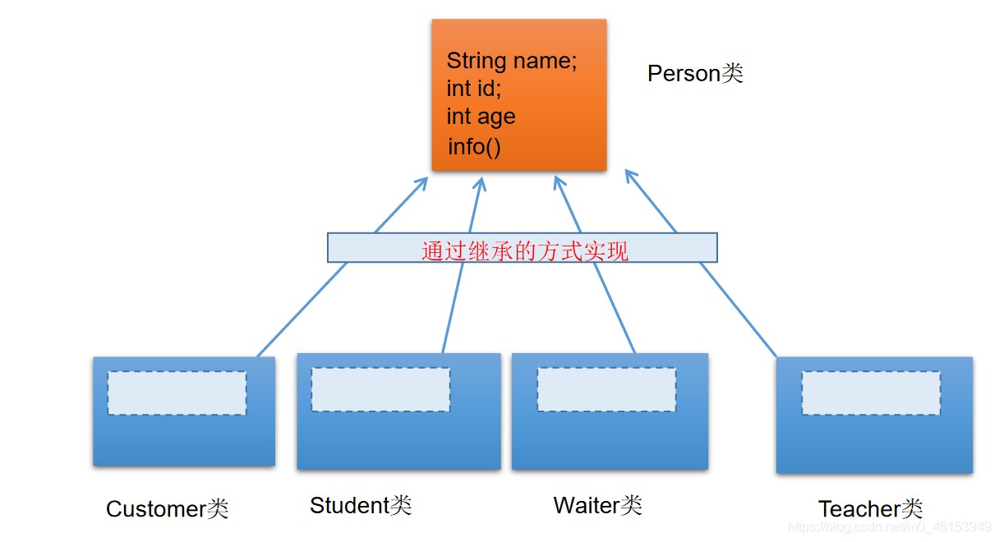


> 3、Java 中关于继承性的规定

```java
/*  三、Java 中关于继承性的规定：
 *  	1.一个类可以被多个类继承
 *  	2.Java 中类的单继承性：一个类只能有一个父类
 *  	3.子父类是相对的概念。
 *  	4.子类直接继承的父类，称为：直接父类。间接继承的父类，称为，间接父类。
 *  	5.子类继承父类后，就获取了直接父类以及所有间接父类中声明的属性和方法。
 * 	
 * 四、1.如果我们没有显式的声明一个类的父类的话，则此类继承于 java.lang.Object 类
 * 	  2.所有的 java 类(除 java.long.Object 类之外)都直接或间接地继承于 java.lang.Object 类;
 * 	  3.意味着，所有的 java 类具有 java.lang.Object 类声明的功能。
 */
public class ExtendsTest {

	public static void main(String[] args) {	
		s1.brease();
		
		Creature c = new Creature();
		System.out.println(c.toString());
		
	}
}
```

> 4、将上述 Person 类改为如下

```java
public class Person extends Creature {
    ...
}
```

> 5、Creature 类

```java
public class Creature {

	public void brease(){
		System.out.println("呼吸");
	}
}
```

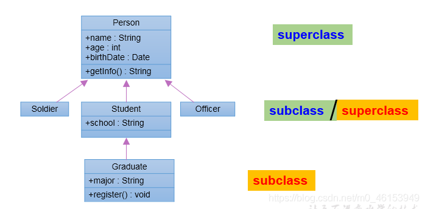

## 1.1、继承性练习

> 1、练习1

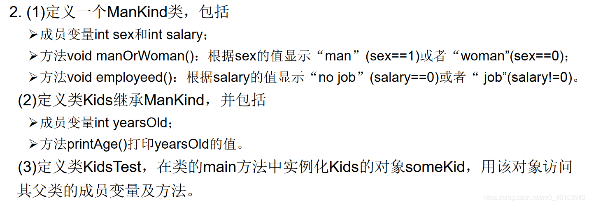

```java
/*
 * 定义类Kids继承ManKind，并包括
 * 成员变量int yearsOld；
 * 方法printAge()打印yearsOld的值
 * 
 */
public class Kids extends ManKind{

	private int yearsOld;	//年限
	
	public Kids() {


	}

	public Kids(int yearsOld) {
		this.yearsOld = yearsOld;
	}

	public int getYearsOld() {
		return yearsOld;
	}

	public void setYearsOld(int yearsOld) {
		this.yearsOld = yearsOld;
	}

	public void printAge(){
		System.out.println("I am " + yearsOld);
	}
}
```

ManKind类

```java
/*
 * 定义一个ManKind类，包括
 * 成员变量int sex和int salary；
 * 方法void manOrWoman()：根据sex的值显示“man”(sex==1)或者“woman”(sex==0)；
 * 方法void employeed()：根据salary的值显示“no job”(salary==0)或者“job”(salary!=0)。
 * 
 */
public class ManKind {

	private int sex;	//性别
	private int salary;	//薪资
	
	public ManKind() {
		
	}

	public ManKind(int sex, int salary) {
		this.sex = sex;
		this.salary = salary;
	}

	public void manOrWoman(){
		if(sex==1){
			System.out.println("man");
		}else if(sex==0){
			System.out.println("woman");
		}
	}
	
	public void employeed(){
		if(salary==0){
			System.out.println("no job");
		}else if(salary!=0){
			System.out.println("job");
		}
	}

	public int getSex() {
		return sex;
	}

	public void setSex(int sex) {
		this.sex = sex;
	}

	public int getSalary() {
		return salary;
	}

	public void setSalary(int salary) {
		this.salary = salary;
	}
	
}
```

KidsTest

```java
/*
 * 定义类KidsTest，在类的main方法中实例化Kids的对象someKid，
 * 用该对象访问其父类的成员变量及方法。
 * 
 */
public class KidsTest {
	public static void main(String[] args) {
		
		Kids someKid = new Kids(12);
		
		someKid.printAge();
		
		someKid.setYearsOld(15);
		someKid.setSalary(0);
		someKid.setSex(1);
		
		someKid.employeed();
		someKid.manOrWoman();
	}
}
```

> 2、练习2

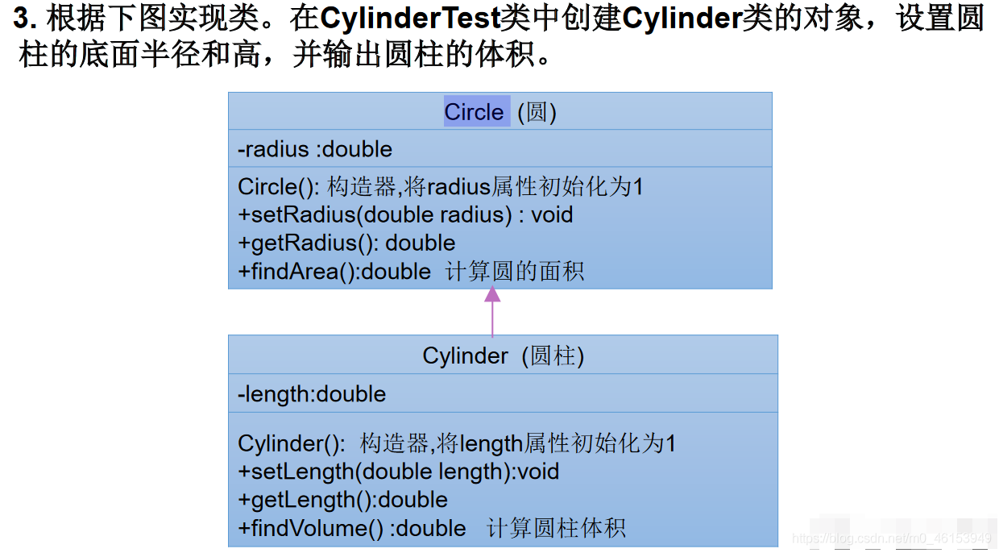

```java
public class Circle {

	public double radius;	//半径
	
	public Circle(){
		radius = 1.0;
	}

	public double getRadius() {
		return radius;
	}

	public void setRadius(double radius) {
		this.radius = radius;
	}
	
	public double findArea(){	//计算圆的面积
		return Math.PI * radius * radius;
	}
}
```

Cylinder类

```java
public class Cylinder extends Circle{

	private double length;
	
	public Cylinder(){
		length = 1.0;
	}

	public double getLength() {
		return length;
	}

	public void setLength(double length) {
		this.length = length;
	}
	
	public double findVolume(){	//计算圆柱体积
		return findArea() * length;
	}
}
```

测试类

```java
public class CylinderTest {
	public static void main(String[] args) {
		
		Cylinder cy = new Cylinder();
		
		cy.setRadius(2.1);
		cy.setLength(3.4);
		double volues = cy.findVolume();
		System.out.println("圆柱的体积:" + volues);
		
		double area = cy.findArea();
		System.out.println("圆的面积: " + area);
	}
}
```

# 02、方法的重写(override/overwrite)

> 1、Person类

```java
public class Person {

	String name;
	int age;
	
	public Person(){
		
	}
	
	public Person(String name,int age){
		this.name = name;
		this.age = age;
	}
	
	public void eat(){
		System.out.println("吃饭");
	}
	
	public void walk(int distance){
		System.out.println("走路，走的距离是：" + distance + "公里");
		show();
	}
	
	private void show(){
		System.out.println("我是一个人。");
	}
	
	public Object info(){
		return null;
	}
	
	public double info1(){
		return 1.0;
	}
}
```

> 2、Student类

```java
public class Student extends Person{

	String major;
	
	public Student(){
		
	}
	
	public Student(String major){
		this.major = major;
	}
	
	public void study(){
		System.out.println("学习，专业是:" + major);
	}
	
	//对父类中的eat()进行了重写
	public void eat(){
		System.out.println("学生应该多吃有营养的。");
	}
	
	public void show(){
		System.out.println("我是一个学生。");
	}
	
	public String info(){
		return null;
	}
	
	//不是一个类型，所以报错。
//	public int info1(){
//		return 1;
//	}
	
	//可以直接将父类的方法的第一行粘过来，直接写方法体
//	public void walk(int distance){
//		System.out.println("重写的方法");
//	}
	
	//直接输入父类的方法名，Alt + /，选择即可生成
	@Override
	public void walk(int distance) {
		System.out.println("自动生成");
	}
}
```

> 3、测试类

```java
/*
 * 方法的重写(override/overwrite)
 * 
 * 1.重写：子类继承父类以后，可以对父类中的方法进行覆盖操作。
 * 2.应用：重写以后，当创建子类对象以后，通过子类对象去调用子父类中同名同参数方法时，执行的是子类重写父类的方法。
 *   即在程序执行时，子类的方法将覆盖父类的方法。
 * 
 * 面试题：区分方法的重载与重写(有的书也叫做“覆盖”)
 * 		答：方法的重写Overriding和重载Overloading是Java多态性的不同表现。
 * 		重写Overriding是父类与子类之间多态性的一种表现，重载Overloading是一个类中多态性的一种表现。
 * 		如果在子类中定义某方法与其父类有相同的名称和参数，我们说该方法被重写 (Overriding)。
 * 		子类的对象使用这个方法时，将调用子类中的定义，对它而言，父类中的定义如同被"屏蔽"了。
 * 		如果在一个类中定义了多个同名的方法，它们或有不同的参数个数或有不同的参数类型，则称为方法的重载(Overloading)。
 * 
 */
public class PersonTest {


	public static void main(String[] args) {
		Student s = new Student("计算机科学与技术");
		s.eat();
		s.walk(10);
		
		s.study();
	}
}
```

## 2.1、方法重写的细节

> 1、Person类

```java
public class Person {

	String name;
	int age;
	
	public Person(){
		
	}
	
	public Person(String name,int age){
		this.name = name;
		this.age = age;
	}
	
//	public void eat(){
//		System.out.println("吃饭");
//	}
	static void eat(){
		System.out.println("吃饭");
	}
	
	public void walk(int distance){
		System.out.println("走路，走的距离是：" + distance + "公里");
		show();
	}
	
	private void show(){
		System.out.println("我是一个人。");
	}
	
	public Object info(){
		return null;
	}
	
	public double info1(){
		return 1.0;
	}
}
```

> 2、Student类

```java
public class Student extends Person{

	String major;
	
	public Student(){
		
	}
	
	public Student(String major){
		this.major = major;
	}
	
	public void study(){
		System.out.println("学习，专业是:" + major);
	}
	
	//对父类中的eat()进行了重写
//	public void eat(){
//		System.out.println("学生应该多吃有营养的。");
//	}
	
	//这样不会报错，但已经不是重写了！！
	public static void eat(){
		System.out.println("学生应该多吃有营养的。");
	}
	
	public void show(){
		System.out.println("我是一个学生。");
	}
	
	public String info(){
		return null;
	}
	
	//不是一个类型，所以报错。
//	public int info1(){
//		return 1;
//	}
	
	//可以直接将父类的方法的第一行粘过来，直接写方法体
//	public void walk(int distance){
//		System.out.println("重写的方法");
//	}
	
	//直接输入父类的方法名，Alt + /，选择即可生成
	@Override
	public void walk(int distance) {
		System.out.println("自动生成");
	}
}
```

> 3、测试类

```java
/*
 * 3.重写的规定：
 * 		方法的声明：权限修饰符 返回值类型 方法名(形参列表){
 * 						//方法体
 * 				 }
 * 		约定俗称:子类中的叫重写的方法，父类中的叫被重写的方法。
 * 		① 子类重写的方法的方法名和形参列表必须和父类被重写的方法的方法名、形参列表相同; 
 * 		② 子类重写的方法使用的访问权限不能小于父类被重写的方法的访问权限,
 *   		特殊情况: 子类不能重写父类中声明为private权限的方法;
 *   	③ 返回值类型:
 *   		> 父类被重写的方法的返回值类型是void,则子类重写的方法的返回值类型只能是void;
 *   		> 父类被重写的方法的返回值类型是A类型，则子类重写的方法的返回值类型可以是A类或A类的子类;
 *   		> 父类被重写的方法的返回值类型如果是基本数据类型(比如:double)，则子类重写的方法的返回值类型必须是相同的基本数据类型(必须是:double)。
 *   		
 *   	④ 子类方法抛出的异常不能大于父类被重写的方法抛出的异常;
 * 
 * 注意：子类与父类中同名同参数的方法必须同时声明为非static的(即为重写)，或者同时声明为static的（不是重写）。
 * 		因为static方法是属于类的，子类无法覆盖父类的方法。
 */
public class PersonTest {


	public static void main(String[] args) {
		Student s = new Student("计算机科学与技术");
		s.eat();
		s.walk(10);
		System.out.println("*******************");
		
		s.study();
		
		Person p1 = new Person();
		p1.eat();
	}
}
```

## 2.2、方法的练习

> 1、练习1

```java
1.如果现在父类的一个方法定义成private访问权限，在子类中将此方法声明为default访问权限，那么这样还叫重写吗？(NO)
1
```

> 2、练习2

```java
/*
 * 2.修改练习1.2中定义的类Kids，在Kids中重新定义employeed()方法，
 * 	  覆盖父类ManKind中定义的employeed()方法，
 *   输出“Kids should study and no job.”
 */
public class Kids extends ManKind{

	private int yearsOld;	//年限
	
	public Kids() {

	}

	public Kids(int yearsOld) {
		this.yearsOld = yearsOld;
	}

	public int getYearsOld() {
		return yearsOld;
	}

	public void setYearsOld(int yearsOld) {
		this.yearsOld = yearsOld;
	}

	public void printAge(){
		System.out.println("I am " + yearsOld);
	}
	
	public void employeed(){
		System.out.println("Kids should study and no job.");
	}
}
```

MindKids类

```java
public class ManKind {

	private int sex;	//性别
	private int salary;	//薪资
	
	public ManKind() {
		
	}

	public ManKind(int sex, int salary) {
		this.sex = sex;
		this.salary = salary;
	}

	public void manOrWoman(){
		if(sex==1){
			System.out.println("man");
		}else if(sex==0){
			System.out.println("woman");
		}
	}
	
	public void employeed(){
		if(salary==0){
			System.out.println("no job");
		}else if(salary!=0){
			System.out.println("job");
		}
	}

	public int getSex() {
		return sex;
	}

	public void setSex(int sex) {
		this.sex = sex;
	}

	public int getSalary() {
		return salary;
	}

	public void setSalary(int salary) {
		this.salary = salary;
	}
	
}
```

测试类

```java
public class KidsTest {
	public static void main(String[] args) {
		
		Kids someKid = new Kids(12);
		
		someKid.printAge();
		
		someKid.setYearsOld(15);
		someKid.setSalary(0);
		someKid.setSex(1);
		
		someKid.employeed();
		someKid.manOrWoman();
	}
}
```

# 03、四种访问权限修饰符

> 四种权限修饰符


> Order类

```java
package githubb;
/*
 * 体会四种不同的权限修饰符
 */
public class Order {

	private int orderPrivate;
	int orderDefault;
	protected int orderProtected;
	public int orderPublic;
	
	private void methodPrivate(){
		orderPrivate = 1;
		orderDefault = 2;
		orderProtected = 3;
		orderPublic = 4;
	}
	
	void methodDefault(){
		orderPrivate = 1;
		orderDefault = 2;
		orderProtected = 3;
		orderPublic = 4;
	}
	
	protected void methodProtected(){
		orderPrivate = 1;
		orderDefault = 2;
		orderProtected = 3;
		orderPublic = 4;
	}
	
	public void methodPublic(){
		orderPrivate = 1;
		orderDefault = 2;
		orderProtected = 3;
		orderPublic = 4;
	}
}
```

> Ordertest类

```java
package githubb;

public class OrderTest {
	public static void main(String[] args) {
		
		Order order = new Order();
		
		order.orderDefault = 1;
		order.orderProtected = 2;
		order.orderPublic = 3;
		
		order.methodDefault();
		order.methodProtected();
		order.methodPublic();
		
		//同一个包中的其它类，不可以调用Order类中私有的属性
//		order.orderPrivate = 4;	//The field Order.orderPrivate is not visible
//		order.methoPrivate();
	}
}
```

> SubOrder类

```java
package githubc;

import githubb.Order;

public class SubOrder extends Order{

	public void method(){
		orderProtected = 1;
		orderPublic = 2;
		
		methodProtected();
		methodPublic();
		
		//在不同包的子类中，不能调用Order类中声明为private和缺省的权限的属性、方法
//		orderDefault = 3;
//		orderPrivate = 4;
//		
//		methodDefault();
//		methodPrivate();
	}
}
```

> OrderTest类

```java
package githubc;

import githubb.Order;

public class OrderTest {
	public static void main(String[] args) {
		
		Order order = new Order();
		order.orderPublic = 1;
		order.methodPublic();
		
		//不同包下的普通类(非子类)要使用Order类，不可以调用声明为private、缺省、protected权限的属性、方法。
//		order.orderPrivate = 2;
//		order.orderProtected = 3;
//		order.orderProtected = 4;
//		
//		order.methodPrivate();
//		order.methodDefault();
//		order.methodProtected();
		
	}
	
	public void show(Order order){
		order.orderPublic = 1;
		order.methodPublic();
		
		//不同包下的普通类(非子类)要使用Order类，不可以调用声明为private、缺省、protected权限的属性、方法。
//		order.orderPrivate = 2;
//		order.orderProtected = 3;
//		order.orderProtected = 4;
//		
//		order.methodPrivate();
//		order.methodDefault();
//		order.methodProtected();
	}
}
```

# 04、关键字：super

> Person类

```java
public class Person {

	String name;
	int age;
	int id = 1003;	//身份证号
	
	public Person(){
		System.out.println("我无处不在");
	}
	
	public Person(String name){
		this.name = name;
	}
	
	public Person(String name,int age){
		this(name);
		this.age = age;
	}
	
	public void eat(){
		System.out.println("人，吃饭");
	}
	
	public void walk(){
		System.out.println("人，走路");
	}
}
```

> Student类

```java
public class Student extends Person{
	
	String major;
	int id = 1002;	//学号
	
	public Student(){

	}
	
	public Student(String name,int age,String major){
//		this.age = age;
//		this.name = name;
		super(name,age);
		this.major = major;
	}
	
	public Student(String major){
		this.major = major;
	}
	
	public void eat(){
		System.out.println("学生多吃有营养的食物");
	}
	
	public void Study(){
		System.out.println("学生，学习知识。");
		this.eat();
		//如果，想调用父类中被重写的，不想调用子类中的方法，可以：
		super.eat();
		super.walk();//子父类中未重写的方法，用"this."或"super."调用都可以
	}
	public void show(){
		System.out.println("name = " + this.name + ",age = " + super.age);
		System.out.println("id = " + this.id);	
		System.out.println("id = " + super.id);
	}
}
```

> 测试类

```java
/*
 * super关键字的使用
 * 1.super理解为:父类的
 * 2.super可以用来调用:属性、方法、构造器 
 * 
 * 3.super的使用
 * 		3.1 我们可以在子类的方法或构造器中，通过"super.属性"或"super.方法"的方式，显式的调用
 * 	父类中声明的属性或方法。但是，通常情况下，我们习惯去省略这个"super."
 * 		3.2 特殊情况:当子类和父类中定义了同名的属性时，我们要想在子类中调用父类中声明的属性，则必须显式的 
 *  使用"super.属性"的方式，表明调用的是父类中声明的属性。
 *  	3.3 特殊情况:当子类重写了父类中的方法后，我们想在子类的方法中调用父类中被重写的方法时，必须显式的
 *  使用"super.方法"的方式，表明调用的是父类中被重写的方法。
 * 
 * 4.super调用构造器
 * 	  4.1  我们可以在子类的构造器中显式的使用"super(形参列表)"的方式,调用父类中声明的指定的构造器
 * 	  4.2 "super(形参列表)"的使用，必须声明在子类构造器的首行！
 *    4.3 我们在类的构造器中，针对于"this(形参列表)"或"super(形参列表)"只能二选一，不能同时出现。
 *    4.4 在构造器的首行，既没有显式的声明"this(形参列表)"或"super(形参列表)",则默认的调用的是父类中的空参构造器。super()
 *    4.5 在类的多个构造器中，至少有一个类的构造器使用了"super(形参列表)",调用父类中的构造器。
 *  
 */
public class SuperTest {
	public static void main(String[] args) {
		
		Student s = new Student();
		s.show();
		
		s.Study();
		
		Student s1 = new Student("Ton",21,"IT" );
		s1.show();
		
		System.out.println("***********************");
		Student s2 = new Student();
		
	}
}
```

# 05、子类对象实例化过程

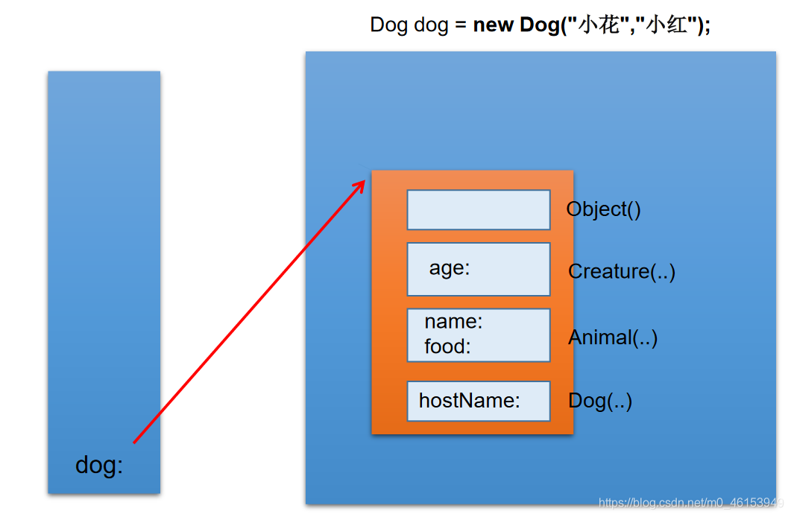
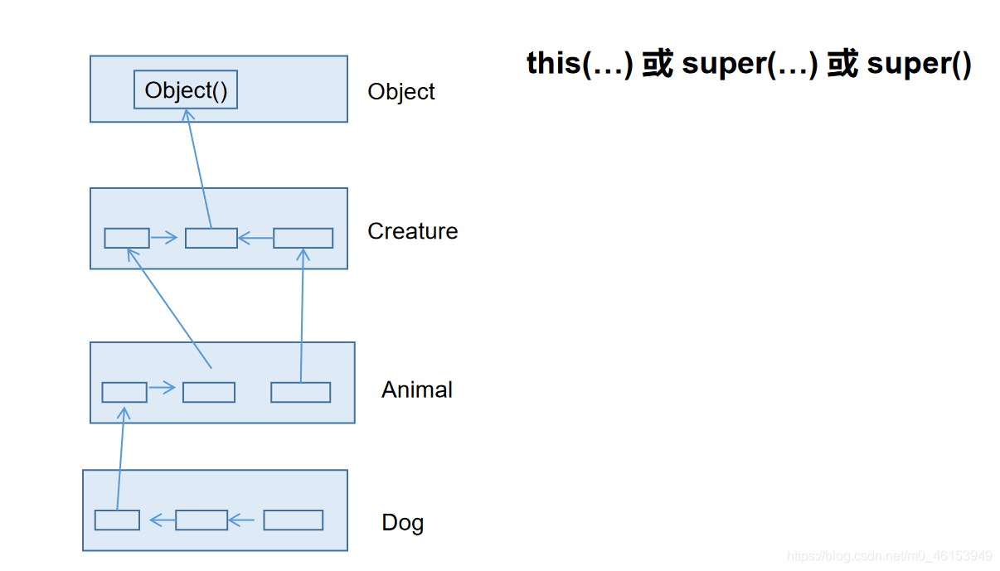

```java
/*
 * 子类对象实例化的全过程
 * 
 * 1.从结果上看:
 * 		子类继承父类以后，就获取了父类中声明的属性或方法。
 * 		创建子类的对象中，在堆空间中，就会加载所有父类中声明的属性。
 * 
 * 2.从过程上看:
 * 		当我们通过子类的构造器创建子类对象时,我们一定会直接或间接的调用其父类构造器， 
 * 		直到调用了java.lang.Object类中空参的构造器为止。正因为加载过所有的父类结构，所以才可以看到内存中有
 * 		父类中的结构，子类对象可以考虑进行调用。
 * 
 * 明确:虽然创建子类对象时，调用了父类的构造器，但自始至终就创建过一个对象，即为new的子类对象。
 */
public class InstanceTest {

}
```

> 练习

Account类

```java
/*
 * 写一个名为Account的类模拟账户。该类的属性和方法如下图所示。
 * 该类包括的属性：账号id，余额balance，年利率annualInterestRate；
 * 包含的方法：访问器方法（getter和setter方法），
 * 返回月利率的方法getMonthlyInterest()，
 * 取款方法withdraw()，存款方法deposit()。
 * 
 */
public class Account {

	private int id;	//账号
	private double balance;	//余额
	private double annualInterestRate;	//年利率
	
	public Account(int id, double balance, double annualInterestRate) {
		super();
		this.id = id;
		this.balance = balance;
		this.annualInterestRate = annualInterestRate;
	}

	public int getId() {
		return id;
	}

	public void setId(int id) {
		this.id = id;
	}

	public double getBalance() {
		return balance;
	}

	public void setBalance(double balance) {
		this.balance = balance;
	}

	public double getAnnualInterestRate() {
		return annualInterestRate;
	}

	public void setAnnualInterestRate(double annualInterestRate) {
		this.annualInterestRate = annualInterestRate;
	}
	
	public double getMonthlyInterest(){	//返回月利率的方法
		return annualInterestRate / 12;
	}
	
	public void withdraw (double amount){	//取款方法
		if(balance >= amount){
			balance -= amount;
			return;
		}
		System.out.println("余额不足");
	}
	
	public void deposit (double amount){	//存款方法
		if(amount > 0){
			balance += amount;
			
		}
	}
	
}
```

AccountTest类

```java
/*
 * 写一个用户程序测试Account类。在用户程序中，
 * 创建一个账号为1122、余额为20000、年利率4.5%的Account对象。
 * 使用withdraw方法提款30000元，并打印余额。再使用withdraw方法提款2500元，
 * 使用deposit方法存款3000元，然后打印余额和月利率。
 */
public class AccountTest {
	public static void main(String[] args) {
		Account acct = new Account(1122,20000,0.045);
		
		acct.withdraw(30000);
		System.out.println("你的账户余额为:" + acct.getBalance());
		acct.withdraw(2500);
		System.out.println("你的账户余额为:" + acct.getBalance());
		acct.deposit(3000);
		System.out.println("你的账户余额为:" + acct.getBalance());


		System.out.println("月利率为: " + (acct.getAnnualInterestRate() * 100) + "%");
	}
}
```

CheckAccount类

```java
/*
 * 创建Account类的一个子类CheckAccount代表可透支的账户，该账户中定义一个属性overdraft代表可透支限额。
 * 在CheckAccount类中重写withdraw方法，其算法如下：
 * 如果（取款金额<账户余额），
 * 可直接取款
 * 如果（取款金额>账户余额），
 * 计算需要透支的额度
 * 判断可透支额overdraft是否足够支付本次透支需要，如果可以
 * 		将账户余额修改为0，冲减可透支金额
 * 如果不可以
 * 		提示用户超过可透支额的限额
 * 
 */
public class CheckAccount extends Account{

	private double overdraft;	//代表可透支限额
	
	public CheckAccount(int id, double balance, double annualInterestRate,double overdraft){
		super(id, balance, annualInterestRate);
		this.overdraft = overdraft;
	}
	
	public double getOverdraft() {
		return overdraft;
	}

	public void setOverdraft(double overdraft) {
		this.overdraft = overdraft;
	}

	@Override
	public void withdraw(double amount) {
		if(getBalance() >= amount){	//余额足够消费
			//方式一
//			setBalance(getBalance() - amount); 
			//方式二
			super.withdraw(amount);
		}else if(overdraft >= amount - getBalance()){	//余额不够
			
			overdraft -= (amount - getBalance());
//			setBalance(0);
			//或
			super.withdraw(getBalance());
			
		}else{	//超过可透支限额
			System.out.println("超过可透支限额！");
		}
		
	}
}
```

CheckAccountTest类

```java
/*
 * 写一个用户程序测试CheckAccount类。在用户程序中，
 * 创建一个账号为1122、余额为20000、年利率4.5%，
 * 可透支限额为5000元的CheckAccount对象。
 * 使用withdraw方法提款5000元，并打印账户余额和可透支额。
 * 再使用withdraw方法提款18000元，并打印账户余额和可透支额。
 * 再使用withdraw方法提款3000元，并打印账户余额和可透支额。
 * 
 */
public class CheckAccountTest {
	public static void main(String[] args) {
		CheckAccount cat = new CheckAccount(1122,20000,0.045,5000);
		
		cat.withdraw(5000);
		System.out.println("您的账户余额为: " + cat.getBalance());
		System.out.println("您的可透支额度为: " + cat.getOverdraft());
		
		cat.withdraw(18000);
		System.out.println("您的账户余额为: " + cat.getBalance());
		System.out.println("您的可透支额度为: " + cat.getOverdraft());
		
		cat.withdraw(3000);
		System.out.println("您的账户余额为: " + cat.getBalance());
		System.out.println("您的可透支额度为: " + cat.getOverdraft());
	}
}
```

# 06、面向对象特征之三：多态性

> Person类

```java
public class Person {
	String name;
	int age;
	
	public void eat(){
		System.out.println("人，吃饭");
	}
	
	public void walk(){
		System.out.println("人，走路");
	}
	
}
```

> Woman类

```java
public class Woman extends Person{

	boolean isBeauty;
	
	public void goShopping(){
		System.out.println("女人喜欢购物");
	}
	
	public void eat(){
		System.out.println("女人少吃，为了减肥。");
	}
	
	public void walk(){
		System.out.println("女人，窈窕的走路。");
	}
}
```

> Man类

```java
public class Man extends Person{
	
	boolean isSmoking;
	
	public void earnMoney(){
		System.out.println("男人负责工作养家");
	}
	
	public void eat() {
		System.out.println("男人多吃肉，长肌肉");
	}
	
	public void walk() {
		System.out.println("男人霸气的走路");
	}
}
```

> 测试类

```java
/*
 * 面向对象之三:多态性
 * 
 * 1.理解多态性:可以理解为一个事物的多种态性。
 * 2.何为多态性:
 * 	 对象的多态性:父类的引用指向子类的对象(或子类的对象赋值给父类的引用)
 * 
 * 3.多态的使用：虚拟方法调用
 * 	有了对象多态性以后，我们在编译期，只能调用父类声明的方法，但在执行期实际执行的是子类重写父类的方法
 * 			简称：编译时，看左边；运行时，看右边。
 *  
 *  若编译时类型和运行时类型不一致，就出现了对象的多态性(Polymorphism)
 *  多态情况下，
 *  	“看左边”：看的是父类的引用（父类中不具备子类特有的方法）
 *  	“看右边”：看的是子类的对象（实际运行的是子类重写父类的方法）
 *  
 *  4.多态性的使用前提：
 *  	① 类的继承关系
 *  	② 方法的重写
 *  5.对象的多态性:只适用于方法，不适用于属性(编译和运行都看左边)
 */
public class PersonTest {
	public static void main(String[] args) {
		
	Person p1 = new Person();
	p1.eat();
	
	Man man = new Man();
	man.eat();
	man.age = 25;
	man.earnMoney();
	
	//************************************
	//对象的多态性，父类的引用指向子类的对象
	Person p2 = new Man();
//	Person p3 = new Woman();
	
	//多态的使用:当调用子父类同名同参数方法时，实际调用的是子类重写父类的方法---虚拟方法调用
	p2.eat();
	p2.walk();
	
//	p2.earnMoney();
	
	}
}
```

> 举例

```java
/*
 * 多态性应用举例
 */
public class AnimalTest {
	
	public static void main(String[] args) {
		AnimalTest test = new AnimalTest();
		test.func(new Dog());
		
		test.func(new Cat());
	}

	public void func(Animal animal){	//Animal animal = new Dog();
		animal.eat();
		animal.shout();
	}
	
	//如果没有多态性，就会写很多如下的方法，去调用
	public void func(Dog dog){
		dog.eat();
		dog.shout();
	}
	
	public void func(Cat cat){
		cat.eat();
		cat.shout();
	}
}

class Animal{
	
	public void eat(){
		System.out.println("动物，进食");
	}
	
	public void shout(){
		System.out.println("动物：叫");
	}
}

class Dog extends Animal{
	public void eat(){
		System.out.println("狗吃骨头");
	}
	
	public void shout() {
		System.out.println("汪！汪！汪！");
	}
}

class Cat extends Animal{
	public void eat(){
		System.out.println("猫吃鱼");
	}
	
	public void shout() {
		System.out.println("喵！喵！喵！");
	}
}
```

## 6.1、虚拟方法的补充

```java
import java.util.Random;
/*
 * 2.从编译和运行的角度看：
 * 重载，是指允许存在多个同名方法，而这些方法的参数不同。
 * 编译器根据方法不同的参数表，对同名方法的名称做修饰。
 * 对于编译器而言，这些同名方法就成了不同的方法。
 * 它们的调用地址在编译期就绑定了。Java的重载是可以包括父类和子类的，
 * 即子类可以重载父类的同名不同参数的方法。所以：对于重载而言，在方法调用之前，
 * 编译器就已经确定了所要调用的方法，这称为“早绑定”或“静态绑定”；
 * 而对于多态，只有等到方法调用的那一刻，解释运行器才会确定所要调用的具体方法，
 * 这称为“晚绑定”或“动态绑定”。
 * 
 * 引用一句Bruce Eckel的话：“不要犯傻，如果它不是晚绑定，它就不是多态。”
 */
//面试题：多态是编译时行为还是运行时行为？
//证明如下：
class Animal  {
 
	protected void eat() {
		System.out.println("animal eat food");
	}
}

class Cat  extends Animal  {
 
	protected void eat() {
		System.out.println("cat eat fish");
	}
}

class Dog  extends Animal  {
 
	public void eat() {
		System.out.println("Dog eat bone");

	}

}

class Sheep  extends Animal  {
 
	public void eat() {
		System.out.println("Sheep eat grass");

	}
 
}

public class InterviewTest {

	public static Animal  getInstance(int key) {
		switch (key) {
		case 0:
			return new Cat ();
		case 1:
			return new Dog ();
		default:
			return new Sheep ();
		}

	}

	public static void main(String[] args) {
		int key = new Random().nextInt(3);

		System.out.println(key);

		Animal  animal = getInstance(key);
		
		animal.eat();
		 
	}

}
```

## 6.2、向下转型的使用

> Person 类

```java
public class Person {
	String name;
	int age;
	
	public void eat(){
		System.out.println("人，吃饭");
	}
	
	public void walk(){
		System.out.println("人，走路");
	}
	
}
```

> Man 类

```java
public class Man extends Person{
	
	boolean isSmoking;
	
	public void earnMoney(){
		System.out.println("男人负责工作养家");
	}
	
	public void eat() {
		System.out.println("男人多吃肉，长肌肉");
	}
	
	public void walk() {
		System.out.println("男人霸气的走路");
	}
}
```

> Woman 类

```java
public class Woman extends Person{

	boolean isBeauty;
	
	public void goShopping(){
		System.out.println("女人喜欢购物");
	}
	
	public void eat(){
		System.out.println("女人少吃，为了减肥。");
	}
	
	public void walk(){
		System.out.println("女人，窈窕的走路。");
	}
}
```

> PersonTest 类

```java
/*
 * 面向对象之三:多态性
 * 
 * 1.理解多态性:可以理解为一个事物的多种态性。
 * 2.何为多态性:
 * 	 对象的多态性:父类的引用指向子类的对象(或子类的对象赋值给父类的引用)
 * 
 * 3.多态的使用：虚拟方法调用
 * 	有了对象多态性以后，我们在编译期，只能调用父类声明的方法，但在执行期实际执行的是子类重写父类的方法
 * 			简称：编译时，看左边；运行时，看右边。
 *  
 *  若编译时类型和运行时类型不一致，就出现了对象的多态性(Polymorphism)
 *  多态情况下，
 *  	“看左边”：看的是父类的引用（父类中不具备子类特有的方法）
 *  	“看右边”：看的是子类的对象（实际运行的是子类重写父类的方法）
 *  
 *  4.多态性的使用前提：
 *  	① 类的继承关系
 *  	② 方法的重写
 *  5.对象的多态性:只适用于方法，不适用于属性(编译和运行都看左边)
 */
public class PersonTest {
	public static void main(String[] args) {

		Person p1 = new Person();
		p1.eat();

		Man man = new Man();
		man.eat();
		man.age = 25;
		man.earnMoney();

		// ************************************
		System.out.println("************************");
		// 对象的多态性，父类的引用指向子类的对象
		Person p2 = new Man();
		// Person p3 = new Woman();

		// 多态的使用:当调用子父类同名同参数方法时，实际调用的是子类重写父类的方法---虚拟方法调用
		p2.eat();
		p2.walk();

		// p2.earnMoney();

		System.out.println("**************************");
		// 不能调用子类所特有的方法、属性，编译时，p2是Person类型，

		// p2.earnMoney();

		p2.name = "Tom";
		// p2.isSmoking = true;
		// 有了对象的多态性以后，内存中实际上是加载了子类特有的属性和方法，但是由于变量声明为父类类型，导致
		// 编译时，只能调用父类中声明的属性和方法。子类的属性和方法不能调用。

		// 如何才能调用子类所特有的属性和方法？
		// 使用强制类型转换符，也可称为:向下转型
		Man m1 = (Man) p2;
		m1.earnMoney();
		m1.isSmoking = true;

		// 使用强转时，可能出现ClassCastException异常
		// Woman w1 = (Woman)p2;
		// w1.goShopping();

		/*
		 * instanceof关键字的使用
		 * 
		 * a instanceof A:判断对象a是否是类A的实例。如果，返回true，如果不是，返回false;
		 * 
		 * 使用情境:为了避免在向下转型时出现ClassCastException异常，我们在进行向下转型之前，先进行
		 * instanceof的判断,一旦返回true,就进行向下转型。如果返回false，不进行向下转型。
		 * 
		 * 如果a instanceof A返回true,则a instanceof B也返回true。 其中类B是类A的父类。
		 * 
		 */

		if (p2 instanceof Woman) {
			Woman w1 = (Woman) p2;
			w1.goShopping();
			System.out.println("**********Woman*********");
		}

		if (p2 instanceof Man) {
			Man m2 = (Man) p2;
			m2.earnMoney();
			System.out.println("*********Man************");
		}

		if (p2 instanceof Person) {
			System.out.println("***********Person************");
		}

		if (p2 instanceof Object) {
			System.out.println("***********object************");
		}
		
		//向下转型的常见问题
		//练习
		//问题1:编译时通过，运行时不通过
		//举例一
//		Person p3 = new Woman();
//		Man m3 = (Man)p3;
		
		//举例二
		Person p4 = new Person();
		Man m4 = (Man)p4;
		
		//问题二:编译通过，运行时也通过
		Object obj = new Woman();
		Person p = (Person)obj;
		
		//问题三:编译不通过
//		Man m5 = new woman();
		
//		String str = new Date();
		
//		Object o = new Date();
//		String str1 = (String)o;
	}
}
```

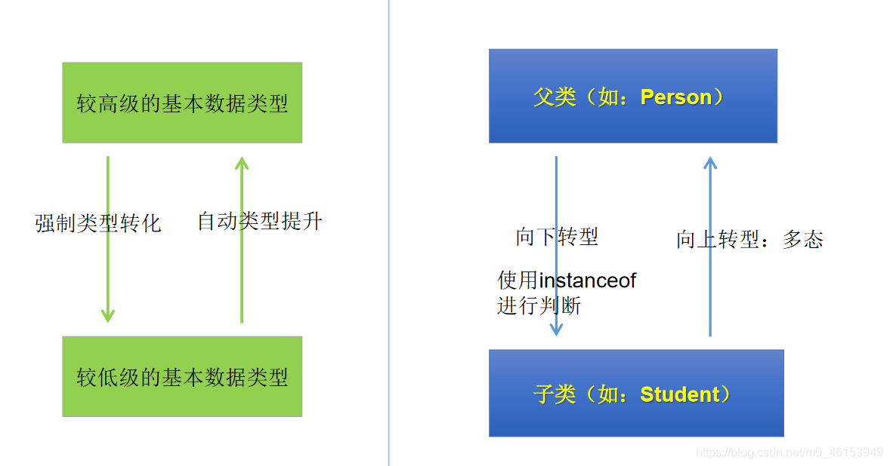

## 6.3、多态性的练习

> 1、练习1

```java
/*
 * 练习:子类继承父类
 * 
 * 1.若子类重写了父类方法，就意味着子类里定义的方法彻底覆盖了父类里的同名方法，
 * 系统将不可能把父类里的方法转移到子类中。
 * 
 * 2.对于实例变量则不存在这样的现象，即使子类里定义了与父类完全相同的实例变量，
 * 这个实例变量依然不可能覆盖父类中定义的实例变量
 * 
 */
public class FieldMethodTest {
	public static void main(String[] args){
		Sub s= new Sub();
		System.out.println(s.count);	//20
		s.display();//20
		
		Base b = s;
		//==:对于引用数据类型来讲，比较的是两个引用数据类型变量的地址值是否一样。
		System.out.println(b == s);	//true
		System.out.println(b.count);	//10
		b.display();
	}
}

class Base {
	int count= 10;
	public void display() {
		System.out.println(this.count);
	}
}

class Sub extends Base {
	int count= 20;
	public void display() {
		System.out.println(this.count);
	}
}
```

> 2、练习2

```java
/*
 * 建立InstanceTest 类，在类中定义方法method(Person e);
 * 
 * 在method中:
 * (1)根据e的类型调用相应类的getInfo()方法。
 * (2)根据e的类型执行：
 * 		如果e为Person类的对象，输出：“a person”;
 * 		如果e为Student类的对象，输出：“a student”“a person ”
 * 		如果e为Graduate类的对象，输出：“a graduated student”
 * 		“a student” “a person”
 * 
 */
class Person {
	protected String name = "person";
	protected int age = 50;


	public String getInfo() {
		return "Name: " + name + "\n" + "age: " + age;
	}
}

class Student extends Person {
	protected String school = "pku";

	public String getInfo() {
		return "Name: " + name + "\nage: " + age + "\nschool: " + school;
	}
}

class Graduate extends Student {
	public String major = "IT";

	public String getInfo() {
		return "Name: " + name + "\nage: " + age + "\nschool: " + school + "\nmajor:" + major;
	}
}


public class InstanceTest{
	
	public static void main(String[] args) {
		//虚拟方法调用
		InstanceTest test = new InstanceTest();
		test.method(new Student());
		
	}
	
	public void method(Person e){
		String info = e.getInfo();
		System.out.println(info);
		
		//方法一
		if(e instanceof Graduate){
			System.out.println("a graduated student");
			System.out.println("a student");
			System.out.println("a person");
		}else if(e instanceof Student){
			System.out.println("a student");
			System.out.println("a person");
		}else{
			System.out.println("a person");
		}
		
		//方法二
		if(e instanceof Graduate){
			System.out.println("a graduated student");
		}
		if(e instanceof Student){
			System.out.println("a student");
		}
		if(e instanceof Person){
			System.out.println("a person");
		}
	}
}
```

> 3、练习3

GeometricObject类

```java
/*
 * 定义三个类，父类GeometricObject代表几何形状，子类Circle代表圆形，MyRectangle代表矩形。
 */
public class GeometricObject {
	protected String color;
	protected double weight;
	public String getColor() {
		return color;
	}
	public void setColor(String color) {
		this.color = color;
	}
	public double getWeight() {
		return weight;
	}
	public void setWeight(double weight) {
		this.weight = weight;
	}
	public GeometricObject(String color, double weight) {
		super();
		this.color = color;
		this.weight = weight;
	}
	
	public double findArea(){
		return 0.0;
	}
}
```

Circle类

```java
public class Circle extends GeometricObject {

	private double radius;
	
	public Circle(double weight,String color, double radius) {
		super(color,weight);
		this.radius = radius;
	}

	public double getRadius() {
		return radius;
	}

	public void setRadius(double radius) {
		this.radius = radius;
	}
	
	@Override
	public double findArea() {
		return 3.14 * radius * radius;
	}
}
```

MyRectangle类

```java
public class MyRectangle extends GeometricObject {

	private double width;
	private double height;
	
	public MyRectangle(double width, double height,String color,double weight) {
		super(color, weight);
		this.height = height;
		this.width = width;
	}

	public double getWidth() {
		return width;
	}

	public void setWidth(double width) {
		this.width = width;
	}

	public double getHeight() {
		return height;
	}

	public void setHeight(double height) {
		this.height = height;
	}

	@Override
	public double findArea() {
		return width * height;
	}
}
```

GeometricTest类

```java
/*
 * 定义一个测试类GeometricTest，编写equalsArea方法测试两个对象的面积是否相等（注意方法的参数类型，利用动态绑定技术），
 * 编写displayGeometricObject方法显示对象的面积（注意方法的参数类型，利用动态绑定技术）。
 * 
 */
public class GeometricTest {
	
	public static void main(String[] args) {
		GeometricTest test = new GeometricTest();
		
		Circle c1 = new Circle(2.3,"white",1.0);
		test.displayGeometricObject(c1);
		
		Circle c2 = new Circle(3.3,"white",1.0);
		test.displayGeometricObject(c2);
		
		boolean isEqual = test.equalsArea(c1, c2);
		System.out.println("面积是否相等: " + isEqual);
		
		MyRectangle rect = new MyRectangle(2.1, 3.4,"red",1.0);
		test.displayGeometricObject(rect);
	}
	
	public void displayGeometricObject(GeometricObject o){
		System.out.println("面积为: " + o.findArea());
	}
	
	//测试两个对象的面积是否相等
	public boolean equalsArea(GeometricObject o1,GeometricObject o2){
		return o1.findArea() == o2.findArea();
	}
}
```

练习4

```java
/*
 * 面试题：多态是编译时行为还是运行时行为？如何证明？
 * 
 * 证明见如下：
 */
import java.util.Random;

class Animal  {

	protected void eat() {
		System.out.println("animal eat food");
	}
}

class Cat  extends Animal  {

	protected void eat() {
		System.out.println("cat eat fish");
	}
}

class Dog  extends Animal  {

	public void eat() {
		System.out.println("Dog eat bone");
	}
}

class Sheep  extends Animal  {

	public void eat() {
		System.out.println("Sheep eat grass");

	}

}

public class InterviewTest {

	public static Animal  getInstance(int key) {
		switch (key) {
		case 0:
			return new Cat ();
		case 1:
			return new Dog ();
		default:
			return new Sheep ();
		}

	}

	public static void main(String[] args) {
		int key = new Random().nextInt(3);

		System.out.println(key);

		Animal  animal = getInstance(key);
		
		animal.eat();
		 
	}
}
```

> 4、面试题拓展

```java
/* 考查多态的笔试题目：
 * 面试题：多态是编译时行为还是运行时行为？如何证明？
 * 
 * 拓展问题
 */
public class InterviewTest1 {

	public static void main(String[] args) {
		Base base = new Sub();
		base.add(1, 2, 3);

//		Sub s = (Sub)base;
//		s.add(1,2,3);
	}
}

class Base {
	public void add(int a, int... arr) {
		System.out.println("base");
	}
}

class Sub extends Base {

	public void add(int a, int[] arr) {
		System.out.println("sub_1");
	}

//	public void add(int a, int b, int c) {
//		System.out.println("sub_2");
//	}

}
```

# 07、Object 类的使用

```java
/*
 * java.lang.Object类
 * 1.Object类是所有Java类的根父类;
 * 2.如果在类的声明中未使用extends关键字指明其父类，则默认父类为java.lang.Object类
 * 3.Object类中的功能(属性、方法)就具有通用性。
 * 属性:无
 * 方法:equals() / toString() / getClass() / hashCode() / clone() /finalize()
 * 	 wait() 、notify()、notifyAll()
 * 
 * 4.Object类只声明了一个空参的构造器。
 * 
 * 面试题:
 * final、finally、finalize的区别？
 * 
 */
public class ObjectTest {

	public static void main(String[] args) {
		
	}
}

class Order{
	
}
```

## 7.1、Object类中的主要结构

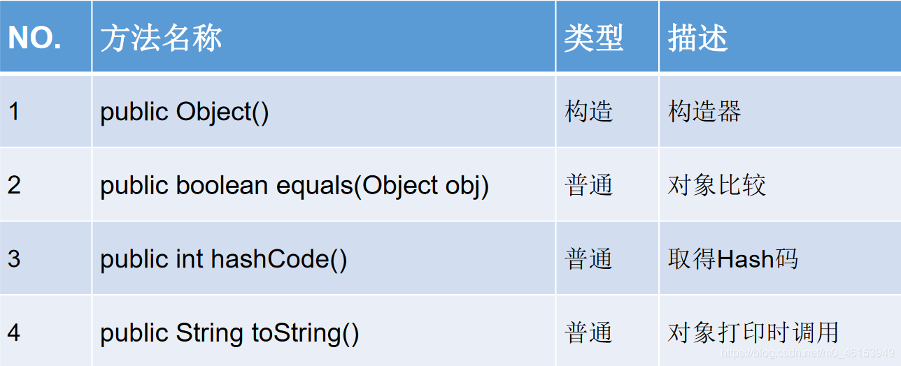

## 7.2、==操作符与equals方法

```java
import java.sql.Date;

/*
 * 面试题: ==和equals的区别
 * 
 * 一、回顾==的使用
 * == : 运算符
 * 1.可以使用在基本数据类型变量和引用数据类型变量中
 * 2.如果比较的是基本数据类型变量：比较两个变量保存的数据是否相等。(不一定类型要相同)
 * 	   如果比较的是引用数据类型变量：比较两个对象的地址值是否相同,即两个引用是否指向同一个对象实体
 *  补充: == 符号使用时，必须保证符号左右两边的变量类型一致。
 *
 * 二、equals()方法的使用
 * 1.是一个方法，而非运算符
 * 2.只能适用于引用数据类型。
 * 3.Object类中equals()的定义：
 * 		public boolean equals(Object obj){
 * 			return (this == obj);
 * 		}
 * 说明：Object类中定义的equals()和==的作用是相同的，比较两个对象的地址值是否相同，即两个引用是否指向同一个对象实体。
 * 
 * 4.像String、Date、File、包装类等都重写了Object类中的equals()方法.
 * 	 两个引用的地址是否相同，而是比较两个对象的“实体内容”是否相同。
 * 
 * 5.通常情况下，我们自定义的类如果使用equals()的话，也通常是比较两个对象的"实体内容"是否相同。那么，我们
 * 	   就需要对Object类中的equals()进行重写。
 * 
 * 重写的原则:比较两个对象的实体内容是否相同。
 * 
 */
public class EqualsTest {
	public static void main(String[] args) {
		
		//基本数据类型
		int i = 10;
		int j = 10;
		double d = 10.0;
		System.out.println(i == j);	//true
		System.out.println(i == d); //true
		
//		boolean b =true;
//		System.out.println(i == b);
		
		char c = 10;
		System.out.println(i == c); //true
		
		char c1 = 'A';
		char c2 = 65;
		System.out.println(c1 == c2); //true
		
		//引用数据类型
		Customer cust1 = new Customer("Tom" ,21);
		Customer cust2 = new Customer("Tom" ,21);
		System.out.println(cust1 == cust2); //false
		
		String str1 = new String("BAT");
		String str2 = new String("BAT");
		System.out.println(str1 == str2); //false
		System.out.println("*************************");
		System.out.println(cust1.equals(cust2));	//false
		System.out.println(str1.equals(str2));	//true
		
		Date date1 = new Date(23432525324L);
		Date date2 = new Date(23432525324L);
		System.out.println(date1.equals(date2));	//true
	}
}
```

> Customer类

```java
public class Customer {
	
	private String name;
	private int age;
	public String getName() {
		return name;
	}
	public void setName(String name) {
		this.name = name;
	}
	public int getAge() {
		return age;
	}
	public void setAge(int age) {
		this.age = age;
	}
	public Customer() {
		super();
	}
	public Customer(String name, int age) {
		super();
		this.name = name;
		this.age = age;
	}


	//自动生成的equals()
	@Override
	public boolean equals(Object obj) {
		if (this == obj)
			return true;
		if (obj == null)
			return false;
		if (getClass() != obj.getClass())
			return false;
		Customer other = (Customer) obj;
		if (age != other.age)
			return false;
		if (name == null) {
			if (other.name != null)
				return false;
		} else if (!name.equals(other.name))
			return false;
		return true;
	}
	
	//重写原则，比较两个对象的实体内容(即name和age)是否相同
	//手动实现equals()的重写
//	@Override
//	public boolean equals(Object obj) {
//		
		System.out.println("Customer equals()....");
//		if(this == obj){
//			return true;
//		}
//		
//		if(obj instanceof Customer){
//			Customer cust = (Customer)obj;
//			//比较两个对象的属性是否都相同
			if(this.age == cust.age && this.name.equals(cust.name)){
				return true;
			}else{
				return false;
			}
//			
//			//或
//			return this.age == cust.age && this.name.equals(cust.name);
//		}
//		
//		return false;
//	}
		
}
```

### 7.2.1、重写equals()方法的原则

- 对称性：如果x.equals(y)返回是“true”，那么y.equals(x)也应该返回是“true”。
- 自反性：x.equals(x)必须返回是“true”。
- 传递性：如果x.equals(y)返回是“true”，而且y.equals(z)返回是“true”，那么z.equals(x)也应该返回是“true”。
- 一致性：如果x.equals(y)返回是“true”，只要x和y内容一直不变，不管你重复x.equals(y)多少次，返回都是“true”。
- 任何情况下，x.equals(null)，永远返回是“false”；x.equals(和x不同类型的对象)永远返回是“false”。

```java
	int it = 65;
    float fl= 65.0f;
	System.out.println("65和65.0f是否相等？" + (it == fl)); //true
	char ch1 = 'A'; 
	char ch2 = 12;
	System.out.println("65和'A'是否相等？" + (it == ch1));//true
	System.out.println("12和ch2是否相等？" + (12 == ch2));//true 
	String str1 = new String("hello");
	String str2 = new String("hello");
	System.out.println("str1和str2是否相等？"+ (str1 == str2));//false
	System.out.println("str1是否equals str2？"+(str1.equals(str2)));//true
	System.out.println("hello" == new java.util.Date()); //编译不通过
```

> 练习一

```java
/*
 * .编写Order类，有int型的orderId，String型的orderName，
 * 相应的getter()和setter()方法，两个参数的构造器，重写父类的equals()方法：public booleanequals(Object obj)，
 * 并判断测试类中创建的两个对象是否相等。
 * 
 * 
 */
public class OrderTest {
	public static void main(String[] args) {
		Order order1 = new Order(1001,"AA");
		Order order2 = new Order(1001,"BB");
		
		System.out.println(order1.equals(order2));	//false
		
		Order order3 = new Order(1001,"BB");
		System.out.println(order2.equals(order3)); //true
	}
}

class Order{
	private int orderId;
	private String orderName;
	public int getOrderId() {
		return orderId;
	}
	public void setOrderId(int orderId) {
		this.orderId = orderId;
	}
	public String getOrderName() {
		return orderName;
	}
	public void setOrderName(String orderName) {
		this.orderName = orderName;
	}
	public Order(int orderId, String orderName) {
		super();
		this.orderId = orderId;
		this.orderName = orderName;
	}
	public boolean equals(Object obj){
		if(this == obj){			
			return true;
		}
		if(obj instanceof Order){
			Order order = (Order)obj;
			//正确的
			return this.orderId == order.orderId && this.orderName.equals(order.orderName);
			//错误的
//			return this.orderId == order.orderId && this.orderName == order.orderName;
		}
		return false;
	}
}
```

> 练习二

```java
/*
 * 请根据以下代码自行定义能满足需要的MyDate类,在MyDate类中覆盖equals方法，
 * 使其判断当两个MyDate类型对象的年月日都相同时，结果为true，否则为false。
 * public boolean equals(Object o)
 */
public class MyDateTest {
	public static void main(String[] args) {
		MyDate m1= new MyDate(14, 3, 1976);
		MyDate m2= new MyDate(14, 3, 1976);
		if(m1== m2) {
			System.out.println("m1==m2");
		} else{
			System.out.println("m1!=m2"); // m1 != m2
		}
		
		if(m1.equals(m2)) {
			System.out.println("m1 is equal to m2");// m1 is equal to m2
		} else{
			System.out.println("m1 is not equal to m2");
		}
	}
}

class MyDate{
	private int day;
	private int month;
	private int year;
	
	public MyDate(int day, int month, int year) {
		super();
		this.day = day;
		this.month = month;
		this.year = year;
	}

	public int getDay() {
		return day;
	}

	public void setDay(int day) {
		this.day = day;
	}

	public int getMonth() {
		return month;
	}


	public void setMonth(int month) {
		this.month = month;
	}

	public int getYear() {
		return year;
	}

	public void setYear(int year) {
		this.year = year;
	}
	
	@Override
	public boolean equals(Object obj) {
		if(this == obj){
			return true;
		}
		if(obj instanceof MyDate){
			MyDate myDate = (MyDate)obj;
			return this.day == myDate.day && this.month == myDate.month &&
					this.year == myDate.year;
		}
		return false;
	}

//	@Override
//	public boolean equals(Object obj) {
//		if (this == obj)
//			return true;
//		if (obj == null)
//			return false;
//		if (getClass() != obj.getClass())
//			return false;
//		MyDate other = (MyDate) obj;
//		if (day != other.day)
//			return false;
//		if (month != other.month)
//			return false;
//		if (year != other.year)
//			return false;
//		return true;
//	}
		
}
```

## 7.3、toString的使用

```java
public class Customer {
	
	private String name;
	private int age;
	public String getName() {
		return name;
	}
	public void setName(String name) {
		this.name = name;
	}
	public int getAge() {
		return age;
	}
	public void setAge(int age) {
		this.age = age;
	}
	public Customer() {
		super();
	}
	public Customer(String name, int age) {
		super();
		this.name = name;
		this.age = age;
	}

	//自动生成的equals()
	@Override
	public boolean equals(Object obj) {
		if (this == obj)
			return true;
		if (obj == null)
			return false;
		if (getClass() != obj.getClass())
			return false;
		Customer other = (Customer) obj;
		if (age != other.age)
			return false;
		if (name == null) {
			if (other.name != null)
				return false;
		} else if (!name.equals(other.name))
			return false;
		return true;
	}
	
	//重写原则，比较两个对象的实体内容(即name和age)是否相同
	//手动实现equals()的重写
//	@Override
//	public boolean equals(Object obj) {
//		
		System.out.println("Customer equals()....");
//		if(this == obj){
//			return true;
//		}
//		
//		if(obj instanceof Customer){
//			Customer cust = (Customer)obj;
//			//比较两个对象的属性是否都相同
			if(this.age == cust.age && this.name.equals(cust.name)){
				return true;
			}else{
				return false;
			}
//			
//			//或
//			return this.age == cust.age && this.name.equals(cust.name);
//		}
//		
//		return false;
//	}
	
	//手动实现
//	@Override
//	public String toString() {
//		return "Customer[name = " + name + ",age = " + age + "]";
//	}
	
	//自动实现
	@Override
	public String toString() {
		return "Customer [name=" + name + ", age=" + age + "]";
	}

}
```

> ToStringTest类

```java
import java.util.Date;
/*
 * Object类中toString()的使用
 * 
 * 1.当我们输出一个引用对象时，实际上就是调用当前对象的toString()
 * 2.Object类中toString的定义方法
 * 	public String toString() {
 *      return getClass().getName() + "@" + Integer.toHexString(hashCode());
 *  }
 * 
 * 3.像String、Date、File、包装类等都重写了Object类中的toString()方法。
 * 	 使得在调用toString()时，返回"实体内容"信息.
 * 
 * 4.自定义类如果重写toString()方法，当调用此方法时，返回对象的"实体内容".
 */
public class ToStringTest {
	public static void main(String[] args) {
		
		Customer cust1 = new Customer("Tom" ,21);
		System.out.println(cust1.toString());	//github4.Customer@15db9742
		System.out.println(cust1); 	//github4.Customer@15db9742 ---> Customer[name = Tom,age = 21]
		
		String str = new String("MM");
		System.out.println(str);
		
		Date date = new Date(45362348664663L);
		System.out.println(date.toString());	//Wed Jun 24 12:24:24 CST 3407
		
	}
}
```

> 练习

GeometricObject类

```java
public class GeometricObject {
	protected  String  color;
	protected  double  weight;
	
	public GeometricObject() {
		super();
		this.color = "white";
		this.weight = 1.0;
	}
	
	public GeometricObject(String color, double weight) {
		super();
		this.color = color;
		this.weight = weight;
	}

	public String getColor() {
		return color;
	}

	public void setColor(String color) {
		this.color = color;
	}

	public double getWeight() {
		return weight;
	}

	public void setWeight(double weight) {
		this.weight = weight;
	}
}
```

> Circle类

```java
public class Circle extends GeometricObject{
	private double radius;

	public Circle() {	//初始化对象的color属性为“white”，weight属性为1.0，radius属性为1.0。
		super();	//super自带，不需再写
//		this.color = "white";
//		this.weight = 1.0;
		this.radius = 1.0;
	}

	//初始化对象的color属性为“white”，weight属性为1.0，radius根据参数构造器确定。
	public Circle(double radius) {	
		super();	//super自带，不需再写
//		this.color = "white";
//		this.weight = 1.0;
		this.radius = radius;
	}

	public Circle(double radius,String color,double weight) {
		super(color,weight);
		this.radius = radius;
	}
	
	public double getRadius() {
		return radius;
	}

	public void setRadius(double radius) {
		this.radius = radius;
	}

	//计算圆的面积
	public double findArea(){
		return Math.PI * radius * radius;
	}
	
	@Override	//重写equals方法,比较两个圆的半径是否相等，如相等，返回true。
	public boolean equals(Object obj) {
		if(this == obj){
			return true;
		}
		
		if(obj instanceof Circle){
			Circle c = (Circle)obj;
			return this.radius == c.radius;
		}
		
		return false;
	}

	@Override
	public String toString() {	//重写toString方法,输出圆的半径。
		return "Circle [radius=" + radius + "]";
	}
	
}
```

> 测试类

```java
/*
 * 写一个测试类，创建两个Circle对象，判断其颜色是否相等；
 * 利用equals方法判断其半径是否相等；利用toString()方法输出其半径。
 * 
 */
public class CircleTest {
	public static void main(String[] args) {
		
		Circle circle1 = new Circle(2.3);
		Circle circle2 = new Circle(3.3,"white",2.0);
		
		System.out.println("颜色是否相等: " + circle1.getColor().equals(circle2.color));
		
		System.out.println("半径是否相等: " + circle1.equals(circle2));
		
		System.out.println(circle1);
		System.out.println(circle2.toString());
	}
}
```

# 08、包装类(Wrapper)的使用

## 8.1、单元测试方法的使用

```java
import java.util.Date;
import org.junit.Test;
/*
 * java中的JUnit单元测试
 * 
 * 步骤:
 * 1.选中当前项目工程 --》 右键:build path --》 add libraries --》 JUnit 4 --》 下一步
 * 2.创建一个Java类进行单元测试。
 * 	 此时的Java类要求:①此类是公共的 ②此类提供一个公共的无参构造器 
 * 3.此类中声明单元测试方法。
 *   此时的单元测试方法:方法的权限是public,没有返回值，没有形参。
 * 
 * 4.此单元测试方法上需要声明注解:@Test并在单元测试类中调用:import org.junit.Test;
 * 5.声明好单元测试方法以后，就可以在方法体内测试代码。
 * 6.写好代码后，左键双击单元测试方法名：右键 --》 run as --》 JUnit Test
 * 
 * 说明:如果执行结果无错误，则显示是一个绿色进度条，反之，错误即为红色进度条。
 */
public class JUnit {
	
	int num = 10;
	
	//第一个单元测试方法
	@Test
	public void testEquals(){
		String s1 = "MM";
		String s2 = "MM";
		System.out.println(s1.equals(s2));
		
		//ClassCastException的异常
//		Object obj = new String("GG");
//		Date date = (Date)obj;
		
		System.out.println(num);
		show();
	}
	
	public void show(){
		num = 20;
		System.out.println("show()...");
	}
	
	//第二个单元测试方法
	@Test
	public void testToString(){
		String s2 = "MM";
		System.out.println(s2.toString());
	}
}
```

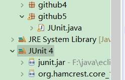


## 8.2、包装类的使用

```java
/*
 * 包装类的使用
 * 1.java提供了8种基本数据类型对应的包装类，使得基本数据类型的变量具有类的特征
 * 		基本数据类型		包装类
 * 		byte			Byte
 * 		short			Short
 * 		int 			Integer
 * 		long			Long
 * 		float			Float
 * 		double			Double
 * 		boolean			Boolean
 * 		char			Character
 * 注意:其中Byte、Short、Integer、Long、Float、Double的父类是:Number
 * /
```

## 8.3、包装类与基本数据类型相互转换

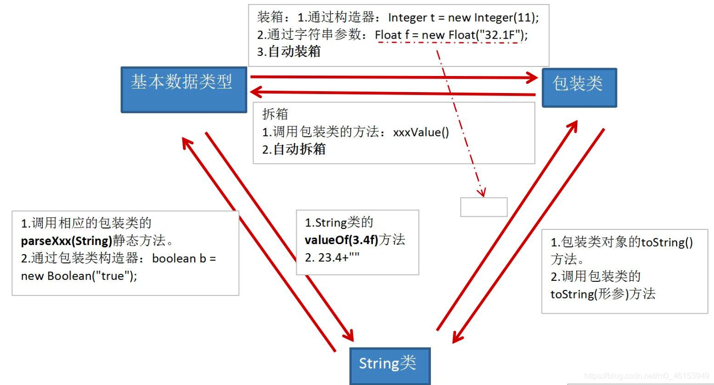

```java
import org.junit.Test;
/*
 * 2.基本数据类型、包装类、String三者之间的相互转换。
 * 
 */
public class WrapperTest {
	
	//String类型---> 基本数据类型、包装类,调用包装类的parseXxx()
	@Test
	public void test5(){
		String str1 = "123";
//		String str1 = "123a";
		
		//错误的情况，可能会报错
//		int num1 = (int)str1;
//		Integer in1 = (Integer)str1;
		
		int num2 = Integer.parseInt(str1); 
		System.out.println(num2 + 1);	//124
		
		String str2 = "true";
		Boolean b1 = Boolean.parseBoolean(str2);
		System.out.println(b1);	//true
		
	}
	
	//基本数据类型、包装类---》String类型，调用String重载的valueOf(Xxx xxx)
	@Test
	public void test4(){
		int num1 = 10;
		//方式1:连接运算
		String str1 = num1 + "";
		//方式2:调用String的valueOf(Xxx xxx)
		float f1 = 12.3f;
		String str2 = String.valueOf(f1); //"12.3"
		
		Double d1 = new Double(12.4);
		String str3 = String.valueOf(d1);
		System.out.println(str2);
		System.out.println(str3);	//"12.4"
		
	}
	
	/*
	 * JDK 5.0 新特性:自动装箱与自动拆箱
	 */
	@Test
	public void test3(){
//		int num1 = 10;
//		//基本数据类型 --》 包装类的对象
//		method(num1);	//Object obj = num1
		
		//自动装箱:基本数据类型 --》 包装类
		int num2 = 10;
		Integer in1 = num2;//自动装箱
		
		boolean b1 = true;
		Boolean b2 = b1;//自动装箱
		
		//自动拆箱：包装类 --》 基本数据类型
		System.out.println(in1.toString());
		
		int num3 = in1;
		
	}
	
	public void method(Object obj){
		System.out.println(obj);
	}
	
	//包装类 --》 基本数据类型:调用包装类的xxxValue()
	@Test
	public void test2() {
		Integer in1 = new Integer(12);
		int i1 = in1.intValue();
		System.out.println(i1 + 1); 
		
		Float f1 = new Float(12.3f);
		float f2 = f1.floatValue();
		System.out.println(f2 + 1); 
	}
	
	//基本数据类型--》包装类,调用包装类的构造器
	@Test
	public void test1() {
		int num1 = 10;
//		System.out.println(num1.toString());
		
		Integer in1 = new Integer(num1);
		System.out.println(in1.toString());
		
		Integer in2 = new Integer("123");
		System.out.println(in2.toString());
		
		//报异常
//		Integer in3 = new Integer("123abc");
//		System.out.println(in3.toString());
		
		Float f1 = new Float(12.3f);
		Float f2 = new Float("12.3");
		System.out.println(f1);
		System.out.println(f2);
		
		Boolean b1 = new Boolean(true);
		Boolean b2 = new Boolean("true");
		
		Boolean b3 = new Boolean("true123");
		System.out.println(b3); //false
		
		Order order = new Order();
		System.out.println(order.isMale); //false
		System.out.println(order.isFemale); //null
		
	}
}

class Order{
	
	boolean isMale;
	Boolean isFemale;
}
```

## 8.4、练习

> 1、面试题

```java
import org.junit.Test;
/*
 * 如下两个题目输出结果相同吗？各是什么：
 * 		Object o1= true? new Integer(1) : new Double(2.0);
 * 		System.out.println(o1);//
 * 
 * 		Object o2;
 * 		if(true)
 * 			o2 = new Integer(1);
 *		else 
 *			o2 = new Double(2.0);
 *		System.out.println(o2);//
 *
 */
public class InterViewTest {

	@Test
	public void test(){
		Object o1= true? new Integer(1) : new Double(2.0);
		System.out.println(o1);// 1.0
	}
	
	@Test
	public void test2(){
		Object o2;
		if(true)
			o2 = new Integer(1);
		else 
			o2 = new Double(2.0);
		System.out.println(o2);// 1
	}
	
	@Test
	public void method1() {
		Integer i = new Integer(1);
		Integer j = new Integer(1);
		System.out.println(i == j); //false
		
	    //Integer内部定义了一个IntegerCache结构，IntegerCache中定义Integer[]
		//保存了从-128-127范围的整数。如果我们使用自动装箱的方式，给Integer赋值的范围在其中时，
		//可以直接使用数组中的元素，不用再去new了。目的，提高效率。
		
		Integer m = 1;
		Integer n = 1;
		System.out.println(m == n);//true
		
		Integer x = 128;//相当于new了一个Integer对象
		Integer y = 128;//相当于new了一个Integer对象
		System.out.println(x == y);//false

	}
}
```

> 2、编程题

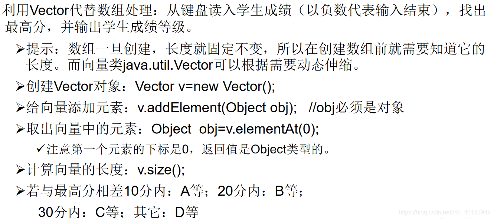

```java
import java.util.Scanner;
import java.util.Vector;

/*
 * 利用Vector代替数组处理：从键盘读入学生成绩（以负数代表输入结束），
 * 找出最高分，并输出学生成绩等级。
 * 
 * 提示：数组一旦创建，长度就固定不变，所以在创建数组前就需要知道它的长度。
 * 而向量类java.util.Vector可以根据需要动态伸缩。
 * 
 * 创建Vector对象：Vector v=new Vector();
 * 给向量添加元素：v.addElement(Object obj);   //obj必须是对象
 * 取出向量中的元素：Object  obj=v.elementAt(0);
 * 注意第一个元素的下标是0，返回值是Object类型的。
 * 计算向量的长度：v.size();
 * 若与最高分相差
 * 		10分内：A等；
 * 		20分内：B等；
 * 		30分内：C等；
 * 		其它：D等
 * 
 */
public class VectorTest {
	public static void main(String[] args) {
		// 1.实例化Scanner，用于从键盘获取学生成绩
		Scanner scan = new Scanner(System.in);

		// 2.创建Vector对象：Vector v=new Vector();相当于原来的数组
		Vector v = new Vector();

		// 3.通过for(;;)或while(true)方式，给Vector中添加数组
		int maxScore = 0;
		for (;;) {
			System.out.println("请输入学生成绩（以负数代表输入结束）");
			int score = scan.nextInt();
			// 3.2 当输入是负数时，跳出循环
			if (score < 0) {
				break;
			}
			if (score > 100) {
				System.out.println("输入的数据非法，请重新输入");
				continue;
			}
			// 3.1 添加操作：：v.addElement(Object obj)
			// jdk5.0之前：
			// Integer inScore = new Integer(score);
			// v.addElement(inScore);//多态
			// jdk5.0之后：
			v.addElement(score);// 自动装箱
			// 4.获取学生成绩的最大值
			if (maxScore < score) {
				maxScore = score;
			}
		}

		// 5.遍历Vector，得到每个学生的成绩，并与最大成绩比较，得到每个学生的等级。
		char level;
		for (int i = 0; i < v.size(); i++) {
			Object obj = v.elementAt(i);
			// jdk 5.0之前：
			// Integer inScore = (Integer)obj;
			// int score = inScore.intValue();
			// jdk 5.0之后：
			int score = (int) obj;

			if (maxScore - score <= 10) {
				level = 'A';
			} else if (maxScore - score <= 20) {
				level = 'B';
			} else if (maxScore - score <= 30) {
				level = 'C';
			} else {
				level = 'D';
			}

			System.out.println("student-" + i + " score is " + score + ",level is " + level);

		}
	}
}
```
