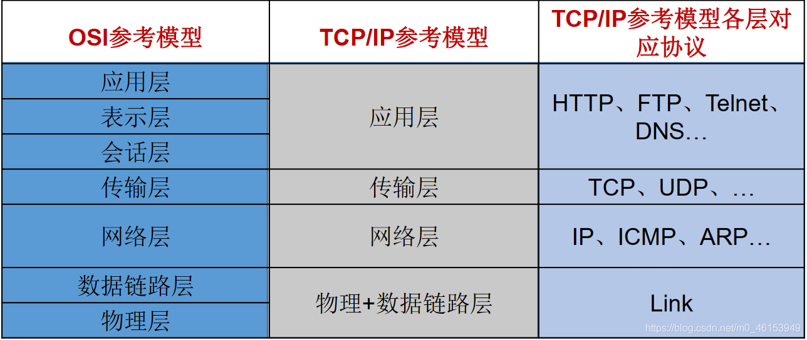
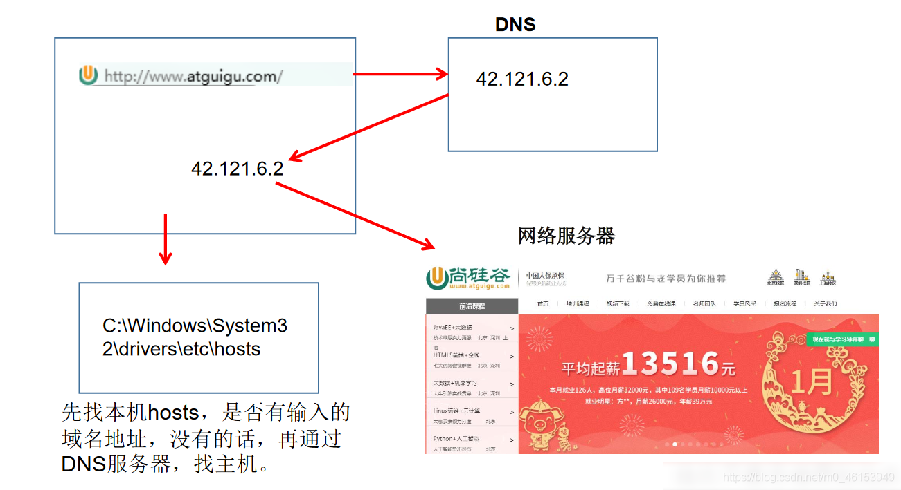
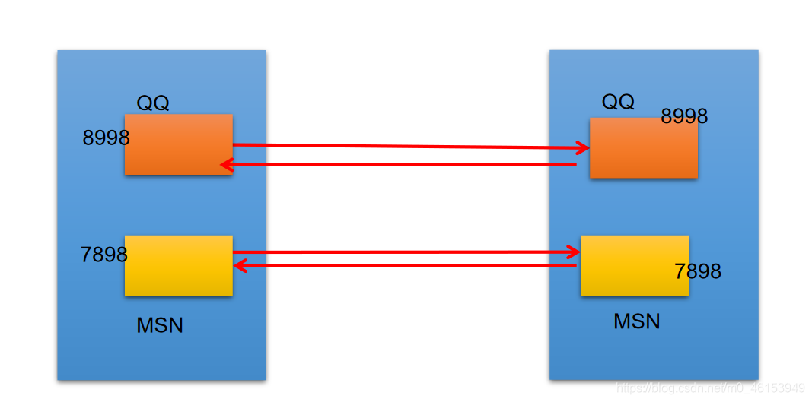
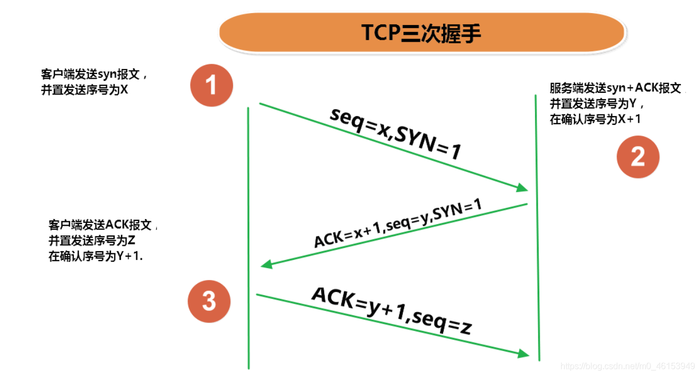
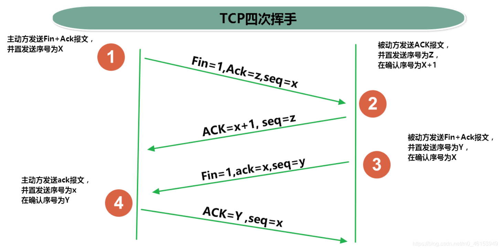
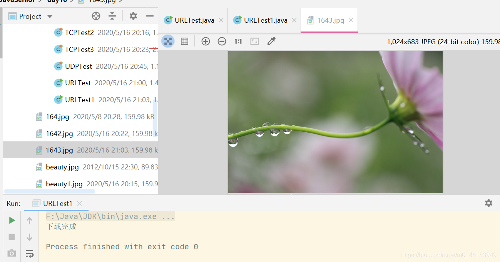
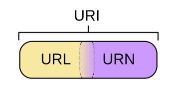

# 16网络编程

---

title: 16网络编程
tags:

- JavaEE
  categories:
- Java基础
- JavaEE
  date: 2020-07-27 00:00:00

---

# 01、网络编程概述

- Java是Internet 上的语言，它从语言级上提供了对网络应用程序的支持，程序员能够很容易开发常见的网络应用程序。
- Java提供的网络类库，可以实现无痛的网络连接，联网的底层细节被隐藏在Java 的本机安装系统里，由JVM 进行控制。并且Java 实现了一个跨平台的网络库，**程序员面对的是一个统一的网络编程环境**。
- 计算机网络：

  把分布在不同地理区域的计算机与专门的外部设备用通信线路互连成一个规模大、功能强的网络系统，从而使众多的计算机可以方便地互相传递信息、共享硬件、软件、数据信息等资源。
- 网络编程的目的：

  直接或间接地通过网络协议与其它计算机实现数据交换，进行通讯。
- 网络编程中有两个主要的问题：

  - 如何准确地定位网络上一台或多台主机；定位主机上的特定的应用
  - 找到主机后如何可靠高效地进行数据传输

# 02、网络通信要素概述

- 通信双方地址
  - IP
  - 端口号
- 一定的规则（即：网络通信协议。有两套参考模型）
  - OSI参考模型：模型过于理想化，未能在因特网上进行广泛推广
  - TCP/IP参考模型(或TCP/IP协议)：事实上的国际标准。
- 网络通信协议




```java
/**
 * 一、网络编程中有两个主要的问题：
 * 1.如何准确地定位网络上一台或多台主机；定位主机上的特定的应用
 * 2.找到主机后如何可靠高效地进行数据传输
 *
 * 二、网络编程中的两个要素：
 * 1.对应问题一：IP和端口号
 * 2.对应问题二：提供网络通信协议：TCP/IP参考模型（应用层、传输层、网络层、物理+数据链路层）
 */
```

# 03、通信要素1：IP和端口号

## 3.1、IP的理解与InetAddress类的实例化

- IP 地址：`InetAddress`
  - 唯一的标识Internet 上的计算机（通信实体）
  - 本地回环地址(hostAddress)：127.0.0.1 主机名(hostName)：localhost
  - IP地址分类方式1：IPV4和IPV6
    - IPV4：4个字节组成，4个0-255。大概42亿，30亿都在北美，亚洲4亿。2011年初已经用尽。以点分十进制表示，如192.168.0.1
    - IPV6：128位（16个字节），写成8个无符号整数，每个整数用四个十六进制位表示，数之间用冒号（：）分开，如：3ffe:3201:1401:1280:c8ff:fe4d:db39:1984
  - IP地址分类方式2：公网地址(万维网使用)和私有地址(局域网使用)。192.168.开头的就是私有地址，范围即为192.168.0.0–192.168.255.255，专门为组织机构内部使用
  - 特点：不易记忆
- Internet上的主机有两种方式表示地址：
  - 域名(hostName)：[www.atguigu.com](http://www.atguigu.com)
  - IP地址(hostAddress)：202.108.35.210
- `InetAddress`类主要表示IP地址，两个子类：`Inet4Address、Inet6Address`。
- `InetAddress`类对象含有一个Internet主机地址的域名和IP地址：[www.atguigu.com](http://www.atguigu.com)和202.108.35.210。
- 域名容易记忆，当在连接网络时输入一个主机的域名后，域名服务器(DNS)负责将域名转化成IP地址，这样才能和主机建立连接。-------域名解析



```java
import java.net.InetAddress;
import java.net.UnknownHostException;

/**
 * 一、网络编程中有两个主要的问题：
 * 1.如何准确地定位网络上一台或多台主机；定位主机上的特定的应用
 * 2.找到主机后如何可靠高效地进行数据传输
 *
 * 二、网络编程中的两个要素：
 * 1.对应问题一：IP和端口号
 * 2.对应问题二：提供网络通信协议：TCP/IP参考模型（应用层、传输层、网络层、物理+数据链路层）
 *
 *
 * 三、通信要素一：IP和端口号
 *
 * 1. IP:唯一的标识 Internet 上的计算机（通信实体）
 * 2. 在Java中使用InetAddress类代表IP
 * 3. IP分类：IPv4 和 IPv6 ; 万维网 和 局域网
 * 4. 域名:   www.baidu.com   www.mi.com  www.sina.com  www.jd.com
 *            www.vip.com
 * 5. 本地回路地址：127.0.0.1 对应着：localhost
 *
 * 6. 如何实例化InetAddress:两个方法：getByName(String host) 、 getLocalHost()
 *        两个常用方法：getHostName() / getHostAddress()
 *
  * 7. 端口号：正在计算机上运行的进程。
 * 要求：不同的进程有不同的端口号
 * 范围：被规定为一个 16 位的整数 0~65535。
 *
 * 8. 端口号与IP地址的组合得出一个网络套接字：Socket
 */
public class InetAddressTest {
    public static void main(String[] args) {

        try {
            //File file = new File("hello.txt");
            InetAddress inet1 = InetAddress.getByName("192.168.10.14");

            System.out.println(inet1);

            InetAddress inet2 = InetAddress.getByName("www.atguigu.com");
            System.out.println(inet2);

            InetAddress inet3 = InetAddress.getByName("127.0.0.1");
            System.out.println(inet3);

            //获取本地ip
            InetAddress inet4 = InetAddress.getLocalHost();
            System.out.println(inet4);

            //getHostName()
            System.out.println(inet2.getHostName());
            //getHostAddress()
            System.out.println(inet2.getHostAddress());

        } catch (UnknownHostException e) {
            e.printStackTrace();
        }
    }
}
```

## 3.2、端口号的理解

- 端口号标识正在计算机上运行的进程（程序）
  - 不同的进程有不同的端口号
  - 被规定为一个16 位的整数`0~65535`。
  - 端口分类：
    - 公认端口：`0~1023`。被预先定义的服务通信占用（如：HTTP占用端口80，FTP占用端口21，Telnet占用端口23）
    - 注册端口：`1024~49151`。分配给用户进程或应用程序。（如：Tomcat占用端口8080，MySQL占用端口3306，Oracle占用端口1521等）。
    - 动态/私有端口：`49152~65535`。
- **端口号与IP地址的组合得出一个网络套接字：**​**`Socket`**​**。**



# 04、通信要素2：网络协议

- **网络通信协议**

  计算机网络中实现通信必须有一些约定，即通信协议，对速率、传输代码、代码结构、传输控制步骤、出错控制等制定标准。
- **问题：网络协议太复杂**

  计算机网络通信涉及内容很多，比如指定源地址和目标地址，加密解密，压缩解压缩，差错控制，流量控制，路由控制，如何实现如此复杂的网络协议呢？
- **通信协议分层的思想**

  在制定协议时，把复杂成份分解成一些简单的成份，再将它们复合起来。最常用的复合方式是层次方式，即同层间可以通信、上一层可以调用下一层，而与再下一层不发生关系。各层互不影响，利于系统的开发和扩展。

## 4.1、TCP和UDP网络通信协议的对比

- 传输层协议中有两个非常重要的协议：
  - 传输控制协议TCP(Transmission Control Protocol)
  - 用户数据报协议UDP(User Datagram Protocol)。
- TCP/IP 以其两个主要协议：传输控制协议(TCP)和网络互联协议(IP)而得名，实际上是一组协议，包括多个具有不同功能且互为关联的协议。
- IP(Internet Protocol)协议是网络层的主要协议，支持网间互连的数据通信。
- TCP/IP协议模型从更实用的角度出发，形成了高效的四层体系结构，即物理链路层、IP层、传输层和应用层。
- TCP协议：
  - 使用TCP协议前，须先建立TCP连接，形成传输数据通道
  - 传输前，采用“三次握手”方式，点对点通信，是可靠的
  - TCP协议进行通信的两个应用进程：客户端、服务端。
  - 在连接中可进行大数据量的传输传输完毕，需释放已建立的连接，效率低
- UDP协议：
  - 将数据、源、目的封装成数据包，不需要建立连接
  - 每个数据报的大小限制在64K内
  - 发送不管对方是否准备好，接收方收到也不确认，故是不可靠的
  - 可以广播发送
  - 发送数据结束时无需释放资源，开销小，速度快




# 05、TCP网络编程

> 1、例题1

```java
import org.junit.Test;

import java.io.ByteArrayOutputStream;
import java.io.IOException;
import java.io.InputStream;
import java.io.OutputStream;
import java.net.InetAddress;
import java.net.ServerSocket;
import java.net.Socket;

/**
 * 实现TCP的网络编程
 * 例子1：客户端发送信息给服务端，服务端将数据显示在控制台上
 */
public class TCPTest {

    //客户端
    @Test
    public void client()  {
        Socket socket = null;
        OutputStream os = null;
        try {
            //1.创建Socket对象，指明服务器端的ip和端口号
            InetAddress inet = InetAddress.getByName("192.168.14.100");
            socket = new Socket(inet,8899);
            //2.获取一个输出流，用于输出数据
            os = socket.getOutputStream();
            //3.写出数据的操作
            os.write("你好，我是客户端HH".getBytes());
        } catch (IOException e) {
            e.printStackTrace();
        } finally {
            //4.资源的关闭
            if(os != null){
                try {
                    os.close();
                } catch (IOException e) {
                    e.printStackTrace();
                }
            }
            if(socket != null){
                try {
                    socket.close();
                } catch (IOException e) {
                    e.printStackTrace();
                }

            }
        }
    }
    //服务端
    @Test
    public void server()  {

        ServerSocket ss = null;
        Socket socket = null;
        InputStream is = null;
        ByteArrayOutputStream baos = null;
        try {
            //1.创建服务器端的ServerSocket，指明自己的端口号
            ss = new ServerSocket(8899);
            //2.调用accept()表示接收来自于客户端的socket
            socket = ss.accept();
            //3.获取输入流
            is = socket.getInputStream();

            //不建议这样写，可能会有乱码
//        byte[] buffer = new byte[1024];
//        int len;
//        while((len = is.read(buffer)) != -1){
//            String str = new String(buffer,0,len);
//            System.out.print(str);
//        }
            //4.读取输入流中的数据
            baos = new ByteArrayOutputStream();
            byte[] buffer = new byte[5];
            int len;
            while((len = is.read(buffer)) != -1){
                baos.write(buffer,0,len);
            }

            System.out.println(baos.toString());

            System.out.println("收到了来自于：" + socket.getInetAddress().getHostAddress() + "的数据");

        } catch (IOException e) {
            e.printStackTrace();
        } finally {
            if(baos != null){
                //5.关闭资源
                try {
                    baos.close();
                } catch (IOException e) {
                    e.printStackTrace();
                }
            }
            if(is != null){
                try {
                    is.close();
                } catch (IOException e) {
                    e.printStackTrace();
                }
            }
            if(socket != null){
                try {
                    socket.close();
                } catch (IOException e) {
                    e.printStackTrace();
                }
            }
            if(ss != null){
                try {
                    ss.close();
                } catch (IOException e) {
                    e.printStackTrace();
                }
            }
        }
    }
}
```

> 2、例题2

```java
import org.junit.Test;

import java.io.*;
import java.net.InetAddress;
import java.net.ServerSocket;
import java.net.Socket;

/**
 * 实现TCP的网络编程
 * 例题2：客户端发送文件给服务端，服务端将文件保存在本地。
 *
 * @author subei
 * @create 2020-05-16 17:05
 */
public class TCPTest2 {

    /**
     * 这里涉及到的异常，应该使用try-catch-finally处理
     * @throws IOException
     */
    @Test
    public void test() throws IOException {
        Socket socket = new Socket(InetAddress.getByName("127.0.0.1"),9090);
        OutputStream os = socket.getOutputStream();
        FileInputStream fis = new FileInputStream(new File("164.jpg"));
        byte[] buffer = new byte[1024];
        int len;
        while((len = fis.read(buffer)) != -1){
            os.write(buffer,0,len);
        }
        fis.close();
        os.close();
        socket.close();
    }

    /**
     * 这里涉及到的异常，应该使用try-catch-finally处理
     * @throws IOException
     */
    @Test
    public void test2() throws IOException {
        ServerSocket ss = new ServerSocket(9090);
        Socket socket = ss.accept();
        InputStream is = socket.getInputStream();
        FileOutputStream fos = new FileOutputStream(new File("1641.jpg"));
        byte[] buffer = new byte[1024];
        int len;
        while((len = is.read(buffer)) != -1){
            fos.write(buffer,0,len);
        }
        fos.close();
        is.close();
        socket.close();
        ss.close();
    }
}
```

> 3、例题3

```java
import org.junit.Test;

import java.io.*;
import java.net.InetAddress;
import java.net.ServerSocket;
import java.net.Socket;

/**
 * 实现TCP的网络编程
 * 例题3：从客户端发送文件给服务端，服务端保存到本地。并返回“发送成功”给客户端。
 * 并关闭相应的连接。
 *
 */
public class TCPTest3 {
    /**
     * 这里涉及到的异常，应该使用try-catch-finally处理
     * @throws IOException
     */
    @Test
    public void test() throws IOException {
        Socket socket = new Socket(InetAddress.getByName("127.0.0.1"),9090);
        OutputStream os = socket.getOutputStream();
        FileInputStream fis = new FileInputStream(new File("164.jpg"));
        byte[] buffer = new byte[1024];
        int len;
        while((len = fis.read(buffer)) != -1){
            os.write(buffer,0,len);
        }
        //关闭数据的输出
        socket.shutdownOutput();

        //5.接收来自于服务器端的数据，并显示到控制台上
        InputStream is = socket.getInputStream();
        ByteArrayOutputStream baos = new ByteArrayOutputStream();
        byte[] bufferr = new byte[20];
        int len1;
        while((len1 = is.read(buffer)) != -1){
            baos.write(buffer,0,len1);
        }
        System.out.println(baos.toString());

        fis.close();
        os.close();
        socket.close();
        baos.close();
    }

    /**
     * 这里涉及到的异常，应该使用try-catch-finally处理
     * @throws IOException
     */
    @Test
    public void test2() throws IOException {
        ServerSocket ss = new ServerSocket(9090);
        Socket socket = ss.accept();
        InputStream is = socket.getInputStream();
        FileOutputStream fos = new FileOutputStream(new File("1642.jpg"));
        byte[] buffer = new byte[1024];
        int len;
        while((len = is.read(buffer)) != -1){
            fos.write(buffer,0,len);
        }

        System.out.println("图片传输完成");

        //6.服务器端给予客户端反馈
        OutputStream os = socket.getOutputStream();
        os.write("你好，照片我已收到，风景不错！".getBytes());

        fos.close();
        is.close();
        socket.close();
        ss.close();
        os.close();
    }
}
```

# 06、UDP网络编程

- 类DatagramSocket和DatagramPacket实现了基于UDP 协议网络程序。
- UDP数据报通过数据报套接字DatagramSocket发送和接收，系统不保证UDP数据报一定能够安全送到目的地，也不能确定什么时候可以抵达。
- DatagramPacket 对象封装了UDP数据报，在数据报中包含了发送端的IP地址和端口号以及接收端的IP地址和端口号。
- UDP协议中每个数据报都给出了完整的地址信息，因此无须建立发送方和接收方的连接。如同发快递包裹一样。
- 流程：
  1. DatagramSocket与DatagramPacket
  2. 建立发送端，接收端
  3. 建立数据包
  4. 调用Socket的发送、接收方法
  5. 关闭Socket

> 1、发送端与接收端是两个独立的运行程序

```java
import org.junit.Test;

import java.io.IOException;
import java.net.DatagramPacket;
import java.net.DatagramSocket;
import java.net.InetAddress;

/**
 * UDPd协议的网络编程
 */
public class UDPTest {

    //发送端
    @Test
    public void sender() throws IOException {
        DatagramSocket socket = new DatagramSocket();

        String str = "我是UDP发送端";
        byte[] data = str.getBytes();
        InetAddress inet = InetAddress.getLocalHost();
        DatagramPacket packet = new DatagramPacket(data,0,data.length,inet,9090);

        socket.send(packet);
        socket.close();
    }

    //接收端
    @Test
    public void receiver() throws IOException {
        DatagramSocket socket = new DatagramSocket(9090);

        byte[] buffer = new byte[100];
        DatagramPacket packet = new DatagramPacket(buffer,0,buffer.length);

        socket.receive(packet);

        System.out.println(new String(packet.getData(),0,packet.getLength()));

        socket.close();
    }
}
```

# 07、URL编程

## 7.1、URL的理解与实例化

```java
import java.net.MalformedURLException;
import java.net.URL;

/**
 * URL网络编程
 * 1.URL:统一资源定位符，对应着互联网的某一资源地址
 * 2.格式：
 *  http://127.0.0.1:8080/work/164.jpg?username=subei
 *  协议   主机名    端口号  资源地址           参数列表
 */
public class URLTest {
    public static void main(String[] args) {
        try {
            URL url = new URL("http://127.0.0.1:8080/work/164.jpg?username=subei");

//            public String getProtocol(  )     获取该URL的协议名
            System.out.println(url.getProtocol());
//            public String getHost(  )           获取该URL的主机名
            System.out.println(url.getHost());
//            public String getPort(  )            获取该URL的端口号
            System.out.println(url.getPort());
//            public String getPath(  )           获取该URL的文件路径
            System.out.println(url.getPath());
//            public String getFile(  )             获取该URL的文件名
            System.out.println(url.getFile());
//            public String getQuery(   )        获取该URL的查询名
            System.out.println(url.getQuery());
        } catch (MalformedURLException e) {
            e.printStackTrace();
        }
    }
}
```

## 7.2、URL网络编程实现Tomcat服务端数据下载

```java
import java.io.FileOutputStream;
import java.io.IOException;
import java.io.InputStream;
import java.net.HttpURLConnection;
import java.net.URL;

public class URLTest1 {
    public static void main(String[] args) {
        HttpURLConnection urlConnection = null;
        InputStream is = null;
        FileOutputStream fos = null;
        try {
            URL url = new URL("http://127.0.0.1:8080/work/164.jpg");

            urlConnection = (HttpURLConnection) url.openConnection();

            urlConnection.connect();

            is = urlConnection.getInputStream();
            fos = new FileOutputStream("day10\\1643.jpg");

            byte[] buffer = new byte[1024];
            int len;
            while((len = is.read(buffer)) != -1){
                fos.write(buffer,0,len);
            }

            System.out.println("下载完成");
        } catch (IOException e) {
            e.printStackTrace();
        } finally {
            //关闭资源
            if(is != null){
                try {
                    is.close();
                } catch (IOException e) {
                    e.printStackTrace();
                }
            }
            if(fos != null){
                try {
                    fos.close();
                } catch (IOException e) {
                    e.printStackTrace();
                }
            }
            if(urlConnection != null){
                urlConnection.disconnect();
            }
        }
    }
}
```



## 7.3、URI、URL和URN的区别

+ URI，是uniform resource identifier，统一资源标识符，用来唯一的标识一个资源。而URL是uniform resource locator，**统一资源定位符**，它是一种具体的URI，即URL可以用来标识一个资源，而且还指明了如何locate这个资源。而URN，uniform resource name，统一资源命名，是通过名字来标识资源，比如mailto:java-net@java.sun.com。也就是说，URI是以一种抽象的，高层次概念定义统一资源标识，而URL和URN则是具体的资源标识的方式。URL和URN都是一种URI。
+ 在Java的URI中，一个URI实例可以代表绝对的，也可以是相对的，只要它符合URI的语法规则。而URL类则不仅符合语义，还包含了定位该资源的信息，因此它不能是相对的。
  
