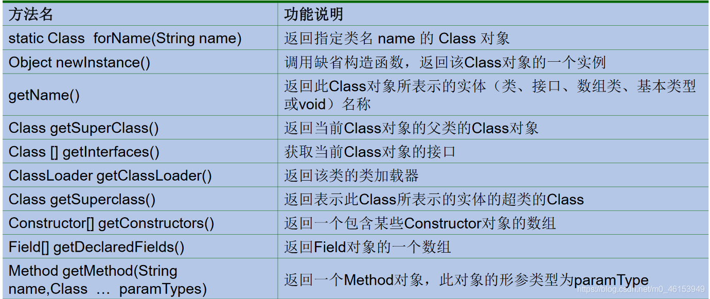
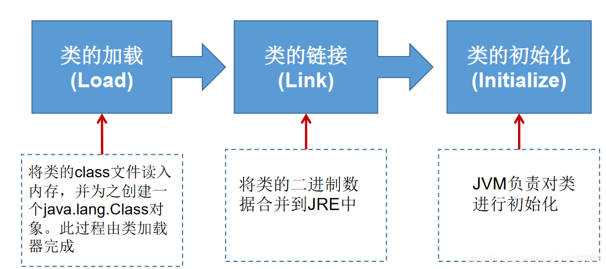
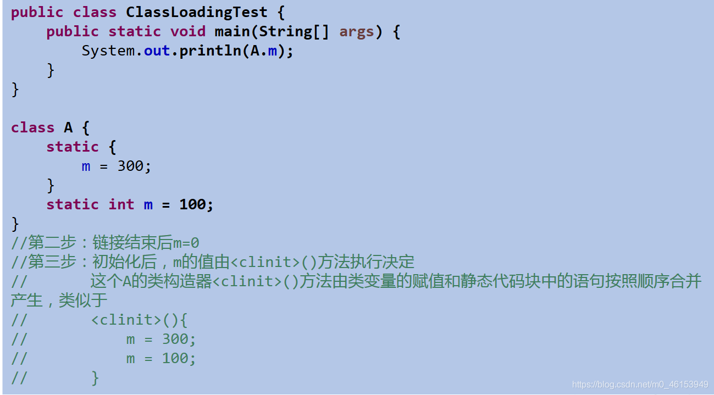
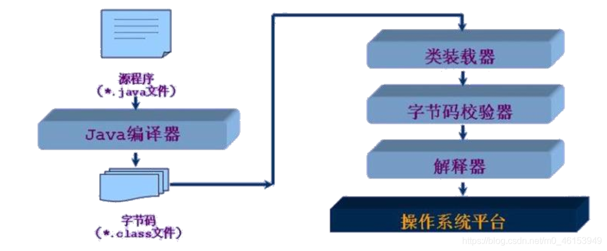
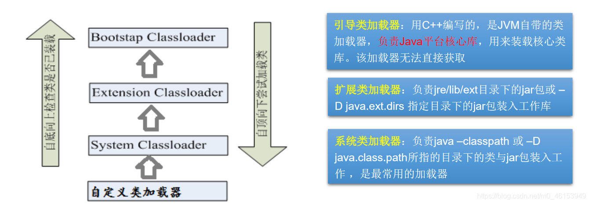
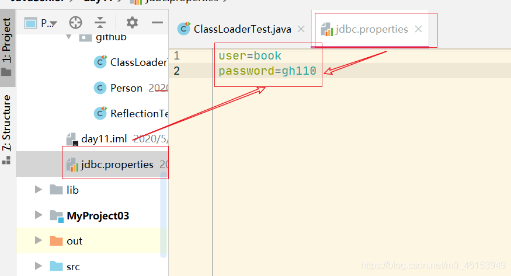
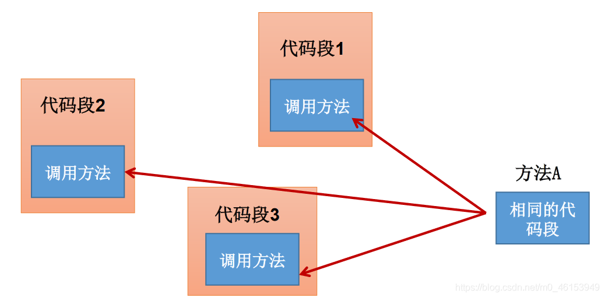
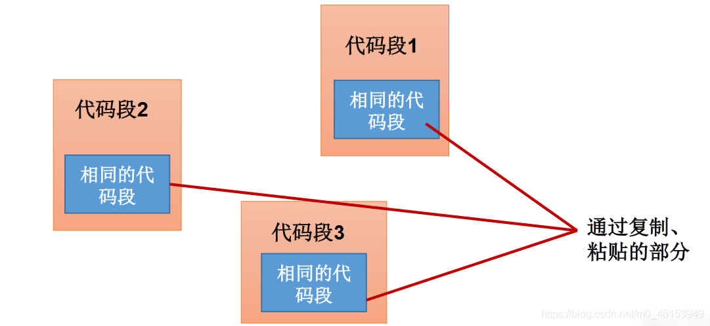
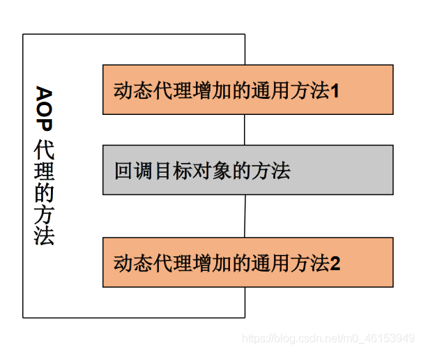

# 17反射与动态代理

---

title: 17反射与动态代理
tags:

- JavaEE
  categories:
- Java基础
- JavaEE
  date: 2020-07-27 00:00:00

---

# 01、Java反射机制概述

Reflection（反射）是被视为动态语言的关键，反射机制允许程序在执行期借助于Reflection API取得任何类的内部信息，并能直接操作任意对象的内部属性及方法。

加载完类之后，在堆内存的方法区中就产生了一个Class类型的对象（一个类只有一个Class对象），这个对象就包含了完整的类的结构信息。我们可以通过这个对象看到类的结构。这个对象就像一面镜子，透过这个镜子看到类的结构，所以，我们形象的称之为：反射。


> 1、动态语言

是一类在运行时可以改变其结构的语言：例如新的函数、对象、甚至代码可以被引进，已有的函数可以被删除或是其他结构上的变化。通俗点说就是在运行时代码可以根据某些条件改变自身结构。主要动态语言：Object-C、C#、JavaScript、PHP、Python、Erlang。

> 2、静态语言

与动态语言相对应的，运行时结构不可变的语言就是静态语言。如Java、C、C++。

- Java不是动态语言，但Java可以称之为“准动态语言”。即Java有一定的动态性，我们可以利用反射机制、字节码操作获得类似动态语言的特性。Java的动态性让编程的时候更加灵活！
- Java反射机制提供的功能
  - 在运行时判断任意一个对象所属的类
  - 在运行时构造任意一个类的对象
  - 在运行时判断任意一个类所具有的成员变量和方法
  - 在运行时获取泛型信息
  - 在运行时调用任意一个对象的成员变量和方法
  - 在运行时处理注解
  - 生成动态代理
- 反射相关的主要API
  - `java.lang.Class`:代表一个类
  - `java.lang.reflect.Method`:代表类的方法
  - `java.lang.reflect.Field`:代表类的成员变量
  - `java.lang.reflect.Constructor`:代表类的构造器

> 测试类

```java
import org.junit.Test;

public class ReflectionTest {

    //反射之前，对于Person的操作
    @Test
    public void test(){

        //1.创建类的对象
        Person p1 = new Person("jay",21);

        //2.调用对象,调用其内部的属性和方法
        p1.age = 15;
        System.out.println(p1.toString());

        p1.show();

        //在Person类的外部，不可以通过Person类的对象调用其内部私有的结构。
        //比如：name、showNation以及私有的构造器。
        
    }
}
```

> Person类

```java
package github;

public class Person {
    private String name;
    public int age;

    public String getName() {
        return name;
    }

    public void setName(String name) {
        this.name = name;
    }

    public int getAge() {
        return age;
    }

    public void setAge(int age) {
        this.age = age;
    }

    public Person() {
    }

    public Person(String name, int age) {
        this.name = name;
        this.age = age;
    }

    private Person(String name) {
        this.name = name;
    }

    @Override
    public String toString() {
        return "Person{" +
                "name='" + name + '\'' +
                ", age=" + age +
                '}';
    }

    public void show(){
        System.out.println("你好，我是🔔");
    }

    private String showNation(String nation){
        System.out.println("喷子实在太多了！！！" + nation);
        return nation;
    }
}
```

## 1.1、使用反射，实现同上的操作

```java
import org.junit.Test;

import java.lang.reflect.Constructor;
import java.lang.reflect.Field;
import java.lang.reflect.InvocationTargetException;
import java.lang.reflect.Method;

public class ReflectionTest {

    //反射之后 ，堆与Person的操作
    @Test
    public void test2() throws NoSuchMethodException, IllegalAccessException, InvocationTargetException, InstantiationException, NoSuchFieldException {
        Class clazz = Person.class;
        //1.通过反射，创建Person类的对象
        Constructor cons = clazz.getConstructor(String.class,int.class);
        Object obj = cons.newInstance("Jon",18);
        Person p = (Person) obj;
        System.out.println(p.toString());
        //2.通过反射，调用对象指定的属性和方法
        //调用属性
        Field age = clazz.getDeclaredField("age");
        age.set(p,10);
        System.out.println(p.toString());

        //调用方法
        Method show = clazz.getDeclaredMethod("show");
        show.invoke(p);

    }
}
```

## 1.2、反射的强大：调用类的私有结构

```java
import org.junit.Test;

import java.lang.reflect.Constructor;
import java.lang.reflect.Field;
import java.lang.reflect.Method;

public class ReflectionTest {
     //反射之后 ，堆与Person的操作
    @Test
    public void test2() throws Exception{
        Class clazz = Person.class;
        //1.通过反射，创建Person类的对象
        Constructor cons = clazz.getConstructor(String.class,int.class);
        Object obj = cons.newInstance("Jon",18);
        Person p = (Person) obj;
        System.out.println(p.toString());
        //2.通过反射，调用对象指定的属性和方法
        //调用属性
        Field age = clazz.getDeclaredField("age");
        age.set(p,10);
        System.out.println(p.toString());

        //调用方法
        Method show = clazz.getDeclaredMethod("show");
        show.invoke(p);

        System.out.println("+++++++++++++++++++++++++");

        //通过反射，是可以调用Person类的私有结构的。比如：私有的构造器、方法、属性
        //调用私有的构造器
        Constructor cons2 = clazz.getDeclaredConstructor(String.class);
        cons2.setAccessible(true);
        Person p1 = (Person) cons2.newInstance("kalo");
        System.out.println(p1);

        //调用私有的属性
        Field name = clazz.getDeclaredField("name");
        name.setAccessible(true);
        name.set(p1,"Taoyao");
        System.out.println(p1);

        //调用私有的方法
        Method showNation = clazz.getDeclaredMethod("LiNin", String.class);
        showNation.setAccessible(true);
        String nation = (String) showNation.invoke(p1,"FaceBook");
        //相当于String nation = p1.showNation("FaceBook")
        System.out.println(nation);
    }

    /**
     * 疑问1：通过直接new的方式或反射的方式都可以调用公共的结构，开发中到底用那个？
     * 建议：直接new的方式。
     * 什么时候会使用：反射的方式。 反射的特征：动态性
     * 疑问2：反射机制与面向对象中的封装性是不是矛盾的？如何看待两个技术？
     * 不矛盾。
     */
}
```

# 02、理解Class类并获取Class实例

## 2.3、Class类的理解

```java
    /**
     * 关于java.lang.Class类的理解
     * 1.类的加载过程：
     * 程序经过Javac.exe命令后，会生成一个或多个字节码文件(.class结尾)。
     * 接着我们使用java.exe命令对某个字节码文件进行解释运行。相当于将某个字节码文件
     * 加载到内存中。此过程就称为类的加载。加载到内存中的类，我们就称为运行时类，此
     * 运行时类，就作为Class的一个实例。
     *
     * 2.换句话说，Class的实例就对应着一个运行时类。
     */
```

> **Class类的常用方法**



## 2.4、获取Class实例的4种方式

```java
import org.junit.Test;

import java.lang.annotation.ElementType;
import java.lang.reflect.Constructor;
import java.lang.reflect.Field;
import java.lang.reflect.Method;

public class ReflectionTest {

    /**
     * 2.换句话说，Class的实例就对应着一个运行时类。
     * 3.加载到内存中的运行时类，会缓存一定的时间。在此时间之内，我们可以通过不同的方式
     * 来获取此运行时类。
     */


    @Test
    public void test3() throws ClassNotFoundException {
        //方式一：
        Class c1 = Person.class;
        System.out.println(c1);

        //方式二：通过运行时类的对象,调用getClass()
        Person p1 = new Person();
        Class c2 = p1.getClass();
        System.out.println(c2);

        //方式三：调用Class的静态方法：forName(String classPath)
        Class c3 = Class.forName("www.gh110.com");
//        c3 = Class.forName("www.123.com");
        System.out.println(c3);

        System.out.println(c1 == c2);
        System.out.println(c1 == c3);

        //方式四：使用类的加载器：ClassLoader  (了解)
        ClassLoader classLoader = ReflectionTest.class.getClassLoader();
        Class c4 = classLoader.loadClass("www.gh110.com");
        System.out.println(c4);

        System.out.println(c1 == c4);
    }
}
```

## 2.5、Class实例对应的结构的说明

> 1、哪些类型可以有Class对象？

（1）`class`：外部类，成员(成员内部类，静态内部类)，局部内部类，匿名内部类
（2）`interface`：接口
（3）`[]`：数组
（4）`enum`：枚举
（5）`annotation`：注解`@interface`
（6）`primitivetype`：基本数据类型
（7）`void`

```java
import org.junit.Test;
import java.lang.annotation.ElementType;
import java.lang.reflect.Constructor;
import java.lang.reflect.Field;
import java.lang.reflect.Method;

public class ReflectionTest {

    //万事万物皆对象？对象.xxx,File,URL,反射,前端、数据库操作

    /**
     * Class实例可以是哪些结构的说明：
     */
    @Test
    public void test4() {
        Class s1 = Object.class;
        Class s2 = Comparable.class;
        Class s3 = String[].class;
        Class s4 = int[][].class;
        Class s5 = ElementType.class;
        Class s6 = Override.class;
        Class s7 = int.class;
        Class s8 = void.class;
        Class s9 = Class.class;

        int[] a = new int[10];
        int[] b = new int[100];
        Class s10 = a.getClass();
        Class s11 = b.getClass();
        // 只要数组的元素类型与维度一样，就是同一个Class
        System.out.println(s10 == s11);
    }

}
```

# 03、类的加载与ClassLoader的理解

## 3.6、了解：类的加载过程

> 当程序主动使用某个类时，如果该类还未被加载到内存中，则系统会通过如下三个步骤来对该类进行初始化。



> 说明

- 加载：将class文件字节码内容加载到内存中，并将这些静态数据转换成方法区的运行时数据结构，然后生成一个代表这个类的java.lang.Class对象，作为方法区中类数据的访问入口（即引用地址）。所有需要访问和使用类数据只能通过这个Class对象。这个加载的过程需要类加载器参与。
- 链接：将Java类的二进制代码合并到JVM的运行状态之中的过程。
  - 验证：确保加载的类信息符合JVM规范，例如：以cafe开头，没有安全方面的问题
  - 准备：正式为类变量（static）分配内存并设置类变量默认初始值的阶段，这些内存都将在方法区中进行分配。
  - 解析：虚拟机常量池内的符号引用（常量名）替换为直接引用（地址）的过程。
- 初始化：
  - 执行类构造器()方法的过程。类构造器()方法是由编译期自动收集类中所有类变量的赋值动作和静态代码块中的语句合并产生的。（类构造器是构造类信息的，不是构造该类对象的构造器）。
  - 当初始化一个类的时候，如果发现其父类还没有进行初始化，则需要先触发其父类的初始化。
  - 虚拟机会保证一个类的()方法在多线程环境中被正确加锁和同步。



## 3.7、了解：什么时候会发生类初始化？

- 类的主动引用（一定会发生类的初始化）
  - 当虚拟机启动，先初始化main方法所在的类
  - new一个类的对象
  - 调用类的静态成员（除了final常量）和静态方法
  - 使用java.lang.reflect包的方法对类进行反射调用
  - 当初始化一个类，如果其父类没有被初始化，则先会初始化它的父类
- 类的被动引用（不会发生类的初始化）
  - 当访问一个静态域时，只有真正声明这个域的类才会被初始化
    - 当通过子类引用父类的静态变量，不会导致子类初始化
  - 通过数组定义类引用，不会触发此类的初始化
  - 引用常量不会触发此类的初始化（常量在链接阶段就存入调用类的常量池中了）

## 3.8、ClassLoader的理解



- 类加载器的作用：
  - 类加载的作用：将class文件字节码内容加载到内存中，并将这些静态数据转换成方法区的运行时数据结构，然后在堆中生成一个代表这个类的java.lang.Class对象，作为方法区中类数据的访问入口。
  - 类缓存：标准的JavaSE类加载器可以按要求查找类，但一旦某个类被加载到类加载器中，它将维持加载（缓存）一段时间。不过JVM垃圾回收机制可以回收这些Class对象。
- 类加载器作用是用来把类(class)装载进内存的。JVM 规范定义了如下类型的类的加载器。



```java
import org.junit.Test;

/**
 * 了解类的加载器
 *
 */
public class ClassLoaderTest {
    
    @Test
    public void test1(){
        //对于自定义类，使用系统类加载器进行加载
        ClassLoader classLoader = ClassLoaderTest.class.getClassLoader();
        System.out.println(classLoader);
        //调用系统类加载器的getParent()：获取扩展类加载器
        ClassLoader classLoader1 = classLoader.getParent();
        System.out.println(classLoader1);
        //调用扩展类加载器的getParent()：无法获取引导类加载器
        //引导类加载器主要负责加载java的核心类库，无法加载自定义类的。
        ClassLoader classLoader2 = classLoader1.getParent();
        System.out.println(classLoader2);

        ClassLoader classLoader3 = String.class.getClassLoader();
        System.out.println(classLoader3);
    }
}
```

## 3.9、使用ClassLoader加载配置文件



```java
import org.junit.Test;

import java.io.InputStream;
import java.util.Properties;

/**
 * 了解类的加载器
 */
public class ClassLoaderTest {

    /**
     * Properties：用来读取配置文件。
     * @throws Exception
     */
    @Test
    public void test2() throws Exception {
        Properties pros = new Properties();
        //此时的文件默认在当前的module下。
        //读取配置文件的方式一：
//        FileInputStream fis = new FileInputStream("jdbc.properties");
//        pros.load(fis);

        //读取配置文件的方式二：使用ClassLoader
        //配置文件默认识别为：当前module的src下
        ClassLoader classLoader = ClassLoaderTest.class.getClassLoader();
        InputStream is = classLoader.getResourceAsStream("jdbc1.properties");
        pros.load(is);

        String user = pros.getProperty("user");
        String password = pros.getProperty("password");
        System.out.println("user = " + user + ",password = " + password);
    }
}
```

# 04、通过反射，创建运行时类的对象

```java
import org.junit.Test;

/**
 * 通过发射创建对应的运行时类的对象
 */
public class NewInstanceTest {

    @Test
    public void test() throws Exception {
        Class<Person> clazz = Person.class;
        /**
         * newInstance():调用此方法，创建对应的运行时类的对象。内部调用了运行时类的空参的构造器。
         *
         * 要想此方法正常的创建运行时类的对象，要求：
         * 1.运行时类必须提供空参的构造器
         * 2.空参的构造器的访问权限得够。通常，设置为public。
         *
         * 在javabean中要求提供一个public的空参构造器。原因：
         * 1.便于通过反射，创建运行时类的对象
         * 2.便于子类继承此运行时类时，默认调用super()时，保证父类有此构造器
         */
        Person obj = clazz.newInstance();
        System.out.println(obj);
    }
}
```

## 4.1、举例体会反射的动态性

```java
import org.junit.Test;
import java.util.Random;

/**
 * 通过发射创建对应的运行时类的对象
 */
public class NewInstanceTest {

    @Test
    public void test2(){
        for(int i = 0;i < 100;i++){
            int num = new Random().nextInt(3);//0,1,2
            String classPath = "";
            switch(num){
                case 0:
                    classPath = "java.util.Date";
                    break;
                case 1:
                    classPath = "java.lang.Object";
                    break;
                case 2:
                    classPath = "www.java.Person";
                    break;
            }
            try {
                Object obj = getInstance(classPath);
                System.out.println(obj);
            } catch (Exception e) {
                e.printStackTrace();
            }
        }
    }

    /**
     * 创建一个指定类的对象。
     * classPath:指定类的全类名
     *
     * @param classPath
     * @return
     * @throws Exception
     */
    public Object getInstance(String classPath) throws Exception {
        Class clazz =  Class.forName(classPath);
        return clazz.newInstance();
    }
}
```

# 05、获取运行时类的完整结构

## 5.1、提供结构丰富Person类

> 1、Person类

```java
@MyAnnotation(value="java")
public class Person extends Creature<String> implements Comparable<String>,MyInterface{

    private String name;
    int age;
    public int id;

    public Person() {
    }

    @MyAnnotation(value="C++")
    Person(String name){
        this.name = name;
    }

    private Person(String name,int age){
        this.name = name;
        this.age = age;
    }

    @MyAnnotation
    private String show(String nation){
        System.out.println("我来自" + nation + "星系");
        return nation;
    }

    @Override
    public void info() {
        System.out.println("火星喷子");
    }

    public String display(String play){
        return play;
    }

    @Override
    public int compareTo(String o) {
        return 0;
    }
}
```

> 2、Creature类

```java
import java.io.Serializable;

public abstract class Creature <T> implements Serializable {
    private char gender;
    public double weight;

    private void breath(){
        System.out.println("太阳系");
    }

    public void eat(){
        System.out.println("银河系");
    }
}
```

> 3、MyInterface

```java
public interface MyInterface {
    void info();
}
```

> 4、MyAnnotation

```java
import java.lang.annotation.Retention;
import java.lang.annotation.RetentionPolicy;
import java.lang.annotation.Target;

import static java.lang.annotation.ElementType.*;

@Target({TYPE, FIELD, METHOD, PARAMETER, CONSTRUCTOR, LOCAL_VARIABLE})
@Retention(RetentionPolicy.RUNTIME)
public @interface MyAnnotation {
    String value() default "hello world";
}
```

## 5.2、获取运行时类的属性结构及其内部结构

> 1、Person类

```java
package github2;

@MyAnnotation(value="java")
public class Person extends Creature<String> implements Comparable<String>,MyInterface{

    private String name;
    int age;
    public int id;

    public Person() {
    }

    @MyAnnotation(value="C++")
    Person(String name){
        this.name = name;
    }

    private Person(String name,int age){
        this.name = name;
        this.age = age;
    }

    @MyAnnotation
    private String show(String nation){
        System.out.println("我来自" + nation + "星系");
        return nation;
    }

    @Override
    public void info() {
        System.out.println("火星喷子");
    }

    public String display(String play){
        return play;
    }

    @Override
    public int compareTo(String o) {
        return 0;
    }
}
```

> 2、测试类

```java
import github2.Person;
import org.junit.Test;

import java.lang.reflect.Field;
import java.lang.reflect.Modifier;

/**
 * 获取当前运行时类的属性结构
 */
public class FieldTest {

    @Test
    public void test(){
        Class clazz = Person.class;
        //获取属性结构
        //getFields():获取当前运行时类及其父类中声明为public访问权限的属性
        Field[] fields = clazz.getFields();
        for(Field f : fields){
            System.out.println(f);
        }
        System.out.println("++++++++++++++++++");
        //getDeclaredFields():获取当前运行时类中声明的所有属性。（不包含父类中声明的属性）
        Field[] declaredFields = clazz.getDeclaredFields();
        for(Field f : declaredFields){
            System.out.println(f);
        }
    }

    //权限修饰符  数据类型 变量名
    @Test
    public void test2(){
        Class clazz = Person.class;
        Field[] declaredFields = clazz.getDeclaredFields();
        for(Field f : declaredFields){
            //1.权限修饰符
            int modifier = f.getModifiers();
            System.out.print(Modifier.toString(modifier) + "\t");
            System.out.println("+++++++++++++++++++++++++++");
            //2.数据类型
            Class type = f.getType();
            System.out.print(type.getName() + "\t");
            System.out.println("***************************");
            //3.变量名
            String fName = f.getName();
            System.out.print(fName);
        }
    }
}
```

## 5.3、获取运行时类的方法结构

> 1、Person类

```java
package github2;

@MyAnnotation(value="java")
public class Person extends Creature<String> implements Comparable<String>,MyInterface{

    private String name;
    int age;
    public int id;

    public Person() {
    }

    @MyAnnotation(value="C++")
    Person(String name){
        this.name = name;
    }

    private Person(String name,int age){
        this.name = name;
        this.age = age;
    }

    @MyAnnotation
    private String show(String nation){
        System.out.println("我来自" + nation + "星系");
        return nation;
    }

    @Override
    public void info() {
        System.out.println("火星喷子");
    }

    public String display(String play){
        return play;
    }

    @Override
    public int compareTo(String o) {
        return 0;
    }
}
```

> 2、测试类

```java
package github3;

import github2.Person;
import org.junit.Test;

import java.lang.reflect.Method;

/**
 * 获取运行时类的方法结构
 */
public class MythodTest {
    @Test
    public void test(){
        Class clazz = Person.class;
        //getMethods():获取当前运行时类及其所有父类中声明为public权限的方法
        Method[] methods = clazz.getMethods();
        for(Method m : methods){
            System.out.println(m + "****");
        }
        System.out.println("++++++++++++++++++++++++++++");
        //getDeclaredMethods():获取当前运行时类中声明的所有方法。（不包含父类中声明的方法）
        Method[] declaredMethods = clazz.getDeclaredMethods();
        for(Method m : declaredMethods){
            System.out.println(m);
        }
    }
}
```

## 5.4、获取运行时类的方法的内部结构

> 1、Person类

```java
@MyAnnotation(value="java")
public class Person extends Creature<String> implements Comparable<String>,MyInterface{

    private String name;
    int age;
    public int id;

    public Person() {
    }

    @MyAnnotation(value="C++")
    Person(String name){
        this.name = name;
    }

    private Person(String name,int age){
        this.name = name;
        this.age = age;
    }

    @MyAnnotation
    private String show(String nation){
        System.out.println("我来自" + nation + "星系");
        return nation;
    }

    @Override
    public void info() {
        System.out.println("火星喷子");
    }

    public String display(String interests,int age) throws Exception{
        return interests + age;
    }

    @Override
    public int compareTo(String o) {
        return 0;
    }
    
    @Override
    public String toString() {
        return "Person{" +
                "name='" + name + '\'' +
                ", age=" + age +
                ", id=" + id +
                '}';
    }
}
```

> 2、测试类

```java
package github3;

import github2.Person;
import org.junit.Test;

import java.lang.annotation.Annotation;
import java.lang.reflect.Method;
import java.lang.reflect.Modifier;

/**
 * 获取运行时类的方法结构
 */
public class MythodTest {

    /**
     * @Xxxx
     * 权限修饰符  返回值类型  方法名(参数类型1 形参名1,...) throws XxxException{}
     */
    @Test
    public void test2() {
        Class clazz = Person.class;
        Method[] declaredMethods = clazz.getDeclaredMethods();
        for (Method m : declaredMethods) {
            //1.获取方法声明的注解
            Annotation[] annos = m.getAnnotations();
            for (Annotation a : annos) {
                System.out.println(a + "KKKK");
            }

            //2.权限修饰符
            System.out.print(Modifier.toString(m.getModifiers()) + "\t");

            //3.返回值类型
            System.out.print(m.getReturnType().getName() + "\t");

            //4.方法名
            System.out.print(m.getName());
            System.out.print("(");
            //5.形参列表
            Class[] pTs = m.getParameterTypes();
            if(!(pTs == null && pTs.length == 0)){
                for(int i = 0;i < pTs.length;i++){
                    if(i == pTs.length - 1){
                        System.out.print(pTs[i].getName() + " args_" + i);
                        break;
                    }
                    System.out.print(pTs[i].getName() + " args_" + i + ",");
                }
            }
            System.out.print(")");

            //6.抛出的异常
            Class[] eTs = m.getExceptionTypes();
            if(eTs.length > 0){
                System.out.print("throws ");
                for(int i = 0;i < eTs.length;i++){
                    if(i == eTs.length - 1){
                        System.out.print(eTs[i].getName());
                        break;
                    }
                    System.out.print(eTs[i].getName() + ",");
                }
            }
            System.out.println("TQA");
        }
    }

}
```

## 5.5、获取运行时类的构造器结构

```java
package github3;

import github2.Person;
import org.junit.Test;

import java.lang.reflect.Constructor;

public class OtherTest {
    /**
     * 获取构造器的结构
     */
    @Test
    public void test(){
        Class clazz = Person.class;
        //getConstructors():获取当前运行时类中声明为public的构造器
        Constructor[] constructors = clazz.getConstructors();
        for(Constructor c : constructors){
            System.out.println(c);
        }
        System.out.println("************************");
        //getDeclaredConstructors():获取当前运行时类中声明的所有的构造器
        Constructor[] declaredConstructors = clazz.getDeclaredConstructors();
        for(Constructor c : declaredConstructors){
            System.out.println(c);
        }
    }
}
```

## 5.6、获取运行时类的父类及父类的泛型

```java
package github3;

import github2.Person;
import org.junit.Test;

import java.lang.reflect.Constructor;
import java.lang.reflect.ParameterizedType;
import java.lang.reflect.Type;

public class OtherTest {
    /**
     * 获取运行时类的父类
     */
    @Test
    public void test2(){
        Class clazz = Person.class;
        Class superclass = clazz.getSuperclass();
        System.out.println(superclass);
    }

    /**
     * 获取运行时类的带泛型的父类
     */
    @Test
    public void test3(){
        Class clazz = Person.class;
        Type genericSuperclass = clazz.getGenericSuperclass();
        System.out.println(genericSuperclass);
    }

    /**
     * 获取运行时类的带泛型的父类的泛型
     */
    @Test
    public void test4(){
        Class clazz = Person.class;
        Type genericSuperclass = clazz.getGenericSuperclass();
        ParameterizedType paramType = (ParameterizedType) genericSuperclass;
        //获取泛型类型
        Type[] actualTypeArguments = paramType.getActualTypeArguments();
//        System.out.println(actualTypeArguments[0].getTypeName());
        System.out.println(((Class)actualTypeArguments[0]).getName());
    }
}
```

## 5.7、获取运行时类的接口、所在包、注解等

```java
package github3;

import github2.Person;
import org.junit.Test;

import java.lang.annotation.Annotation;
import java.lang.reflect.Constructor;
import java.lang.reflect.ParameterizedType;
import java.lang.reflect.Type;

public class OtherTest {
    /**
     * 获取运行时类实现的接口
     */
    @Test
    public void test5(){
        Class clazz = Person.class;

        Class[] interfaces = clazz.getInterfaces();
        for(Class c : interfaces){
            System.out.println(c);
        }
        System.out.println("++++++++++++++++++++++");
       
        //获取运行时类的父类实现的接口
        Class[] interfaces1 = clazz.getSuperclass().getInterfaces();
        for(Class c : interfaces1){
            System.out.println(c);
        }
    }

    /**
     * 获取运行时类所在的包
     */
    @Test
    public void test6(){
        Class clazz = Person.class;
        Package pack = clazz.getPackage();
        System.out.println(pack);
    }

    /**
     * 获取运行时类声明的注解
     */
    @Test
    public void test7(){
        Class clazz = Person.class;
        Annotation[] annotations = clazz.getAnnotations();
        for(Annotation annos : annotations){
            System.out.println(annos);
        }
    }
}
```

# 06、调用运行时类的指定结构

## 6.1、调用运行时类中的指定属性

> 1、Person类

```java
package github2;

@MyAnnotation(value="java")
public class Person extends Creature<String> implements Comparable<String>,MyInterface{

    private String name;
    int age;
    public int id;

    public Person() {
    }

    @MyAnnotation(value="C++")
    Person(String name){
        this.name = name;
    }

    private Person(String name,int age){
        this.name = name;
        this.age = age;
    }

    @MyAnnotation
    private String show(String nation){
        System.out.println("我来自" + nation + "星系");
        return nation;
    }

    @Override
    public void info() {
        System.out.println("火星喷子");
    }

    public String display(String interests,int age) throws Exception{
        return interests + age;
    }

    @Override
    public int compareTo(String o) {
        return 0;
    }

    @Override
    public String toString() {
        return "Person{" +
                "name='" + name + '\'' +
                ", age=" + age +
                ", id=" + id +
                '}';
    }
}
```

> 2、测试类

```java
package github3;

import github2.Person;
import org.junit.Test;

import java.lang.reflect.Field;

/**
 * 调用运行时类中指定的结构：属性、方法、构造器
 */
public class ReflectionTest {
    /**
     * 不需要掌握
     */
    @Test
    public void testField() throws Exception {
        Class clazz = Person.class;

        //创建运行时类的对象
        Person p = (Person) clazz.newInstance();

        //获取指定的属性：要求运行时类中属性声明为public
        //通常不采用此方法
        Field id = clazz.getField("id");

        //设置当前属性的值
        //set():参数1：指明设置哪个对象的属性   参数2：将此属性值设置为多少
        id.set(p,1001);

        //获取当前属性的值
        //get():参数1：获取哪个对象的当前属性值
        int pId = (int) id.get(p);
        System.out.println(pId);
    }

    /**
     * 如何操作运行时类中的指定的属性 -- 需要掌握
     */
    @Test
    public void testField1() throws Exception {
        Class clazz = Person.class;

        //创建运行时类的对象
        Person p = (Person) clazz.newInstance();

        //1. getDeclaredField(String fieldName):获取运行时类中指定变量名的属性
        Field name = clazz.getDeclaredField("name");

        //2.保证当前属性是可访问的
        name.setAccessible(true);

        //3.获取、设置指定对象的此属性值
        name.set(p,"Jam");
        System.out.println(name.get(p));
    }
}
```

## 6.2、调用运行时类中的指定方法

```java
package github3;

import github2.Person;
import org.junit.Test;

import java.lang.reflect.Constructor;
import java.lang.reflect.Field;
import java.lang.reflect.Method;

/**
 * 调用运行时类中指定的结构：属性、方法、构造器
 */
public class ReflectionTest {
    /**
     * 如何操作运行时类中的指定的方法 -- 需要掌握
     */
    @Test
    public void testMethod() throws Exception {
        Class clazz = Person.class;
        //创建运行时类的对象
        Person p = (Person) clazz.newInstance();

        //1.获取指定的某个方法
        //getDeclaredMethod():参数1 ：指明获取的方法的名称  参数2：指明获取的方法的形参列表
        Method show = clazz.getDeclaredMethod("show", String.class);

        //2.保证当前方法是可访问的
        show.setAccessible(true);

        //3.调用方法的invoke():参数1：方法的调用者  参数2：给方法形参赋值的实参
        //invoke()的返回值即为对应类中调用的方法的返回值。
        Object returnValue = show.invoke(p,"CCA"); //String nation = p.show("CCA");
        System.out.println(returnValue);

        System.out.println("+++++++++如何调用静态方法+++++++++++");

//    private static void showDesc()

        Method showDesc = clazz.getDeclaredMethod("showDown");
        showDesc.setAccessible(true);
        //如果调用的运行时类中的方法没有返回值，则此invoke()返回null
//    Object returnVal = showDesc.invoke(null);
        Object returnVal = showDesc.invoke(Person.class);
        System.out.println(returnVal);//null
    }
}
```

## 6.3、调用运行时类中的指定构造器

```java
import github2.Person;
import org.junit.Test;

import java.lang.reflect.Constructor;
import java.lang.reflect.Field;
import java.lang.reflect.Method;

/**
 * 调用运行时类中指定的结构：属性、方法、构造器
 */
public class ReflectionTest {

    /**
     * 如何调用运行时类中的指定的构造器
     */
    @Test
    public void testConstructor() throws Exception {
        Class clazz = Person.class;

        //private Person(String name)
        //1.获取指定的构造器
        //getDeclaredConstructor():参数：指明构造器的参数列表
        Constructor constructor = clazz.getDeclaredConstructor(String.class);

        //2.保证此构造器是可访问的
        constructor.setAccessible(true);

        //3.调用此构造器创建运行时类的对象
        Person per = (Person) constructor.newInstance("Tom");
        System.out.println(per);
    }
}
```

# 07、反射的应用：动态代理

## 7.1、代理模式与动态代理

- 代理设计模式的原理:

  使用一个代理将对象包装起来, 然后用该代理对象取代原始对象。任何对原始对象的调用都要通过代理。代理对象决定是否以及何时将方法调用转到原始对象上。
- 之前为大家讲解过代理机制的操作，属于静态代理，特征是代理类和目标对象的类都是在编译期间确定下来，不利于程序的扩展。同时，每一个代理类只能为一个接口服务，这样一来程序开发中必然产生过多的代理。**最好可以通过一个代理类完成全部的代理功能**。
- 动态代理是指客户通过代理类来调用其它对象的方法，并且是在程序运行时根据需要动态创建目标类的代理对象。
- 动态代理使用场合:

  - 调试
  - 远程方法调用
- **动态代理相比于静态代理的优点**：

  抽象角色中（接口）声明的所有方法都被转移到调用处理器一个集中的方法中处理，这样，我们可以更加灵活和统一的处理众多的方法。

## 7.2、静态代理举例

```java
/**
 * 静态代理举例
 *
 * 特点：代理类和被代理类在编译期间，就确定下来了。
 */
interface ClothFactory{
    void produceCloth();
}

//代理类
class PersonTest implements ClothFactory{
    private ClothFactory factory;//用被代理类对象进行实例化

    public PersonTest(ClothFactory factory){
        this.factory = factory;
    }

    @Override
    public void produceCloth() {
        System.out.println("造纸厂开始做一些准备工作");

        factory.produceCloth();

        System.out.println("造纸厂做一些后续收尾工作");
    }
}

//被代理类
class NeckTest implements ClothFactory{

    @Override
    public void produceCloth() {
        System.out.println("造纸厂计划生产一批卫生纸");
    }
}

public class StaticProxyTest {
    public static void main(String[] args) {
        //创建被代理类的对象
        ClothFactory word = new NeckTest();

        //创建代理类的对象
        ClothFactory proxyPaperFactory = new PersonTest(word);

        proxyPaperFactory.produceCloth();
    }
}
```

## 7.3、动态代理举例

```java
import java.lang.reflect.InvocationHandler;
import java.lang.reflect.Method;
import java.lang.reflect.Proxy;

/**
 * 动态代理举例
 */
interface Moon{
    String getBelief();

    void Object(String Moon);
}

//被代理类
class Venus implements Moon{


    @Override
    public String getBelief() {
        return "The only planet in the solar system without a magnetic field.";
    }

    @Override
    public void Object(String MinMoon) {
        System.out.println("周围有很多" + MinMoon);
    }
}

/**
 * 要想实现动态代理，需要解决的问题？
 * 问题一：如何根据加载到内存中的被代理类，动态的创建一个代理类及其对象。
 * 问题二：当通过代理类的对象调用方法a时，如何动态的去调用被代理类中的同名方法a。
 */
class BookTest{

    //调用此方法，返回一个代理类的对象。解决问题一
    public static Object getProxyInstance(Object obj){//obj:被代理类的对象
        DeskTest hander = new DeskTest();
        hander.bind(obj);
        return Proxy.newProxyInstance(obj.getClass().getClassLoader(),obj.getClass().getInterfaces(),hander);
    }
}

class DeskTest implements InvocationHandler{

    private Object obj;//需要使用被代理类的对象进行赋值

    public void bind(Object obj){
        this.obj = obj;
    }

    //当我们通过代理类的对象，调用方法a时，就会自动的调用如下的方法：invoke()
    //将被代理类要执行的方法a的功能就声明在invoke()中
    @Override
    public Object invoke(Object proxy, Method method, Object[] args) throws Throwable {

        //method:即为代理类对象调用的方法，此方法也就作为了被代理类对象要调用的方法
        //obj:被代理类的对象
        Object returnValue = method.invoke(obj,args);

        //上述方法的返回值就作为当前类中的invoke()的返回值。
        return returnValue;
    }
}

public class ProductTest {
    public static void main(String[] args) {
        Venus superMan = new Venus();
        //NumTest:代理类的对象
        Moon NumTest = (Moon) BookTest.getProxyInstance(superMan);
        //当通过代理类对象调用方法时，会自动的调用被代理类中同名的方法
        String belief = NumTest.getBelief();
        System.out.println(belief);
        NumTest.Object("四川大巴山");

        System.out.println("+++++++++++++++++++");

        NeckTest fox = new NeckTest();
        ClothFactory ween = (ClothFactory) BookTest.getProxyInstance(fox);

        ween.produceCloth();
    }
}
```

### 7.4、AOP与动态代理的举例

> 前面介绍的Proxy和InvocationHandler，很难看出这种动态代理的优势，下面介绍一种更实用的动态代理机制




- 改进后的说明：代码段1、代码段2、代码段3和深色代码段分离开了，但代码段1、2、3又和一个特定的方法A耦合了！最理想的效果是：代码块1、2、3既可以执行方法A，又无须在程序中以硬编码的方式直接调用深色代码的方法。
- 使用Proxy生成一个动态代理时，往往并不会凭空产生一个动态代理，这样没有太大的意义。通常都是为指定的目标对象生成动态代理
- 这种动态代理在AOP中被称为AOP代理，AOP代理可代替目标对象，AOP代理包含了目标对象的全部方法。但AOP代理中的方法与目标对象的方法存在差异：**AOP代理里的方法可以在执行目标方法之前、之后插入一些通用处理**。



> 举例

```java
/**
 * 静态代理举例
 *
 * 特点：代理类和被代理类在编译期间，就确定下来了。
 */
interface ClothFactory{
    void produceCloth();
}

//代理类
class PersonTest implements ClothFactory{
    private ClothFactory factory;//用被代理类对象进行实例化

    public PersonTest(ClothFactory factory){
        this.factory = factory;
    }

    @Override
    public void produceCloth() {
        System.out.println("造纸厂开始做一些准备工作");

        factory.produceCloth();

        System.out.println("造纸厂做一些后续收尾工作");
    }
}

//被代理类
class NeckTest implements ClothFactory{

    @Override
    public void produceCloth() {
        System.out.println("造纸厂计划生产一批卫生纸");
    }
}

public class StaticProxyTest {
    public static void main(String[] args) {
        //创建被代理类的对象
        ClothFactory word = new NeckTest();

        //创建代理类的对象
        ClothFactory proxyPaperFactory = new PersonTest(word);

        proxyPaperFactory.produceCloth();
    }
}
```

> 测试类

```java
package github4;

import java.lang.reflect.InvocationHandler;
import java.lang.reflect.Method;
import java.lang.reflect.Proxy;

/**
 * 动态代理举例
 */
interface Moon{
    String getBelief();

    void Object(String Moon);
}

//被代理类
class Venus implements Moon{


    @Override
    public String getBelief() {
        return "The only planet in the solar system without a magnetic field.";
    }

    @Override
    public void Object(String MinMoon) {
        System.out.println("周围有很多" + MinMoon);
    }
}

/**
 * 要想实现动态代理，需要解决的问题？
 * 问题一：如何根据加载到内存中的被代理类，动态的创建一个代理类及其对象。
 * 问题二：当通过代理类的对象调用方法a时，如何动态的去调用被代理类中的同名方法a。
 */
class BookTest{

    //调用此方法，返回一个代理类的对象。解决问题一
    public static Object getProxyInstance(Object obj){//obj:被代理类的对象
        DeskTest hander = new DeskTest();
        hander.bind(obj);
        return Proxy.newProxyInstance(obj.getClass().getClassLoader(),obj.getClass().getInterfaces(),hander);
    }
}

class DeskTest implements InvocationHandler{

    private Object obj;//需要使用被代理类的对象进行赋值

    public void bind(Object obj){
        this.obj = obj;
    }

    //当我们通过代理类的对象，调用方法a时，就会自动的调用如下的方法：invoke()
    //将被代理类要执行的方法a的功能就声明在invoke()中
    @Override
    public Object invoke(Object proxy, Method method, Object[] args) throws Throwable {
        SunTest util = new SunTest();
        util.Star();

        //method:即为代理类对象调用的方法，此方法也就作为了被代理类对象要调用的方法
        //obj:被代理类的对象
        Object returnValue = method.invoke(obj,args);

        util.Star2();

        //上述方法的返回值就作为当前类中的invoke()的返回值。
        return returnValue;
    }
}

class SunTest{

    public void Star(){
        System.out.println("====================通用方法一====================");

    }

    public void Star2(){
        System.out.println("====================通用方法二====================");
    }

}

public class ProductTest {
    public static void main(String[] args) {
        Venus superMan = new Venus();
        //NumTest:代理类的对象
        Moon NumTest = (Moon) BookTest.getProxyInstance(superMan);
        //当通过代理类对象调用方法时，会自动的调用被代理类中同名的方法
        String belief = NumTest.getBelief();
        System.out.println(belief);
        NumTest.Object("四川大巴山");

        System.out.println("+++++++++++++++++++");

        NeckTest fox = new NeckTest();
        ClothFactory ween = (ClothFactory) BookTest.getProxyInstance(fox);

        ween.produceCloth();
    }
}
```
