# Linux

Linux-Day01

## 课程内容

- Linux简介
- Linux安装
- Linux常用命令

## 1. 前言

### 1.1 什么是Linux


Linux是一套免费使用和自由传播的操作系统。说到操作系统，大家比较熟知的应该就是Windows和MacOS操作系统，我们今天所学习的Linux也是一款操作系统。

### 1.2 为什么要学Linux

那么我们为什么要学习Linux呢，主要出于两个方面的原因。

**1). 企业用人要求**

以下，是从知名招聘网站上搜索的java开发工程师的岗位要求，在很多的岗位要求中都提到了Linux操作系统的经验。


为什么作为javaEE开发工程师，企业还要求我们会Linux操作系统的相关知识呢?

这是因为Linux操作系统提供了很多稳定的发行版本，广泛的应用在我们的各种服务器操作系统领域，我们将来开发出来的项目，最终要上线运行，就需要将项目部署在Linux服务器中。

**2). 个人发展需要**


我们作为javaEE开发工程师，将来在企业中开发时会涉及到很多的数据库、中间件等技术，比如MySQL、Redis、MQ等技术，而这些应用软件大多都是需要安装在Linux系统中使用的。我们做为开发人员，是需要通过远程工具连接Linux操作系统，然后来操作这些软件的。而且一些小公司，可能还需要我们自己在服务器上安装这些软件。

所以，不管从企业的用人需求层面，还是个人发展需要层面来讲，我们作为服务端开发工程师，Linux的基本使用是我们必不可少的技能。

### 1.3 学完Linux能干什么

学习完Linux操作系统课程之后，我们可以做以下几个方面的事情：

<div>

</div>

**1). 环境搭建**

系统安装 : 一般我们不会直接将Linux系统安装在本机电脑上，而会安装在公司的一台专门的服务器上。

远程连接 : 那么我们要想使用服务器，一般都是通过远程连接工具连接Linux系统进行操作。

**2). 常用命令**

连接上服务器之后，我们可以通过所学习的相关指令， 来操作Linux服务器，在Linux服务器中可以执行如下操作：

A. 文件、目录的基本操作(查看,删除,创建等)

B. 文件及文件夹的拷贝、移动、重命名

C. 文件的打包、压缩、解压缩操作

D. 文本的编辑

**3). 安装软件**

基本的常用指令学会操作之后，我们可以在Linux服务器中安装我们开发常用的软件，比如： JDK、Tomcat、MySQL的安装及配置。

**4). 项目部署**

把基础的软件及环境安装配置好之后，我们就可以将我们开发的项目部署在服务器中进行运行并测试。

对于我们学习Linux操作系统时，Linux命令是基础，也是学习Linux系统的重点内容，虽然Linux的指令有很多，但是我们常用的指令并不多，大家在学习的时候，主要掌握这部分常用的指令就可以了，对于其他的指令，以后我们用到的时候，知道怎么查询即可。

**对于Linux的常用指令的学习，最好的学习方法就是：&lt;font color='red' size=7&gt;多敲**​**&lt;/font&gt;**

## 2. Linux简介

### 2.1 主流操作系统

不同领域的主流操作系统，主要分为以下这么几类： 桌面操作系统、服务器操作系统、移动设备操作系统、嵌入式操作系统。接下来，这几个领域中，代表性的操作系统是那些?

1). 桌面操作系统

|操作系统|特点|
| --------| --------------------------------------|
|Windows|用户数量最多|
|MacOS|操作体验好，办公人士首选|
|Linux|用户数量少(桌面操作系统,Linux使用较少)|

2). 服务器操作系统

|操作系统|特点|
| --------------| --------------------------|
|Unix|安全、稳定、付费|
|Linux|安全、稳定、免费、占有率高|
|Windows Server|付费、占有率低|

3). 移动设备操作系统

|操作系统|特点|
| --------| -------------------------------------------------------------|
|Android|基于 Linux 、开源，主要用于智能手机、平板电脑和智能电视|
|IOS|苹果公司开发、不开源，用于苹果公司的产品，例如：iPhone、 iPad|

4). 嵌入式操作系统

|操作系统|特点|
| --------| ----------------------|
|Linux|机顶盒、路由器、交换机|

### 2.2 Linux发展历史


时间：1991年

地点：芬兰赫尔辛基大学

人物：Linus Torvalds（21岁）

语言：C语言、汇编语言

logo：企鹅

特点：免费、开源(源代码开放)、多用户(同时允许多个用户操作同一个Linux系统)、多任务(同时允许多个任务执行)

### 2.3 Linux系统版本

Linux系统的版本分为两种，分别是： 内核版 和 发行版。

**1). 内核版**

- 由Linus Torvalds及其团队开发、维护
- 免费、开源
- 负责控制硬件

**2). 发行版**

- 基于Linux内核版进行扩展
- 由各个Linux厂商开发、维护
- 有收费版本和免费版本

我们使用Linux操作系统，实际上选择的是Linux的发行版本。在linux系统中，有各种各样的发行版本，具体如下：

|发行版本|特点|
| -----------| ----------------------------------|
|Ubuntu|以桌面应用为主|
|RedHat|应用最广泛、收费|
|CentOS|RedHat的社区版、免费|
|openSUSE|对个人完全免费、图形界面华丽|
|Fedora|功能完备、快速更新、免费|
|红旗Linux|北京中科红旗软件技术有限公司开发|

除了上述罗列出来的发行版，还有很多Linux发行版，这里，我们就不再一一列举了。

## 3. Linux安装

### 3.1 安装方式介绍

Linux系统的安装方式，主要包含以下两种：


|方式|概述|场景|
| ----------| --------------------------------| -------------------------------------------------------------------------|
|物理机安装|直接将操作系统安装到服务器硬件上|企业开发中，我们使用的服务器基本都是采用这种方式|
|虚拟机安装|通过虚拟机软件安装|我们在学习阶段，没有自己服务器，而我们又需要学Linux，就可以安装在虚拟机上|

**虚拟机**（Virtual Machine）指通过**软件**模拟的具有完整硬件系统功能、运行在完全隔离环境中的完整计算机系统。常用虚拟机软件：

- VMWare
- VirtualBox
- VMLite WorkStation
- Qemu
- HopeddotVOS

那么我们就可以在课程中将Linux操作系统安装在虚拟机中，我们课上选择的虚拟机软件是VMware。

### 3.2 安装VMware


在我们的课程资料中提供了VMware的安装程序。直接双击运行VMware安装程序，根据提示完成安装即可。


以上就是VMware在安装时的每一步操作，基本上就是点击 "下一步" 一直进行安装。

### 3.3 安装Linux

VMware虚拟机安装完毕之后，我们就可以打开VMware，并在上面来安装Linux操作系统。具体步骤如下：

**1). 选择创建新的虚拟机**

<div>

</div>

**2). 选择&quot;典型&quot;配置**

​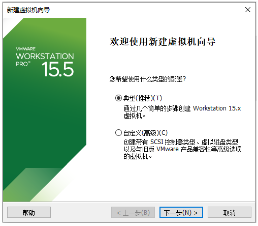​

**3). 选择&quot;稍后安装操作系统(S)&quot;**

​​

**4). 选择&quot;Linux&quot;操作系统,&quot;CentOS7 64位&quot;版本**


**5). 设置虚拟机的名称及系统文件存放路径**

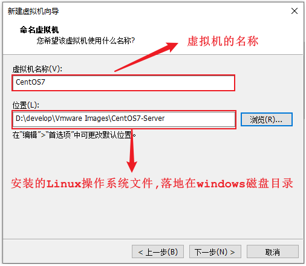

**6). 设置磁盘容量**


**7). 自定义硬件信息**

​​

**8). 启动上述创建的新虚拟机**

​​

**9). 选择&quot;Install CentOS7&quot;**

​​

> 进入到Linux系统里面, 我们发现光标无法移动到windows操作系统中了, 这个时候, 我们可以通过快捷键 "Ctrl+Alt" 切换光标到windows系统中。

**10). 选择语言为 &quot;简体中文&quot;**

​​

**11). 选择&quot;自动配置分区&quot;**


12). 选择"最小安装"


**13). 设置&quot;root&quot;用户密码**


安装完毕后，点击窗口中的蓝色的 "重启" 按钮，重启Linux系统。

**14). 登录系统**

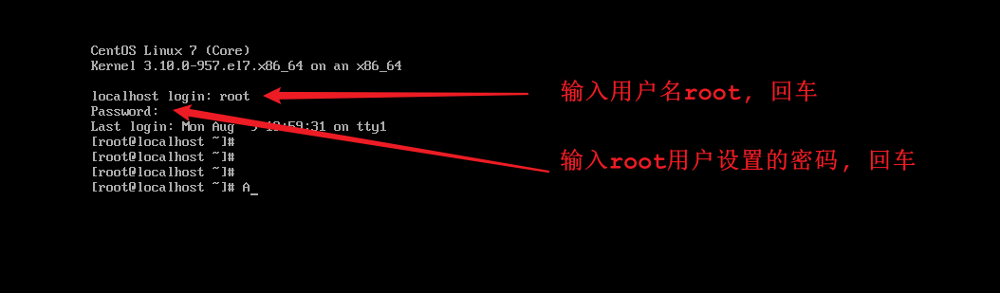

> <div>
> 注意 : 在Linux系统中，在命令行中输入密码信息，为了保证安全性，密码是不显示的(看似没有输入，实际已经输入了)
> </div>

### 3.4 网卡设置

服务器重启完成之后，我们可以通过linux的指令 `ip addr`​ 来查询Linux系统的IP地址，具体信息如下:

​​

从图中我们可以看到，并没有获取到linux系统的IP地址，这是为什么呢？这是由于启动服务器时未加载网卡，导致IP地址初始化失败而造成的。那么接下来我们就需要来修改网络初始化配置，设定网卡在系统启动时初始化。

**具体操作步骤如下：**

1). 修改网卡的配置项

```java
cd /				进入根目录
cd etc				进入etc目录
cd sysconfig		进入sysconfig目录
cd network-scripts	进入network-scripts
vi ifcfg-ens33		编辑ifcfg-ens33文件


进入文件后执行如下操作: 
①. 按 i 键 		 进入编辑状态
②. 按↑↓键来移动光标, 删除no,输入yes 
③. 按 ESC 键
④. 输入 :wq
⑤. 按 ENTER	保存退出
```


> 备注: 在上述的操作中用到了Linux中的相关指令, 目前大家不用深究, 后面会详细讲解, 目前大家只需要把这个文件的配置项ONBOOT的值有no改为yes即可。

2). 重新启动虚拟机

​​

重启之后, 再次输入root的用户名密码，登录到Linux系统之后，可以通过指令 `ip addr`​ 来查看IP地址。

​​

### 3.5 安装SSH连接工具

#### 3.5.1 SSH连接工具介绍

Linux已经安装并且配置好了，接下来我们要来学习Linux的基本操作指令。而在学习之前，我们还需要做一件事情，由于我们企业开发时，Linux服务器一般都是在远程的机房部署的，我们要操作服务器，不会每次都跑到远程的机房里面操作，而是会直接通过SSH连接工具进行连接操作。


SSH（Secure Shell），建立在应用层基础上的安全协议。常用的SSH连接工具:

|SSH工具|说明|
| ------------| -----------------------------------------|
|putty|免费, 界面简单, 功能单一|
|secureCRT|收费, 功能强大|
|xshell|收费版/免费版|
|finalshell|免费, 功能强大, 界面效果好 (课程中采用)|

#### 3.5.2 FinalShell安装

在课程资料中，提供了finalShell的安装包


双击.exe文件，然后进行正常的安装即可。


#### 3.5.3 连接Linux

**1). 打开finalShell**

​​

**2). 建立连接**

​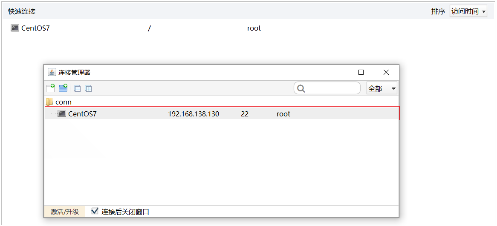​


### 3.6 Linux目录结构

登录到Linux系统之后，我们需要先来熟悉一下Linux的目录结构。在Linux系统中，也是存在目录的概念的，但是Linux的目录结构和Windows的目录结构是存在比较多的差异的 在Windows目录下，是一个一个的盘符(C盘、D盘、E盘)，目录是归属于某一个盘符的。Linux系统中的目录有以下特点：

**A. / 是所有目录的顶点**

**B. 目录结构像一颗倒挂的树**

**Linux 和 Windows的目录结构对比:**

​​

Linux的目录结构，如下：


根目录/ 下各个目录的作用及含义说明:

|编号|目录|含义|
| ----| -----| ------------------------------------------|
|1|/bin|存放二进制可执行文件|
|2|/boot|存放系统引导时使用的各种文件|
|3|/dev|存放设备文件|
|4|/etc|存放系统配置文件|
|5|/home|存放系统用户的文件|
|6|/lib|存放程序运行所需的共享库和内核模块|
|7|/opt|额外安装的可选应用程序包所放置的位置|
|8|/root|超级用户目录|
|9|/sbin|存放二进制可执行文件，只有root用户才能访问|
|10|/tmp|存放临时文件|
|11|/usr|存放系统应用程序|
|12|/var|存放运行时需要改变数据的文件，例如日志文件|

## 4. Linux常用命令

### 4.1 Linux命令初体验

#### 4.1.1 常用命令演示

在这一部分中，我们主要介绍几个常用的命令，让大家快速感受以下Linux指令的操作方式。主要包含以下几个指令：

|序号|命令|对应英文|作用|
| ------| ----------------| ----------------------| -------------------------|
|1|ls [目录名]|list|查看当前目录下的内容|
|2|pwd|print work directory|查看当前所在目录|
|3|cd [目录名]|change directory|切换目录|
|4|touch [文件名]|touch|如果文件不存在,创建文件|
|5|mkdir [目录名]|make directory|创建目录|
|6|rm [文件名]|remove|删除指定文件|

接下来，我们快速的来演示一下这些常用的指令。

**1). ls**


> 指令解读:
>
> ​	ls 	查看当前目录下的内容(文件及目录)
>
> ​	ls /   查看指定目录(/)下的内容

**2). pwd**


> 指令解读:
>
> ​	pwd	查看当前所在目录

**3). cd**


> 指令解读:
>
> ​	cd  /		切换到根目录
>
> ​	cd  /root	切换到/root目录

**4). touch**


> 指令解读:
>
> ​	touch  1.txt    创建文件1.txt
>
> ​	touch  2.txt 3.txt 4.txt   一次性创建文件2.txt,3.txt,3.txt

**5). mkdir**


> 指令解读:
>
> ​	mkdir 01 	创建文件夹01

**6). rm**


> 指令解读:
>
> ​	rm  4.txt	删除文件 (删除文件时,需要确认,输入y, 代表确定)

==注意:==

​	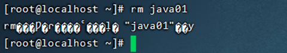

​	==在执行Linux命令时，提示信息如果显示为乱码，如上图所示。这是由于编码问题导致，只需要修改Linux的编码即可，命令如下：==

​	echo 'LANG="en_US.UTF-8"' >> /etc/profile

​	source /etc/profile

#### 4.1.2 Linux命令使用技巧

在我们使用Linux系统命令时，可以使用以下几个技巧：

1). Tab键自动补全

2). 连续两次Tab键，给出操作提示

3). 使用上下箭头快速调出曾经使用过的命令

4). 使用clear命令或者Ctrl+l快捷键实现清屏

**操作示例:**

A. 执行指令的时候，对于操作的文件/目录，按一下Tab会自动补全:


B. 如果上述以 "1." 开头的文件有多个，可以按两下Tab键，给出操作提示:

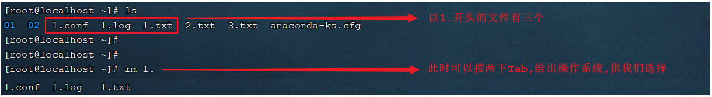

C. 使用clear命令或者Ctrl+l快捷键实现清屏:


清屏之后，界面就变得干净了:


#### 4.1.3 Linux命令格式

```
command [-options] [parameter]
	
说明: 
	command: 	 命令名
	[-options]:  选项，可用来对命令进行控制，也可以省略
	[parameter]: 传给命令的参数，可以是零个、一个或者多个
	
注意: 
	[] 	 代表可选
	命令名、选项、参数之间有空格进行分隔
```

**操作示例:**


### 4.2 文件目录操作命令

#### 4.2.1 ls

```
作用: 显示指定目录下的内容
语法: ls [-al] [dir]
说明: 
	-a 显示所有文件及目录 (. 开头的隐藏文件也会列出)
	-l 除文件名称外，同时将文件型态(d表示目录，-表示文件)、权限、拥有者、文件大小等信息详细列出
	
注意: 
	由于我们使用ls命令时经常需要加入-l选项，所以Linux为ls -l命令提供了一种简写方式，即ll
	
常见用法: 
	ls -al 	查看当前目录的所有文件及目录详细信息
	ls -al /etc   查看/etc目录下所有文件及目录详细信息
	ll  	查看当前目录文件及目录的详细信息 
```

**操作示例:**


#### 4.2.2 cd

```
作用: 用于切换当前工作目录，即进入指定目录
语法: cd [dirName]
	
特殊说明: 
	~	表示用户的home目录
	. 	表示目前所在的目录
	.. 	表示目前目录位置的上级目录
	
举例: 
	cd 	..		切换到当前目录的上级目录
	cd 	~		切换到用户的home目录
	cd 	/usr/local	切换到/usr/local目录
```

> 备注:
>
> ​	用户的home目录
>
> ​	root用户	/root
>
> ​	其他用户	/home/xxx

操作示例:


cd .. 切换到当前目录位置的上级目录; 可以通过 cd ../.. 来切换到上级目录的上级目录。

#### 4.2.3 cat

```
作用: 用于显示文件内容
语法: cat [-n] fileName

说明:
	-n: 由1开始对所有输出的行数编号

举例:
	cat /etc/profile		查看/etc目录下的profile文件内容
```

**操作演示:**


cat 指令会一次性查看文件的所有内容，如果文件内容比较多，这个时候查看起来就不是很方便了，这个时候我们可以通过一个新的指令more。

#### 4.2.4 more

```
作用: 以分页的形式显示文件内容
语法: more fileName

操作说明:
    回车键 	向下滚动一行
    空格键 	向下滚动一屏
    b 		返回上一屏
    q或者Ctrl+C	退出more
	
举例：
	more /etc/profile		以分页方式显示/etc目录下的profile文件内容
```

**操作示例：**

​​

当我们在查看一些比较大的文件时，我们可能需要经常查询文件尾部的数据信息，那这个时候如果文件很大，我们要一直向下翻页，直到最后一页，去看最新添加的数据，这种方式就比较繁琐了，此时，我们可以借助于tail指令。

#### 4.2.5 tail

```
作用: 查看文件末尾的内容
语法: tail [-f] fileName

说明:
	-f : 动态读取文件末尾内容并显示，通常用于日志文件的内容输出
	
举例: 
tail /etc/profile		显示/etc目录下的profile文件末尾10行的内容
tail -20 /etc/profile	显示/etc目录下的profile文件末尾20行的内容
tail -f /itcast/my.log	动态读取/itcast目录下的my.log文件末尾内容并显示
```

**操作示例：**

A. 默认查询文件尾部10行记录


B. 可以通过指定参数设置查询尾部指定行数的数据


C. 动态读取文件尾部的数据


在窗口1中执行指令 `tail -f 1.txt` 动态查看文件尾部的数据。然后在顶部的标签中右键选择 "复制标签"，打开新的窗口2 , 此时再新打开的窗口2中执行指令 `echo 1 >> 1.txt` , 往1.txt文件尾部追加内容，然后我们就可以在窗口1中看到最新的文件尾部的数据。

如果我们不想查看文件尾部的数据了，可以直接使用快捷键 Ctrl+C ， 结束当前进程。

#### 4.2.6 mkdir

```
作用: 创建目录
语法: mkdir [-p] dirName

说明: 
	-p: 确保目录名称存在，不存在的就创建一个。通过此选项，可以实现多层目录同时创建

举例: 
    mkdir itcast  在当前目录下，建立一个名为itcast的子目录
    mkdir -p itcast/test   在工作目录下的itcast目录中建立一个名为test的子目录，若itcast目录不存在，则建立一个
```

**操作演示:**


#### 4.2.7 rmdir

```
作用: 删除空目录
语法: rmdir [-p] dirName

说明:
	-p: 当子目录被删除后使父目录为空目录的话，则一并删除

举例:
    rmdir itcast   删除名为itcast的空目录
    rmdir -p itcast/test   删除itcast目录中名为test的子目录，若test目录删除后itcast目录变为空目录，则也被删除
    rmdir itcast*   删除名称以itcast开始的空目录
```

**操作演示:**

A. 删除空目录


B. 删除非空目录


C. 使用*通配符删除目录


> *: 是一个通配符，代表任意字符；
>
> rmdir  itcast* : 删除以itcast开头的目录
>
> rmdir  *itcast : 删除以itcast结尾的目录

#### 4.2.8 rm

```
作用: 删除文件或者目录
语法: rm [-rf] name

说明: 
    -r: 将目录及目录中所有文件（目录）逐一删除，即递归删除
    -f: 无需确认，直接删除
	
举例: 
    rm -r itcast/     删除名为itcast的目录和目录中所有文件，删除前需确认
    rm -rf itcast/    无需确认，直接删除名为itcast的目录和目录中所有文件
    rm -f hello.txt   无需确认，直接删除hello.txt文件

```

**操作示例:**


==注意: 对于 rm -rf xxx 这样的指令，在执行的时候，一定要慎重，确认无误后再进行删除，避免误删。==

### 4.3 拷贝移动命令

#### 4.3.1 cp

```
作用: 用于复制文件或目录
语法: cp [-r] source dest

说明: 
	-r: 如果复制的是目录需要使用此选项，此时将复制该目录下所有的子目录和文件

举例: 
    cp hello.txt itcast/            将hello.txt复制到itcast目录中
    cp hello.txt ./hi.txt           将hello.txt复制到当前目录，并改名为hi.txt
    cp -r itcast/ ./itheima/    	将itcast目录和目录下所有文件复制到itheima目录下
    cp -r itcast/* ./itheima/ 	 	将itcast目录下所有文件复制到itheima目录下
```

**操作示例:**


如果拷贝的内容是目录，需要加上参数 -r

#### 4.3.2 mv

```
作用: 为文件或目录改名、或将文件或目录移动到其它位置
语法: mv source dest

举例: 
    mv hello.txt hi.txt                 将hello.txt改名为hi.txt
    mv hi.txt itheima/                  将文件hi.txt移动到itheima目录中
    mv hi.txt itheima/hello.txt   		将hi.txt移动到itheima目录中，并改名为hello.txt
    mv itcast/ itheima/                 如果itheima目录不存在，将itcast目录改名为itheima
    mv itcast/ itheima/                 如果itheima目录存在，将itcast目录移动到itheima目录中
```

**操作示例:**

mv 命令既能够改名，又可以移动，具体是改名还是移动,系统会根据我们输入的参数进行判定(如果第二个参数dest是一个已存在的目录,将执行移动操作,其他情况都是改名)


### 4.4 打包压缩命令

```
作用: 对文件进行打包、解包、压缩、解压
语法: tar  [-zcxvf]  fileName  [files]
    包文件后缀为.tar表示只是完成了打包，并没有压缩
    包文件后缀为.tar.gz表示打包的同时还进行了压缩

说明:
    -z: z代表的是gzip，通过gzip命令处理文件，gzip可以对文件压缩或者解压
    -c: c代表的是create，即创建新的包文件
    -x: x代表的是extract，实现从包文件中还原文件
    -v: v代表的是verbose，显示命令的执行过程
    -f: f代表的是file，用于指定包文件的名称

举例：
    打包
        tar -cvf hello.tar ./*		  		将当前目录下所有文件打包，打包后的文件名为hello.tar
        tar -zcvf hello.tar.gz ./*		  	将当前目录下所有文件打包并压缩，打包后的文件名为hello.tar.gz
		
    解包
        tar -xvf hello.tar		  			将hello.tar文件进行解包，并将解包后的文件放在当前目录
        tar -zxvf hello.tar.gz		  		将hello.tar.gz文件进行解压，并将解压后的文件放在当前目录
        tar -zxvf hello.tar.gz -C /usr/local     将hello.tar.gz文件进行解压，并将解压后的文件放在/usr/local目录

```

**操作示例:**

A. 打包


B. 打包并压缩


C. 解包

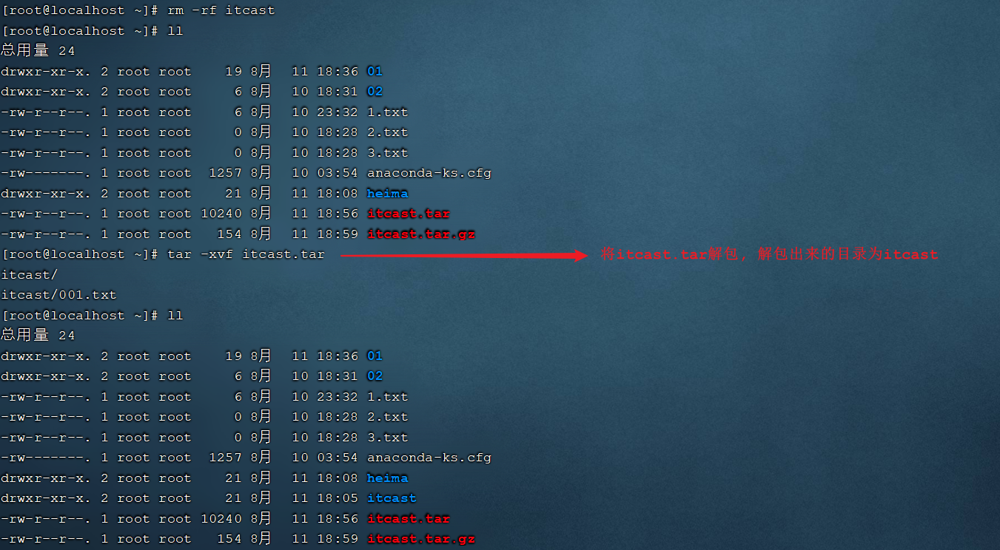

D. 解压


解压到指定目录,需要加上参数 -C


### 4.5 文本编辑命令

文本编辑的命令，主要包含两个: vi 和 vim，两个命令的用法类似，我们课程中主要讲解vim的使用。

#### 4.5.1 vi&vim介绍

作用: vi命令是Linux系统提供的一个文本编辑工具，可以对文件内容进行编辑，类似于Windows中的记事本

语法: vi fileName

说明:
1). vim是从vi发展来的一个功能更加强大的文本编辑工具，编辑文件时可以对文本内容进行着色，方便我们对文件进行编辑处理，所以实际工作中vim更加常用。
2). 要使用vim命令，需要我们自己完成安装。可以使用下面的命令来完成安装：`yum install vim`

#### 4.5.2 vim安装

命令： yum install vim


安装过程中，会有确认提示，此时输入 y，然后回车，继续安装：


#### 4.5.3 vim使用

作用: 对文件内容进行编辑，vim其实就是一个文本编辑器
语法: vim fileName
说明:
1). 在使用vim命令编辑文件时，如果指定的文件存在则直接打开此文件。如果指定的文件不存在则新建文件。
2). vim在进行文本编辑时共分为三种模式，分别是 命令模式（Command mode），插入模式（Insert mode）和底行模式（Last line mode）。这三种模式之间可以相互切换。我们在使用vim时一定要注意我们当前所处的是哪种模式。

三种模式:
- 命令模式
A. 命令模式下可以查看文件内容、移动光标（上下左右箭头、gg、G）
B. 通过vim命令打开文件后，默认进入命令模式
C. 另外两种模式需要首先进入命令模式，才能进入彼此

|命令模式指令|含义|
| ------------| ---------------------------------|
|gg|定位到文本内容的第一行|
|G|定位到文本内容的最后一行|
|dd|删除光标所在行的数据|
|ndd|删除当前光标所在行及之后的n行数据|
|u|撤销操作|
|shift+zz|保存并退出|
|i 或 a 或 o|进入插入模式|

​

- 插入模式
  A. 插入模式下可以对文件内容进行编辑
  B. 在命令模式下按下[i,a,o]任意一个，可以进入插入模式。进入插入模式后，下方会出现【insert】字样
  C. 在插入模式下按下ESC键，回到命令模式
- 底行模式
  A. 底行模式下可以通过命令对文件内容进行查找、显示行号、退出等操作
  B. 在命令模式下按下[:,/]任意一个，可以进入底行模式
  C. 通过/方式进入底行模式后，可以对文件内容进行查找
  D. 通过:方式进入底行模式后，可以输入wq（保存并退出）、q!（不保存退出）、set nu（显示行号）

  |底行模式命令|含义|
  | ------------| ------------------------------------|
  |:wq|保存并退出|
  |:q!|不保存退出|
  |:set nu|显示行号|
  |:set nonu|取消行号显示|
  |:n|定位到第n行, 如 :10 就是定位到第10行|

​​

​

**操作示例:**


### 4.6 查找命令

#### 4.6.1 find

```
作用: 在指定目录下查找文件
语法: find dirName -option fileName
举例:
    find  .  –name "*.java"			在当前目录及其子目录下查找.java结尾文件
    find  /itcast  -name "*.java"	在/itcast目录及其子目录下查找.java结尾的文件
```

**操作示例:**


#### 4.6.2 grep

```
作用: 从指定文件中查找指定的文本内容
语法: grep word fileName
举例: 
    grep Hello HelloWorld.java	查找HelloWorld.java文件中出现的Hello字符串的位置
    grep hello *.java			查找当前目录中所有.java结尾的文件中包含hello字符串的位置
```

**操作示例:**


# Linux-Day02

## 课程内容

- 软件安装
- 项目部署

## 1. 软件安装

### 1.1 软件安装方式

在Linux系统中，安装软件的方式主要有四种，这四种安装方式的特点如下：

|安装方式|特点|
| ----------------| -------------------------------------------------------------------------------------------------------------|
|二进制发布包安装|软件已经针对具体平台编译打包发布，只要解压，修改配置即可|
|rpm安装|软件已经按照redhat的包管理规范进行打包，使用rpm命令进行安装，==不能自行解决库依赖问题==|
|yum安装|一种在线软件安装方式，本质上还是rpm安装，自动下载安装包并安装，安装过程中自动解决库依赖问题(安装过程需要联网)|
|源码编译安装|软件以源码工程的形式发布，需要自己编译打包|

### 1.2 安装JDK

上述我们介绍了Linux系统软件安装的四种形式，接下来我们就通过第一种(二进制发布包)形式来安装JDK。 JDK对应的二进制发布包，在课程资料中已经提供，如下：

JDK具体安装步骤如下：

**1). 上传安装包**

使用FinalShell自带的上传工具将jdk的二进制发布包上传到Linux


由于上述在进行文件上传时，选择的上传目录为根目录 /，上传完毕后，我们执行指令 cd / 切换到根目录下，查看上传的安装包。


**2). 解压安装包**

执行如下指令，将上传上来的压缩包进行解压，并通过-C参数指定解压文件存放目录为 /usr/local。

```
tar -zxvf jdk-8u171-linux-x64.tar.gz -C /usr/local
```


**3). 配置环境变量**

使用vim命令修改/etc/profile文件，在文件末尾加入如下配置

```
JAVA_HOME=/usr/local/jdk1.8.0_171
PATH=$JAVA_HOME/bin:$PATH
```

具体操作指令如下:

```
1). 编辑/etc/profile文件，进入命令模式
	vim /etc/profile

2). 在命令模式中，输入指令 G ， 切换到文件最后
	G

3). 在命令模式中输入 i/a/o 进入插入模式，然后切换到文件最后一行
	i

4). 将上述的配置拷贝到文件中
	JAVA_HOME=/usr/local/jdk1.8.0_171
	PATH=$JAVA_HOME/bin:$PATH
	
5). 从插入模式，切换到指令模式
	ESC
	
6). 按:进入底行模式，然后输入wq，回车保存
	:wq
```

**4). 重新加载profile文件**

为了使更改的配置立即生效，需要重新加载profile文件，执行命令:

```
source /etc/profile
```

**5). 检查安装是否成功**

```
java -version
```


### 1.3 安装Tomcat

#### 1.3.1 Tomcat安装

Tomcat的安装和上述JDK的安装采用相同的方式，都是使用二进制发布包的形式进行安装，在我们的资料目录下，也已经准备了Tomcat的安装包：


具体安装步骤如下：

**1). 上传安装包**

使用FinalShell自带的上传工具将Tomcat的二进制发布包上传到Linux(与前面上传JDK安装包步骤一致)。


**2). 解压安装包**

将上传上来的安装包解压到指定目录/usr/local下，执行命令为

```
tar -zxvf apache-tomcat-7.0.57.tar.gz -C /usr/local
```

**3). 启动Tomcat**

进入Tomcat的bin目录启动服务。执行命令为:

```
cd /usr/local/apache-tomcat-7.0.57/

cd bin

sh startup.sh或者./startup.sh
```

​​​

​

#### 1.3.2 Tomcat进程查看

上述我们将Tomcat启动完成之后，并不能知道Tomcat是否正常运行，那么我们验证Tomcat启动是否成功，有多种方式，我们这里主要介绍常见的两种方式：

**1). 查看启动日志**

Tomcat的启动日志输出在Tomcat的安装目录下的logs目录中，Tomcat的启动及运行日志文件名为 catalina.out，所以我们查看Tomcat启动日志，主要可以通过两条指令，如下：

```
1). 分页查询Tomcat的日志信息
more /usr/local/apache-tomcat-7.0.57/logs/catalina.out

2). 查询日志文件尾部的50行记录
tail -50 /usr/local/apache-tomcat-7.0.57/logs/catalina.out
```

只要Tomcat在启动的过程中，日志输出没有报错，基本可以判定Tomcat启动成功了。

**2). 查询系统进程**

我们也可以通过Linux系统的查看系统进程的指令，来判定Tomcat进程是否存在，从而判定Tomcat是否启动。执行如下指令：

```
ps -ef|grep tomcat
```


**说明:**

- ==ps==命令是linux下非常强大的进程查看命令，通过ps -ef可以查看当前运行的所有进程的详细信息
- =="|"== 在Linux中称为管道符，可以将前一个命令的结果输出给后一个命令作为输入
- 使用ps命令查看进程时，经常配合管道符和查找命令 grep 一起使用，来查看特定进程

#### 1.3.3 防火墙操作

前面我们已经通过日志的方式及查看系统进程的方式，验证了Tomcat服务已经正常启动，接下来我们就可以尝试访问一下。访问地址：[http://192.168.138.130](http://192.168.138.130:8080)，我们发现是访问不到的。


那为什么tomcat启动成功了，但就是访问不到呢？原因就在于Linux系统的防火墙，系统安装完毕后，系统启动时，防火墙自动启动，防火墙拦截了所有端口的访问。接下来我们就需要学习一下，如何操作防火墙，具体指令如下：

|操作|指令|备注|
| ----------------------------| -------------------------------------------------------------| --------------------|
|查看防火墙状态|systemctl status firewalld / firewall-cmd --state||
|暂时关闭防火墙|systemctl stop firewalld||
|永久关闭防火墙(禁用开机自启)|systemctl disable firewalld|==下次启动,才生效==|
|暂时开启防火墙|systemctl start firewalld||
|永久开启防火墙(启用开机自启)|systemctl enable firewalld|==下次启动,才生效==|
|开放指定端口|firewall-cmd --zone=public --add-port=8080/tcp --permanent|==需要重新加载生效==|
|关闭指定端口|firewall-cmd --zone=public --remove-port=8080/tcp --permanent|==需要重新加载生效==|
|立即生效(重新加载)|firewall-cmd --reload||
|查看开放端口|firewall-cmd --zone=public --list-ports||

> 注意：
>
> ​	A. systemctl是管理Linux中服务的命令，可以对服务进行启动、停止、重启、查看状态等操作
>
> ​	B. firewall-cmd是Linux中专门用于控制防火墙的命令
>
> ​	C. 为了保证系统安全，服务器的防火墙不建议关闭

那么我们要想访问到Tomcat，就可以采取两种类型的操作：

**A. 关闭防火墙**

执行指令 :

```
systemctl stop firewalld
```

关闭之后，再次访问Tomcat，就可以访问到了。


<font color='red'>注意: 上面我们也提到了，直接关闭系统的防火墙，是不建议的，因为这样会造成系统不安全。</font>

**B. 开放Tomcat的端口号8080**

执行指令:

```
①. 先开启系统防火墙
systemctl start firewalld

②. 再开放8080端口号
firewall-cmd --zone=public --add-port=8080/tcp --permanent

③. 重新加载防火墙
firewall-cmd --reload
```

执行上述的操作之后，就开放了当前系统中的8080端口号，再次访问Tomcat。


#### 1.3.4 停止Tomcat

在Linux系统中，停止Tomcat服务的方式主要有两种：

**1). 运行Tomcat提供的脚本文件**

在Tomcat安装目录下有一个bin目录，这个目录中存放的是tomcat的运行脚本文件，其中有一个脚本就是用于停止tomcat服务的。


我们可以切换到bin目录，并执行如下指令，来停止Tomcat服务：

```
sh shutdown.sh
./shutdown.sh
```

**2). 结束Tomcat进程**

我们可以先通过 `ps -ef|grep tomcat` 指令查看tomcat进程的信息，从进程信息中获取tomcat服务的进程号。然后通过kill -9 的形式，来杀死系统进程。

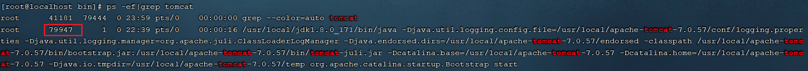

通过上述的指令，我们可以获取到tomcat的进程号为 79947。接下来，我们就可以通过指令 ，来杀死tomcat的进程 ：

```
kill -9 79947 
```

执行完上述指令之后，我们再访问Linux系统中的Tomcat，就访问不到了。

> 注意：
>
> ​	kill命令是Linux提供的用于结束进程的命令，-9表示强制结束

> 注意 ：
>
> ​	虽然上述讲解的两种方式，都可以停止Tomcat服务，但是推荐使用第一种方式(./shutdown.sh)执行脚本来关闭tomcat服务，如果通过第一种方式停止不了tomcat了，这个时候，我们可以考虑使用第二种方式，强制杀死进程。

### 1.4 安装MySQL

#### 1.4.1 MySQL安装

对于MySQL数据库的安装，我们将要使用前面讲解的第二种安装方式rpm进行安装。那么首先我们先了解一下什么rpm？

> **RPM：**全称为 Red-Hat Package Manager，RPM软件包管理器，是红帽Linux用于管理和安装软件的工具。

我们要通过rpm，进行MySQL数据库的安装，主要的步骤如下：

**1). 检测当前系统是否安装过MySQL相关数据库**

需要通过rpm相关指令，来查询当前系统中是否存在已安装的mysql软件包，执行指令如下：

```
rpm -qa							查询当前系统中安装的所有软件
rpm -qa | grep mysql			查询当前系统中安装的名称带mysql的软件
rpm -qa | grep mariadb			查询当前系统中安装的名称带mariadb的软件
```

通过rpm -qa 查询到系统通过rpm安装的所有软件，太多了，不方便查看，所以我们可以通过管道符 | 配合着grep进行过滤查询。


通过查询，我们发现在当前系统中存在mariadb数据库，是CentOS7中自带的，而这个数据库和MySQL数据库是冲突的，所以要想保证MySQL成功安装，需要卸载mariadb数据库。

**2). 卸载现有的MySQL数据库**

在rpm中，卸载软件的语法为：

```
rpm -e --nodeps  软件名称
```

那么，我们就可以通过指令，卸载 mariadb，具体指令为：

```
rpm -e --nodeps  mariadb-libs-5.5.60-1.el7_5.x86_64
```


我们看到执行完毕之后， 再次查询 mariadb，就查不到了，因为已经被成功卸载了。

**3). 将资料中提供的MySQL安装包上传到Linux并解压**

A. 上传MySQL安装包

在课程资料中，提供的有MySQL的安装包 ，我们需要将该安装包上传到Linux系统的根目录 / 下面。


B. 解压到/usr/local/mysql

执行如下指令:

```
mkdir /usr/local/mysql
tar -zxvf mysql-5.7.25-1.el7.x86_64.rpm-bundle.tar.gz -C /usr/local/mysql
```

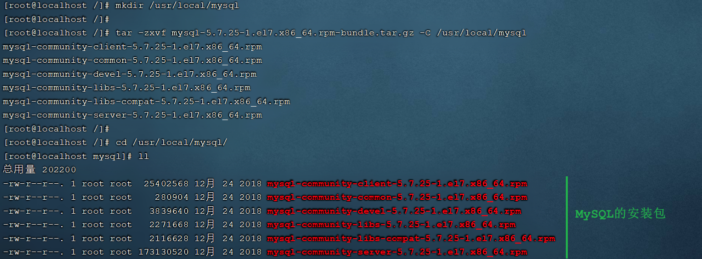

**4). 安装顺序安装rpm安装包**

```shell
rpm -ivh mysql-community-common-5.7.25-1.el7.x86_64.rpm
rpm -ivh mysql-community-libs-5.7.25-1.el7.x86_64.rpm
rpm -ivh mysql-community-devel-5.7.25-1.el7.x86_64.rpm
rpm -ivh mysql-community-libs-compat-5.7.25-1.el7.x86_64.rpm
rpm -ivh mysql-community-client-5.7.25-1.el7.x86_64.rpm
yum install net-tools
rpm -ivh mysql-community-server-5.7.25-1.el7.x86_64.rpm
```

> 说明:
>
> - 因为rpm安装方式，是不会自动处理依赖关系的，需要我们自己处理，所以对于上面的rpm包的安装顺序不能随意修改。
> - 安装过程中提示缺少net-tools依赖，使用yum安装(yum是一种在线安装方式，需要保证联网)
> - 可以通过指令(yum update)升级现有软件及系统内核


#### 1.4.2 MySQL启动

MySQL安装完成之后，会自动注册为系统的服务，服务名为mysqld。那么，我们就可以通过systemctl指令来查看mysql的状态、启动mysql、停止mysql。

```
systemctl status mysqld		查看mysql服务状态
systemctl start mysqld		启动mysql服务
systemctl stop mysqld		停止mysql服务
```


> 说明：
>
> ​	可以设置开机时启动mysql服务，避免每次开机启动mysql。执行如下指令：
>
> ​	systemctl enable mysqld

我们可以通过如下两种方式，来判定mysql是否启动：

```
netstat -tunlp					查看已经启动的服务
netstat -tunlp | grep mysql		查看mysql的服务信息

ps –ef | grep mysql				查看mysql进程
```


> <font color='red'>备注: </font>
>
> ​	<font color='red'>A. netstat命令用来打印Linux中网络系统的状态信息，可让你得知整个Linux系统的网络情况。</font>
>
> ​		参数说明:
>
> ​		-l或--listening：显示监控中的服务器的Socket；
> ​		-n或--numeric：直接使用ip地址，而不通过域名服务器；
> ​		-p或--programs：显示正在使用Socket的程序识别码和程序名称；
> ​		-t或--tcp：显示TCP传输协议的连线状况；
> ​		-u或--udp：显示UDP传输协议的连线状况；
>
> ​	<font color='red'>B. ps命令用于查看Linux中的进程数据。</font>

#### 1.4.3 MySQL登录

##### 1.4.3.1 查阅临时密码

MySQL启动起来之后，我们就可以测试一下登录操作，但是我们要想登录MySQL，需要一个访问密码，而刚才在安装MySQL的过程中，并没有看到让我们设置访问密码，那这个访问密码是多少呢? 那实际上，对于rpm安装的mysql，在mysql第一次启动时，会自动帮我们生成root用户的访问密码，并且输出在mysql的日志文件 /var/log/mysqld.log中，我们可以查看这份日志文件，从而获取到访问密码。

可以执行如下指令：

1). cat /var/log/mysqld.log


这种方式，可以看到所有的日志数据，文件比较大时，很不方便查看数据。我们可以通过管道符 | 配合grep来对数据进行过滤。

2). cat /var/log/mysqld.log | grep password

我们可以通过上述指令，查询日志文件内容中包含password的行信息。


##### 1.4.3.2 登录MySQL

获取到root用户的临时密码之后，我们就可以登录mysql数据库，修改root的密码，为root设置一个新的密码。并且我们还需要开启root用户远程访问该数据库的权限，这样的话，我们就可以在windows上来访问这台MySQL数据库。

执行如下指令：

```
①. 登录mysql（复制日志中的临时密码登录）
	mysql -uroot -p								

②. 修改密码
    set global validate_password_length=4;			设置密码长度最低位数
    set global validate_password_policy=LOW;		设置密码安全等级低，便于密码可以修改成root
    set password = password('root');				设置密码为root
    
③. 开启访问权限
    grant all on *.* to 'root'@'%' identified by 'root';
    flush privileges;
```

操作完上述的指令之后，数据库root用户的密码以及远程访问我们就配置好了，接下来，可以执行exit退出mysql，再次通过新的密码进行登录。

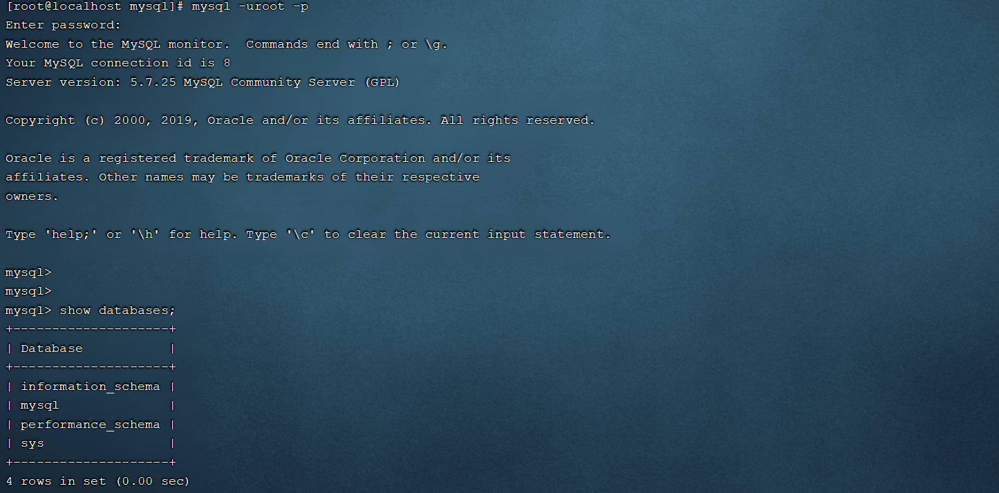

当然我们也可以使用安装在windows系统中的sqlyog或者Navicat来远程连接linux上的MySQL。​​

==注意： 要想在windows上能够访问MySQL，还需要开放防火墙的3306端口，执行如下指令：==

```
firewall-cmd --zone=public --add-port=3306/tcp --permanent
firewall-cmd --reload
```


### 1.5 安装lrzsz

lrzsz 是用于在Linux系统中文件上传下载的软件。大家可能会存在疑问，我们用finalShell图形化界面就可以很方便的完成上传下载，为什么还要使用这个软件来完成上传下载呢？实际上是这样的，Linux的远程连接工具有很多，而finalShell只是其中的一种，而还有很多的远程连接工具并没有上传下载的功能，这个时候就需要依赖于lrzsz这个软件了。

对于lrzsz的安装，我们需要通过第三种软件安装方式yum来进行安装。这里，我们先对yum做一个简单介绍。

> **Yum：** (Yellow dog Updater,Modified)，是一个在Fedora和RedHat以及CentOS中的Shell前端软件包管理器。基于RPM包管理，能够从指定的服务器自动下载RPM包并且安装，可以自动处理依赖关系，并且一次安装所有依赖的软件包，无须繁琐地一次次下载、安装。

安装lrzsz的步骤如下:

**1). 搜索lrzsz安装包**

```
yum list lrzsz
```


**2). 在线安装lrzsz**

```
yum install lrzsz.x86_64
```


**3). 测试**

在命令行中输入 rz , 就会自动打开一个文件选择的窗口，然后选择要上传的文件。


> **yum拓展知识:**
>
> ​	 1). 如果在不更改软件来源的情况下，是需要联网才能使用yum的，那么我们安装的软件是从哪儿下载的呢，这里就涉及到一个概念： yum源。
>
> ​
>
> ​	 2). 我们可以通过一个指令，来检查当前的yum源
>
> ​		
>
> ​		从图中，我们可以看到我们安装的 CentOS7 采用的是网易的163yum源。
>
> ​
>
> ​	  3). 网络 yum 源配置文件位于 /etc/yum.repos.d/ 目录下，文件扩展名为"*.repo"
>
> ​		
>
> ​		可以看到，该目录下有 7 个 yum 配置文件，通常情况下 CentOS-Base.repo 文件生效。
>
> ​
>
> ​	  4). 添加阿里云yum源
>
> ​		A. 先通过 `yum install wget` ,安装wget命令
>
> ​		B. 备份默认的网易163的yum源，执行指令 ：
>
> ​			切换目录: cd /etc/yum.repos.d/
>
> ​			创建备份目录: mkdir bak
>
> ​			移动现有的yum源文件到bak: mv *.repo bak/
>
> ​		C. 下载阿里云的yum源
>
> ​			wget -O /etc/yum.repos.d/CentOS-Base.repo [http://mirrors.aliyun.com/repo/Centos-7.repo](http://mirrors.aliyun.com/repo/Centos-7.repo)
>
> ​		D. 执行命令，重新生成cache
>
> ​			yum clean all
>
> ​			yum makecache
>
> ​		E. 再次查看yum源
>
> ​			
>
> ​			之后，我们通过yum指令安装软件，就是从阿里云下载的。

## 2. 项目部署

之前我们讲解Linux操作系统时，就提到，我们服务端开发工程师学习Linux系统的目的就是将来我们开发的项目绝大部分情况下都需要部署在Linux系统中。那么在本章节，我们将通过两种方式，来演示项目部署，分别是：手动部署项目 和 基于shell脚本自动部署。

### 2.1 手动部署项目

**1). 在IDEA中开发SpringBoot项目并打成jar包**

项目是一个很简单的springboot项目(可以自己开发一个，也可以直接导入资料中提供的)，结构如下：


可以在本地的idea中先启动当前的demo工程，然后访问一下，看看工程是否正常访问。


执行package指令，进行打包操作，将当前的springboot项目，打成一个jar包。


**2). 将jar包上传到Linux服务器**

通过 rz 指令，将打好的jar包上传至Linux服务器的 /usr/local/app 目录下。 先执行指令创建app目录。

```
A. 在/usr/local下创建目录app
mkdir /usr/local/app

B. 切换到app目录下
cd /usr/local/app

C. 执行指令,进行jar包上传
rz
```


此时这个jar包就上传到 /usr/local/app 目录了。


**3). 启动SpringBoot程序**

由于我们的项目已经打成jar包上传上来到Linux服务器，我们只需要运行这个jar包项目就启动起来了，所以只需要执行如下指令即可：

```
java -jar helloworld-1.0-SNAPSHOT.jar
```


==注意： 由于前面安装的Tomcat在启动时，会占用端口号8080，而当前springboot项目我们没有配置端口号，默认也是8080，所以我们要想启动springboot项目，需要把之前运行的Tomcat停止掉。==

**4). 检查防火墙，确保8080端口对外开放，访问SpringBoot项目**

```
firewall-cmd --zone=public --list-ports
```


如果防火墙没有放开8080端口，还需要放开对应的端口号，执行如下指令：

```
firewall-cmd --zone=public --add-port=8080/tcp --permanent
```

**5). 访问测试**

[http://192.168.138.130/hello](http://192.168.138.130:8080/hello)


**6). 后台运行项目**

当前这个demo工程我们已经部署成功了，并且我们也可以访问项目了。但是这个工程目前是存在问题的，就是当前我们项目启动的这个窗口被霸屏占用了，如果我们把这个窗口关闭掉(或ctrl+c)，当前服务也就访问不到了，我们可以试一下。


**目前程序运行的问题：**

A. 线上程序不会采用控制台霸屏的形式运行程序，而是将程序在后台运行

B. 线上程序不会将日志输出到控制台，而是输出到日志文件，方便运维查阅信息

**后台运行程序:**

要想让我们部署的项目进行后台运行，这个时候我们需要使用到linux中的一个命令 nohup ，接下来，就来介绍一下nohup命令。

> **nohup命令：**英文全称 no hang up（不挂起），用于不挂断地运行指定命令，退出终端不会影响程序的运行
>
> **语法格式：** nohup Command [ Arg … ] [&]
>
> **参数说明：**
>
> ​	Command：要执行的命令
>
> ​	Arg：一些参数，可以指定输出文件
>
> ​	&：让命令在后台运行
>
> **举例：**
>
> ​	nohup java -jar boot工程.jar &> hello.log &
>
> ​	上述指令的含义为： 后台运行 java -jar 命令，并将日志输出到hello.log文件

那么经过上面的介绍，我们可以推测中，我们要想让当前部署的项目后台运行，就可以使用下面的指令：

```
nohup java -jar helloworld-1.0-SNAPSHOT.jar &> hello.log &
```


这样的话，我们的项目就已经启动成功了，我们可以通过ps指令，查看到系统的进程。


接下来，我们再次访问我们的项目，来看看服务是否可用。


**7). 停止SpringBoot项目**


### 2.2 基于Shell脚本自动部署

#### 2.2.1 介绍

前面介绍的项目部署是手动部署，也就是部署过程中的每一步操作都需要我们手动操作。接下来，我们需要再讲解一下项目的自动部署，从而来简化项目部署的操作，那么我们先来整体上了解一下项目自动部署的流程及操作步骤。​​

操作步骤如下：

1). 在Gitee上创建远程仓库，并将本地的项目代码推送到远程仓库中

2). 在Linux中安装Git,克隆代码

3). 在Linux中安装maven

4). 编写Shell脚本（拉取代码、编译、打包、启动）

5). 为用户授予执行Shell脚本的权限

6). 执行Shell脚本

#### 2.2.2 推送代码到远程

这部分操作，大家只需要参考之前讲解的Git，来完成helloworld工程代码推送即可。

A. 创建远程仓库​​

B. 将idea中的代码提交并推送到远程仓库

​​​​

#### 2.2.3 Git操作

1). Git软件安装

通过yum命令在线安装git，执行如下指令：

```
yum list git			列出git安装包
yum install git			在线安装git
```

通过上述指令，安装好git之后，我们就可以通过 git --version去验证git的环境。


2). Git克隆代码

```
cd /usr/local/
git clone https://gitee.com/ChuanZhiBoKe/helloworld.git
```


#### 2.2.4 Maven安装

由于我们的工程是maven工程，我们要想进行项目的编译打包，需要用到maven的指令，所以需要安装maven。具体操作步骤如下：

**1). 上传资料中提供的maven的安装包**

通过rz指令上传课程资料中的maven安装包

​​

​​


**2). 解压maven安装包到/usr/local目录**

```
tar -zxvf apache-maven-3.5.4-bin.tar.gz -C /usr/local
```


**3). 在/etc/profile配置文件中配置环境变量**

```
vim /etc/profile

修改配置文件，进入到命令模式，按G切换到最后一行，按a/i/o进入插入模式，然后在最后加入如下内容 :
export MAVEN_HOME=/usr/local/apache-maven-3.5.4
export PATH=$JAVA_HOME/bin:$MAVEN_HOME/bin:$PATH

然后按ESC进入到命令模式，输入 :wq 保存并退出
```

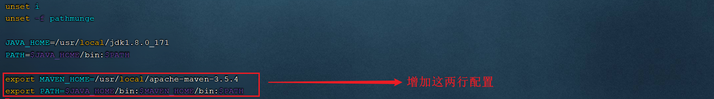

要想让配置的环境变量生效,还需要执行如下指令:

```
source /etc/profile
```


**4). 修改maven的settings.xml配置文件,配置本地仓库地址**

A. 切换目录

```
cd /usr/local/apache-maven-3.5.4/conf
```

B. 编辑settings.xml配置文件

```
vim settings.xml
```

在其中增加如下配置,配置本地仓库地址:

```
<localRepository>/usr/local/repo</localRepository>
```


并在settings.xml中的<mirrors>标签中,配置阿里云的私服(==选做==):

```xml
<mirror> 
    <id>alimaven</id> 
    <mirrorOf>central</mirrorOf> 
    <name>aliyun maven</name> 
    <url>http://maven.aliyun.com/nexus/content/groups/public/</url>
</mirror> 
```


#### 2.2.5 Shell脚本准备

> Shell脚本（shell script），是一种Linux系统中的脚本程序。使用Shell脚本编程跟 JavaScript、Java编程一样，只要有一个能编写代码的文本编辑器和一个能解释执行的脚本解释器就可以了。
>
> 对于Shell脚本编写不作为本课程重点内容，直接使用课程资料中提供的脚本文件bootStart.sh即可。

在/usr/local/目录下创建一个目录 sh(mkdir sh)，并将shell脚本上传到该目录下。或者直接在sh目录下创建一个脚本bootStart.sh，然后将资料中的bootStart.sh文件打开,内容拷贝过来即可。


**脚本解读:**

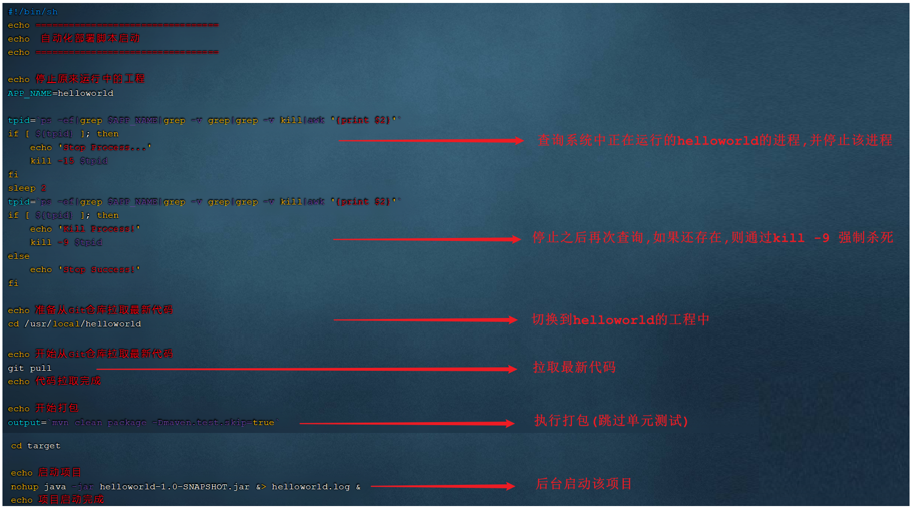

#### 2.2.6 Linux权限

前面我们已经把Shell脚本准备好了，但是Shell脚本要想正常的执行，还需要给Shell脚本分配执行权限。 由于linux系统是一个多用户的操作系统，并且针对每一个用户，Linux会严格的控制操作权限。接下来，我们就需要介绍一下Linux系统的权限控制。

> 1). ==chmod==（英文全拼：change mode）命令是控制用户对文件的权限的命令
>
> 2). Linux中的权限分为三种 ：读(r)、写(w)、执行(x)
>
> 3). Linux文件权限分为三级 : 文件所有者（Owner）、用户组（Group）、其它用户（Other Users）
>
> 4). 只有文件的所有者和超级用户可以修改文件或目录的权限
>
> 5). 要执行Shell脚本需要有对此脚本文件的执行权限(x)，如果没有则不能执行

Linux系统中权限描述如下:


解析当前脚本的权限情况:

​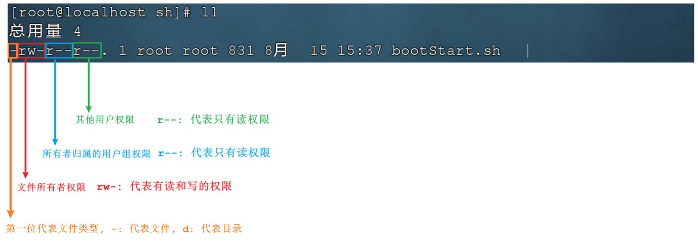​

chmod命令可以使用八进制数来指定权限(0 - 代表无 , 1 - 执行x , 2 - 写w , 4 - 读r):

|值|权限|rwx|
| --| --------------| ---|
|7|读 + 写 + 执行|rwx|
|6|读 + 写|rw-|
|5|读 + 执行|r-x|
|4|只读|r--|
|3|写 + 执行|-wx|
|2|只写|-w-|
|1|只执行|--x|
|0|无|---|

**举例:**

```
chmod 777 bootStart.sh   为所有用户授予读、写、执行权限
chmod 755 bootStart.sh   为文件拥有者授予读、写、执行权限，同组用户和其他用户授予读、执行权限
chmod 210 bootStart.sh   为文件拥有者授予写权限，同组用户授予执行权限，其他用户没有任何权限
```

==注意:==

三个数字分别代表不同用户的权限

- 第1位表示文件拥有者的权限
- 第2位表示同组用户的权限
- 第3位表示其他用户的权限

#### 2.2.7 授权并执行脚本

在测试阶段，我们可以给所有的人都赋予执行该shell脚本的权限。所以可以执行如下指令：

```
chmod 777 bootStart.sh
```


权限解读:

A. 第一个7，代表当前文件所有者root用户，对该文件具有读写执行权限；

B. 第二个7，代表当前文件所有者所属组的用户，对该文件具有读写执行权限；

B. 第三个7，代表其他用户，对该文件具有读写执行权限；

执行该shell脚本:


==注意： 在执行maven指令进行打包时，第一次执行可能会耗时比较长，因为在进行maven工程的打包时，需要到中央仓库下载工程依赖的jar包和插件(可以在settings.xml中配置阿里云私服加速下载)。==

启动完成之后, 我们可以查看java进程：


访问项目：


#### 2.2.8 设置静态IP

我们目前安装的Linux操作系统，安装完毕之后并没有配置IP地址，默认IP地址是动态获取的，那如果我们使用该Linux服务器部署项目，IP动态获取的话，也就意味着，IP地址可能会发生变动，那我们访问项目的话就会非常繁琐，所以作为服务器，我们一般还需要把IP地址设置为静态的。

1). 设置静态IP

设置静态ip，我们就需要修改 /etc/sysconfig/network-scripts/ifcfg-ens33 配置文件，内容如下：

```properties
TYPE=Ethernet
PROXY_METHOD=none
BROWSER_ONLY=no
BOOTPROTO=static
IPADDR="192.168.138.100"        # 设置的静态IP地址
NETMASK="255.255.255.0"         # 子网掩码
GATEWAY="192.168.138.2"         # 网关地址
DNS1="192.168.138.2"            # DNS服务器
DEFROUTE=yes
IPV4_FAILURE_FATAL=no
IPV6INIT=yes
IPV6_AUTOCONF=yes
IPV6_DEFROUTE=yes
IPV6_FAILURE_FATAL=no
IPV6_ADDR_GEN_MODE=stable-privacy
NAME=ens33
UUID=afd0baa3-8bf4-4e26-8d20-5bc426b75fd6
DEVICE=ens33
ONBOOT=yes
ZONE=public
```


上述我们所设置的网段为138，并不是随意指定的，需要和我们虚拟机中的虚拟网络编辑器中的NAT模式配置的网关保持一致。


2). 重启网络服务

ip地址修改完毕之后，需要重启网络服务，执行如下指令：

```
systemctl restart network
```


==注意：重启完网络服务后ip地址已经发生了改变，此时FinalShell已经连接不上Linux系统，需要创建一个新连接才能连接到Linux。==

再次连接上Linux之后，我们再次查看IP地址，就可以看到我们所设置的静态IP：


