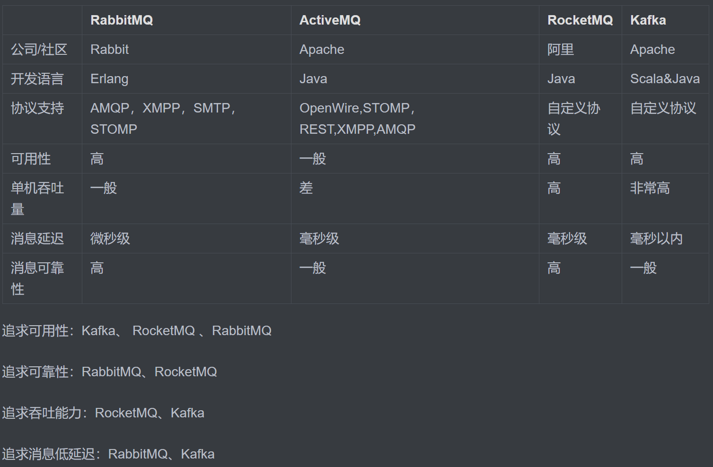

# RabbitMQ

## 同步和异步通讯

* ### 同步通讯

  * what

    * 就像打电话，需要实时响应。
  * 优点

    * 时效性较强，可以立即得到结果
  * 缺点

    * 耦合度高：每次加入新的需求，都要修改原来的代码。
    * 性能和吞吐能力下降：调用都需要等待服务提供者响应，如果调用链过长则响应时间等于每次调用的时间之和。
    * 有额外的资源消耗：调用链中的每个服务在等待响应过程中，不能释放请求占用的资源，高并发场景下会极度浪费系统资源。
    * 级联失败：如果服务提供者出现问题，所有调用者都会跟着出问题，如同多米诺骨牌一样，迅速导致整个微服务群故障。
* ### 异步通讯

  * what

    * 就像发邮件，不需要马上回复。
  * how

    * 为了解除事件发布者与订阅者之间的耦合，两者并不是直接通信，而是有一个中间人（Broker）。发布者发布事件到Broker，不关心谁来订阅事件。订阅者从Broker订阅事件，不关心谁发来的消息。​
  * 好处

    * 吞吐量提升：无需等待订阅者处理完成，响应更快速
    * 故障隔离：服务没有直接调用，不存在级联失败问题
    * 调用间没有阻塞，不会造成无效的资源占用
    * 耦合度极低，每个服务都可以灵活插拔，可替换
    * 流量削峰：不管发布事件的流量波动多大，都由Broker接收，订阅者可以按照自己的速度去处理事件
  * 缺点

    * 架构复杂了，业务没有明显的流程线，不好管理
    * 需要依赖于Broker的可靠、安全、性能

## MQ

### what

* MQ，中文是消息队列（MessageQueue），字面来看就是存放消息的队列。也就是事件驱动架构中的Broker。

### 常见MQ与对比

* ​

## RabbitMQ安装

* 参考https://blog.csdn.net/tirster/article/details/121938987如果软件下载太慢，可以通过百度网盘下载。
* rabbitmq-server-3.9.14链接：https://pan.baidu.com/s/1ymwl5xW-R0qUUNouY7BXYQ 提取码：f7ia
* otp_win64_24.3.3链接：https://pan.baidu.com/s/15mk0_FheXxsWImzoIHKzeg 提取码：7yw8

## RabbitMQ启动

* sbin 目录下CMD执行以下命令
* rabbitmq-plugins enable rabbitmq_management
* 主页：[RabbitMQ Management](http://127.0.0.1:15672)

‍
