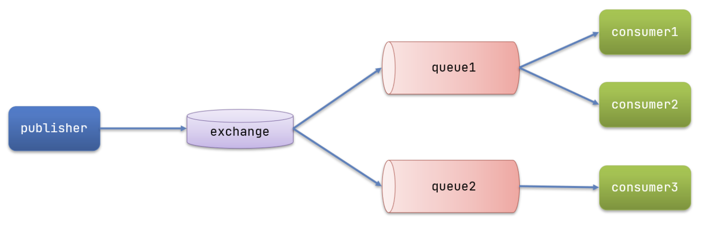

# SpringAMQP

官方地址：https://spring.io/projects/spring-amqp

## 环境准备

### 引入AMQP依赖

* ```xml
  <!--AMQP依赖，包含RabbitMQ-->
  <dependency>
      <groupId>org.springframework.boot</groupId>
      <artifactId>spring-boot-starter-amqp</artifactId>
  </dependency>
  ```

### application.yml配置

* ```yaml
  spring:
    rabbitmq:
      host: localhost # 主机名
      port: 5672 # 端口
      virtual-host: / # 虚拟主机
      username: guest# 用户名
      password: 123456# 密码
  ```

### 配置json序列化方式

* ```java
  package com.zhixing.gulimall.order.config;

  import org.springframework.amqp.core.Message;
  import org.springframework.amqp.rabbit.connection.CorrelationData;
  import org.springframework.amqp.rabbit.core.RabbitTemplate;
  import org.springframework.amqp.support.converter.Jackson2JsonMessageConverter;
  import org.springframework.amqp.support.converter.MessageConverter;
  import org.springframework.context.annotation.Bean;
  import org.springframework.context.annotation.Configuration;

  import javax.annotation.PostConstruct;
  import javax.annotation.Resource;

  @Configuration
  public class MyRabbitConfig {

      @Bean
      public MessageConverter messageConverter() {
          return new Jackson2JsonMessageConverter();
      }
  }
  ```

## AmqpAdmin使用

what

* 创建交换机与队列，绑定关系

how

* ```java
  package com.zhixing.gulimall.order.controller;

  import org.springframework.amqp.core.AmqpAdmin;
  import org.springframework.amqp.core.Binding;
  import org.springframework.amqp.core.DirectExchange;
  import org.springframework.amqp.core.Queue;
  import org.springframework.web.bind.annotation.*;
  import javax.annotation.Resource;

  @RestController
  @RequestMapping("/rabbitMQ")
  public class RabbitMQController {
      @Resource
      private AmqpAdmin amqpAdmin;

      @RequestMapping("/contextLoads")
  	//创建交换机，参数分别为交换机名，是否持久化，是否自动删除，参数（可选或Null）
      public void contextLoads() {
          DirectExchange directExchange = new DirectExchange(
                  "hello-java-exchange",
                  true,
                  false);
          amqpAdmin.declareExchange(directExchange);
      }

      @RequestMapping("/createQueue")
  	//创建交换机，参数分别为队列名，是否持久化，是否自动删除，参数（可选或Null）
      public void createQueue(){
          Queue queue = new Queue(
                  "hello-java-queue", 
                  true, 
                  false, 
                  false,
                  null);
          amqpAdmin.declareQueue(queue);
      }

      @RequestMapping("/createBinding")
  	//创建绑定关系，参数分别为队列名，绑定对象类型，交换机名，路径键，参数（可选或Null）
      public void createBinding(){
          Binding binding = new Binding(
                  "hello-java-queue", 
                  Binding.DestinationType.QUEUE,
                  "hello-java-exchange",
                  "hello.java",
                  null);
          amqpAdmin.declareBinding(binding);
      }

  }

  ```

## Basic Queue（一队一听）

### what

* 一个消费者处理消息

### how

#### 发送消息

* convertAndSend(queueName, message);
* 这里当路由key参数为queueName时，会把消息直接发送给队列
* ```java
  @Resource
  private RabbitTemplate rabbitTemplate;

  @RequestMapping("/sendMessageToQueue")
  public R sendMessageToQueue(String queueName,String message){
  	rabbitTemplate.convertAndSend(queueName, message);
  	return R.ok();
  }
  ```

#### 监听消息

* 该方法会持续监听队列
* ```java
  @RabbitListener(queues = "test")
  public void listenSimpleQueueMessage(String msg) {
  	System.out.println("spring 消费者1接收到消息：【" + msg + "】");
  }
  ```

## WorkQueue（一队多听）

### what

* 多个消费者同时监听一个队列
* 一个消息只能被一个消费者处理

### how

#### 发送消息

* ```
  @Resource
  private RabbitTemplate rabbitTemplate;

  @RequestMapping("/sendMessageToQueue")
  public R sendMessageToQueue(String queueName,String message){
  	rabbitTemplate.convertAndSend(queueName, message);
  	return R.ok();
  }
  ```

#### 监听消息

* ```java
  @RabbitListener(queues = "test")
  public void listenSimpleQueueMessage(String msg){
  	System.out.println("spring 消费者1接收到消息：【" + msg + "】");
  }

  @RabbitListener(queues = "test")
  public void listenSimpleQueueMessage2(String msg){
  	System.out.println("spring 消费者2接收到消息：【" + msg + "】");
  }
  ```

### 能者多劳配置

* ```yaml
  spring:
    rabbitmq:
      listener:
        simple:
          prefetch: 1 # 每次只能获取一条消息，处理完成才能获取下一个消息
  ```

## Fanout交换机（订阅模式）

### what

* 可以有多个队列绑定到Exchange（交换机）
* 生产者发送的消息，只能发送到交换机，交换机来决定要发给哪个队列

### how

#### 声明队列与交换机绑定关系

##### 配置类方式

* 在服务启动时配置Binding（绑定关系）
* ```java
  package com.zhixing.gulimall.order.config;

  import org.springframework.amqp.core.Binding;
  import org.springframework.amqp.core.BindingBuilder;
  import org.springframework.amqp.core.FanoutExchange;
  import org.springframework.amqp.core.Queue;
  import org.springframework.context.annotation.Bean;
  import org.springframework.context.annotation.Configuration;

  @Configuration
  public class FanoutConfig {

      @Bean
      public Binding bindingQueue1() {
          return BindingBuilder.bind(
                          new Queue("test1"))
                  .to(new FanoutExchange("testExchange"));
      }

      @Bean
      public Binding bindingQueue2() {
          return BindingBuilder.bind(
                          new Queue("test2"))
                  .to(new FanoutExchange("testExchange"));

      }
  }
  ```

##### 注解方式

* ```java
  //value声明队列
  //exchange声明交换机
  //type声明交换机类型
  @RabbitListener(bindings = @QueueBinding(
  		value = @Queue(name = "queueName"),
  		exchange = @Exchange(name = "exChangeName", 
  		type = ExchangeTypes.FANOUT)
  ))
  public void listener(String msg){}
  ```

#### 发送消息

* ```java
  @Resource
  private RabbitTemplate rabbitTemplate;
  @RequestMapping("/sendMessageToExChange")
  public R sendMessageToExChange(String exChangeName,String message){
  	rabbitTemplate.convertAndSend(exChangeName,"",message);
  	return R.ok();
  }
  ```

#### 侦听消息

* 同使用注解声明队列与交换机绑定关系

## Direct交换机（口令订阅模式）

### what

* 可以有多个队列 通过RoutingKey(可指定多个)绑定到Exchange（交换机）
* 生产者发送的消息，只能发送到交换机，并要指定RoutingKey
* 交换机根据RoutingKey来决定要发给哪个队列

### how

#### 声明队列与交换机绑定关系

* ```java
  //value声明侦听队列
  //exchange声明交换机
  //type声明交换机类型
  //key声明RoutingKey，可指定多个
  @RabbitListener(bindings = @QueueBinding(
  		value = @Queue(name = "direct1"),
  		exchange = @Exchange(name = "directExchange", 
  		type = ExchangeTypes.FANOUT),
  		key = {"red", "yellow"}
  ))
  ```

#### 发送消息

* ```java
  @Resource
  private RabbitTemplate rabbitTemplate;

  @RequestMapping("/sendMessageToDirectExChange")
  public R sendMessageToDirectExChange(String exChangeName,String routingKey, String message){
  	rabbitTemplate.convertAndSend(exChangeName,routingKey,message);
  	return R.ok();
  }
  ```

#### 侦听消息

* 同声明队列与交换机绑定关系

## Topic交换机（主题订阅模式）

### what

* 类似Direct交换机（口令订阅模式）
* 但是口令匹配非完全匹配，而是模糊匹配

### how

#### 声明队列与交换机绑定关系

* ```java
  @Resource
  private RabbitTemplate rabbitTemplate;

  //value声明侦听队列
  //exchange声明交换机
  //type声明交换机类型
  //key声明主题，可指定多个,
  //#：匹配一个或多个词
  //*：匹配不多不少恰好1个词
  @RabbitListener(bindings = @QueueBinding(
  		value = @Queue(name = "topic1"),
  		exchange = @Exchange(name = "topicExchange", 
  		type = ExchangeTypes.TOPIC),
  		key = {"china.#"}
  ))
  public void listenTopicQueue1(String msg){}
  ```

#### 发送消息

* ```java
  @Resource
  private RabbitTemplate rabbitTemplate;

  @RequestMapping("/sendMessageToDirectExChange")
  public R sendMessageToDirectExChange(String exChangeName,String routingKey, String message){
  	rabbitTemplate.convertAndSend(exChangeName,routingKey,message);
  	return R.ok();
  }
  ```

#### 侦听消息

* 同声明队列与交换机绑定关系

## 发布订阅的模型

* ### 模型图

  * ​
* ### 角色

  * Publisher：生产者，也就是要发送消息的程序，但是不再发送到队列中，而是发给X（交换机）
  * Exchange：一方面，接收生产者发送的消息。另一方面，知道如何处理消息，例如递交给某个特别队列、递交给所有队列、或是将消息丢弃。到底如何操作，取决于Exchange的类型。
  * Consumer：消费者，与以前一样，订阅队列，没有变化
  * Queue：消息队列也与以前一样，接收消息、缓存消息。

## 发送并监听对象消息（json)

### 配置序列化器

* ```java
  import org.springframework.amqp.support.converter.Jackson2JsonMessageConverter;
  import org.springframework.amqp.support.converter.MessageConverter;
  import org.springframework.context.annotation.Bean;
  import org.springframework.context.annotation.Configuration;

  @Configuration
  public class MyRabbitConfig{
      @Bean
      public MessageConverter messageConverter(){
          return new Jackson2JsonMessageConverter();
      }
  }
  ```

### 发送消息

* 只能向交换机发送对象消息
* ```java
  @Resource
  private RabbitTemplate rabbitTemplate;

  @RequestMapping("/sendMessageToQueue")
  public R sendMessageToQueue(){
  	OrderEntity orderEntity = new OrderEntity();
  	rabbitTemplate.convertAndSend("testExchange","",orderEntity);
  	return R.ok();
  }
  ```

### 监听消息

* 注意传入参数的类型必须与发送时一致
* ```java
  @RabbitListener(queues = "test1")
  public void listenSimpleQueueMessage(OrderEntity orderEntity) throws InterruptedException {
  	System.out.println(orderEntity.toString());
  }
  ```

## RabbitListener&RabbitHandler接收多类型消息

### RabbitListener&RabbitHandler区别

* @RabbitListener： 类+方法上（监听哪些队列即可）
* @RabbitHandler: 标在方法上(重载区分不同的消息)

### how

* @RabbitListener注解类，声明监听的队列
* @RabbitHandler注解监听方法，声明不同重载方法
* ```java
  @RabbitListener(queues = "test1")
  public class RabbitMQController {
      @Resource
      private RabbitTemplate rabbitTemplate;

  	//侦听String类型消息
      @RabbitHandler
      public void listenSimpleQueueMessage1(String str) throws InterruptedException {
          System.out.println(str);
      }
      //侦听OrderEntity类型消息
      @RabbitHandler
      public void listenSimpleQueueMessage2(OrderEntity orderEntity) throws InterruptedException {
          System.out.println(orderEntity.toString());
      }
  }
  ```

## 可靠投递机制

### 发送端

#### what

* confirmCallback确认模式：消息发送至服务器成功或失败均有反馈
* returnCallback：消息未投递到queue有反馈

#### how

* application配置

  * ```java
    #开启发送端确认
    spring.rabbitmq.publisher-confirm-type=correlated
    #开启发送端抵达队列确认
    spring.rabbitmq.publisher-returns=true
    #只要抵达队列，以异步发送优先回调我们这个returnConfirm
    spring.rabbitmq.template.mandatory=true
    ```
* 配置具备的反馈内容

  * ```java
    package com.zhixing.gulimall.order.config;

    import org.springframework.amqp.core.Message;
    import org.springframework.amqp.rabbit.connection.CorrelationData;
    import org.springframework.amqp.rabbit.core.RabbitTemplate;
    import org.springframework.amqp.support.converter.Jackson2JsonMessageConverter;
    import org.springframework.amqp.support.converter.MessageConverter;
    import org.springframework.context.annotation.Bean;
    import org.springframework.context.annotation.Configuration;

    import javax.annotation.PostConstruct;
    import javax.annotation.Resource;

    @Configuration
    public class MyRabbitConfig {
        @Resource
        private RabbitTemplate rabbitTemplate;

        @Bean
        public MessageConverter messageConverter() {
            return new Jackson2JsonMessageConverter();
        }

        @PostConstruct   //MyRabbitConfig对象创建完以后，执行这个方法
        public void initRabbitTemplate() {
            //设置确认回调
            rabbitTemplate.setConfirmCallback(new RabbitTemplate.ConfirmCallback() {
                /**
                 * 只要消息抵达Broker就b = true
                 * @param correlationData 当前消息的唯一关联数据（这个消息的唯一id）
                 * @param b  消息是否成功收到
                 * @param s 失败的原因
                 */
                @Override
                public void confirm(CorrelationData correlationData, boolean b, String s) {
                    System.out.println("correlationData = " + correlationData);
                    System.out.println("消息是否成功收到 = " + b);
                    System.out.println("失败的原因 = " + s);
                }
            });

            //设置消息抵达队列的确认回调
            rabbitTemplate.setReturnCallback(new RabbitTemplate.ReturnCallback() {
                /**
                 * 只要消息没有投递给指定的队列，就触发这个失败回调
                 * @param message 投递失败的消息详细信息
                 * @param i 回复的状态码
                 * @param s 回复的文本内容
                 * @param s1 当时这个消息发给哪个交换机
                 * @param s2 当时这个消息用哪个路由键
                 */
                @Override
                public void returnedMessage(Message message, int i, String s, String s1, String s2) {
                    System.out.println("投递失败的消息详细信息 = " + message);
                    System.out.println("回复的状态码 = " + i);
                    System.out.println("回复的文本内容 = " + s);
                    System.out.println("当时这个消息发给哪个交换机 = " + s1);
                    System.out.println("当时这个消息用哪个路由键 = " + s2);
                }
            });
        }
    }
    ```

### 消费端

#### what

* 消费者可对收到的消息进行确认或拒收
* 服务端将根据消费者反馈对消息保留与删除。

#### how

* 机制

  * 获取消息时：消息状态会从ready变为unacked
  * 默认：消费者收到消息后会自动ack，即使宕机未处理消息，服务端也会删除消息。
  * 手动确认（basicAck）：该消息从队列中移除，unacked数量少
  * 手动拒绝(basicNack)：退回消息，unacked数量少，ready数量对应增加；拒绝并丢弃消息，unacked数量少；
  * 手动拒绝(basicReject)：同basicNack，但是不支持多消息。
  * 不回应：消息状态会保存为unacked，直到连接中断，状态会更新为ready
* application配置

  * ```yaml
    #手动确认收货（ack）
    spring.rabbitmq.listener.simple.acknowledge-mode=manual
    ```
* 代码

  * basic.reject方法拒绝deliveryTag对应的消息，第二个参数是否requeue，true则重新入队列，否则丢弃或者进入死信队列。该方法reject后，该消费者还是会消费到该条被reject的消息。
  * basic.nack方法为不确认deliveryTag对应的消息，第二个参数是否应用于多消息，第三个参数是否requeue，与basic.reject区别就是同时支持多个消息，可以nack该消费者先前接收未ack的所有消息。nack后的消息也会被自己消费到。
  * ```java
    public void listen(Message message, String msg, Channel channel)  {
    	//获取消费者处理的消息序号，从0开始
    	MessageProperties properties = message.getMessageProperties();
    	long tag = properties.getDeliveryTag();
    	channel.basicNack(tag,false,true);
    }
    ```

## 死信队列（延时队列）实现订单提交与锁库存分布式事务（最终一致性）

### 业务流程

* 提交订单时远程调用锁库存服务。
* 库存锁定时，更新锁定库存字段，同时生成操作锁定库存的记录（用于订单失败时解锁库存）
* 通过交换机发送死信至死信队列
* 死信到期后通过交换机发送至正常消费列队
* 监听者消费解锁消息，判定订单是否成功，不成功则解锁库存

### 代码实现

* RabbitMQ环境准备
* 配置死信队列、消费队列、交换机、绑定关系

  * ```java
    package com.zhixing.gulimall.ware.config;

    import org.springframework.amqp.core.*;
    import org.springframework.amqp.rabbit.annotation.RabbitListener;
    import org.springframework.amqp.rabbit.core.RabbitTemplate;
    import org.springframework.amqp.support.converter.Jackson2JsonMessageConverter;
    import org.springframework.amqp.support.converter.MessageConverter;
    import org.springframework.beans.factory.annotation.Autowired;
    import org.springframework.context.annotation.Bean;
    import org.springframework.context.annotation.Configuration;

    import java.util.HashMap;
    import java.util.Map;

    @Configuration
    public class MyRabbitConfig {

        @RabbitListener(queues = "stock.release.stock.queue")
        public void handle(Message message) {

        }

        //配置交换机
        @Bean
        public Exchange stockEventExchange() {
            return new TopicExchange("stock-event-exchange", true, false);
        }

        //配置正常监听消息的队列
        @Bean
        public Queue stockReleaseStockQueue() {
            return new Queue("stock.release.stock.queue", true, false, false);
        }

        //配置死信队列（延时队列）
        @Bean
        public Queue stockDelayQueue() {
            Map<String, Object> arguments = new HashMap<>();
            //配置死信转发的目标交换机
            arguments.put("x-dead-letter-exchange", "stock-event-exchange");
            //配置死信转发路由键
            arguments.put("x-dead-letter-routing-key", "order.release");
            //配置消息过期时间，单位为ms
            arguments.put("x-message-ttl", 10000);
            return new Queue("stock.delay.queue", true, false, false, arguments);
        }

        //配置交换机与正常队列的绑定关系
        @Bean
        public Binding stockReleaseStockBinding() {
            return new Binding("stock.release.stock.queue",
                    Binding.DestinationType.QUEUE,
                    "stock-event-exchange",
                    "stock.release.#",
                    new HashMap<>());
        }

        //配置交换机与死信队列的绑定关系
        @Bean
        public Binding orderLockedBinding() {
            return new Binding("stock.delay.queue",
                    Binding.DestinationType.QUEUE,
                    "stock-event-exchange",
                    "stock.locked",
                    new HashMap<>());
        }

    }
    ```
* 配置监听者用于解锁库存

  * ```java
    package com.zhixing.gulimall.ware.config;

    import org.springframework.amqp.core.*;
    import org.springframework.amqp.rabbit.annotation.RabbitListener;
    import org.springframework.amqp.rabbit.core.RabbitTemplate;
    import org.springframework.amqp.support.converter.Jackson2JsonMessageConverter;
    import org.springframework.amqp.support.converter.MessageConverter;
    import org.springframework.beans.factory.annotation.Autowired;
    import org.springframework.context.annotation.Bean;
    import org.springframework.context.annotation.Configuration;

    import java.util.HashMap;
    import java.util.Map;

    @Configuration
    public class MyRabbitConfig {

        @RabbitListener(queues = "stock.release.stock.queue")
        public void handle(Message message) {

        }

        //配置交换机
        @Bean
        public Exchange stockEventExchange() {
            return new TopicExchange("stock-event-exchange", true, false);
        }

        //配置正常监听消息的队列
        @Bean
        public Queue stockReleaseStockQueue() {
            return new Queue("stock.release.stock.queue", true, false, false);
        }

        //配置死信队列（延时队列）
        @Bean
        public Queue stockDelayQueue() {
            Map<String, Object> arguments = new HashMap<>();
            //配置死信转发的目标交换机
            arguments.put("x-dead-letter-exchange", "stock-event-exchange");
            //配置死信转发路由键
            arguments.put("x-dead-letter-routing-key", "order.release");
            //配置消息过期时间，单位为ms
            arguments.put("x-message-ttl", 10000);
            return new Queue("stock.delay.queue", true, false, false, arguments);
        }

        //配置交换机与正常队列的绑定关系
        @Bean
        public Binding stockReleaseStockBinding() {
            return new Binding("stock.release.stock.queue",
                    Binding.DestinationType.QUEUE,
                    "stock-event-exchange",
                    "stock.release.#",
                    new HashMap<>());
        }

        //配置交换机与死信队列的绑定关系
        @Bean
        public Binding orderLockedBinding() {
            return new Binding("stock.delay.queue",
                    Binding.DestinationType.QUEUE,
                    "stock-event-exchange",
                    "stock.locked",
                    new HashMap<>());
        }

    }
    ```
* 锁库存时发送定时解锁消息

  * ```java
        @Transactional
        @Override
        public Boolean orderLockStock(WareSkuLockVo vo) {

            //锁库存操作前先保存一个对应的WareOrderTaskEntity实体
            WareOrderTaskEntity taskEntity = new WareOrderTaskEntity();
            taskEntity.setOrderSn(vo.getOrderSn());
            taskEntity.setCreateTime(new Date());
            wareOrderTaskService.save(taskEntity);
            // 1、按照下单的收货地址，找到一个就近仓库，锁定库存

            // 1、找到每个商品在哪个仓库都有库存
            List<OrderItemVo> locks = vo.getLocks();
            List<SkuWareHasStock> collect = locks.stream().map(item -> {
                SkuWareHasStock stock = new SkuWareHasStock();
                Long skuId = item.getSkuId();
                stock.setSkuId(skuId);
                stock.setNum(item.getCount());
                //查询这个商品在哪个仓库有库存
                List<Long> wareIds = wareSkuDao.listWareIdHasSkuStock(skuId);
                stock.setWareId(wareIds);
                return stock;
            }).collect(Collectors.toList());
            // 2、锁定库存
            for (SkuWareHasStock hasStock : collect) {
                Boolean skuStocked = false;
                Long skuId = hasStock.getSkuId();
                List<Long> wareIds = hasStock.getWareId();
                if (wareIds == null || wareIds.size() == 0) {
                    //没有任何库存有这个商品的库存
                    throw new NoStockException(skuId);
                }
                for (Long wareId : wareIds) {
                    //成功返回1；否则就是0
                    Long count = wareSkuDao.lockSkuStock(skuId, wareId, hasStock.getNum());
                    if (count == 1) {
                        WareOrderTaskDetailEntity detailEntity = new WareOrderTaskDetailEntity(
                                null,
                                hasStock.getSkuId(),
                                null,
                                hasStock.getNum(),
                                taskEntity.getId(),
                                wareId,
                                1);
                        wareOrderTaskDetailService.save(detailEntity);
                        //发送库存锁定消息至延迟队列
                        StockLockedTo lockedTo = new StockLockedTo();
                        lockedTo.setId(taskEntity.getId());
                        StockDetailTo detailTo = new StockDetailTo();
                        BeanUtils.copyProperties(detailEntity, detailTo);
                        lockedTo.setDetailTo(detailTo);
                        rabbitTemplate.convertAndSend("stock-event-exchange", "stock.locked", lockedTo);

                        skuStocked = true;
                        break;
                        //当仓库锁失败，重试下一个仓库
                    }
                }
                if (skuStocked == false) {
                    //当前商品所有仓库都没有锁住
                    throw new NoStockException(skuId);
                }
            }
            // 3、肯定全部都是锁定成功的
            return true;
        }
    ```
