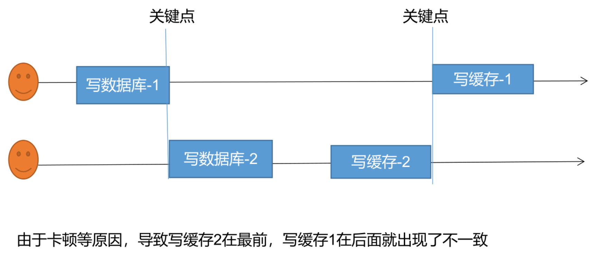
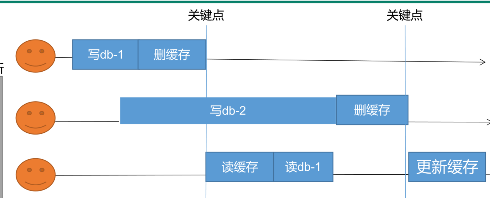

# redis

* 启动

  * cmd运行redis-server
  * cmd运行redis-cli.exe
* NoSQL数据库

  * 特点

    * NoSQL(NoSQL = Not Only SQL )，意即“不仅仅是SQL”，泛指非关系型的数据库。NoSQL 不依赖业务逻辑方式存储，而以简单的{{7032547205132::key-value模式}}存储。因此大大的增加了数据库的扩展能力。
  * 适用场景

    * 对数据高并发的读写

      ‍
    * 海量数据的读写
    * 对数据高可扩展性的
  * 不适用场景

    * 需要事务支持
    * 基于sql的结构化查询存储，处理复杂的关系，需要即席查询。
* Spring整合Redis

  * 导入maven坐标，排除lettuce-core依赖，换成jedis，因为lettuce会导致内存溢出问题

    * ```xml
      <dependency>
      	<groupId>org.springframework.boot</groupId>
      	<artifactId>spring-boot-starter-data-redis</artifactId>
      	<exclusions>
      		<exclusion>
      			<groupId>io.lettuce</groupId>
      			<artifactId>lettuce-core</artifactId>
      		</exclusion>
      	</exclusions>
      </dependency>

      <dependency>
      	<groupId>redis.clients</groupId>
      	<artifactId>jedis</artifactId>
      </dependency>
      ```
  * 配置application.yml  中Redis数据库相关信息

    * ```yaml
      spring:
        application:
          name: springdataredis_demo
        #Redis相关配置
        redis:
          host: localhost
          port: 6379
          #password: 123456
          database: 0 #操作的是0号数据库
          jedis:
            #Redis连接池配置
            pool:
              max-active: 8 #最大连接数
              max-wait: 1ms #连接池最大阻塞等待时间
              max-idle: 4 #连接池中的最大空闲连接
              min-idle: 0 #连接池中的最小空闲连接
      ```
  * 提供配置类

    * ```yaml
      spring:
        application:
          name: springdataredis_demo
        #Redis相关配置
        redis:
          host: localhost
          port: 6379
          #password: 123456
          database: 0 #操作的是0号数据库
          jedis:
            #Redis连接池配置
            pool:
              max-active: 8 #最大连接数
              max-wait: 1ms #连接池最大阻塞等待时间
              max-idle: 4 #连接池中的最大空闲连接
              min-idle: 0 #连接池中的最小空闲连接
      ```
* Redisson

  * 环境配置

    * 引入依赖

      * ```yaml
                <dependency>
                    <groupId>org.redisson</groupId>
                    <artifactId>redisson</artifactId>
                    <version>3.12.0</version>
                </dependency>
        ```
    * 配置RedissonClient客户端

      * ```java
        package com.zhixing.gulimall.product.config;

        import org.redisson.Redisson;
        import org.redisson.api.RedissonClient;
        import org.redisson.config.Config;
        import org.springframework.context.annotation.Bean;
        import org.springframework.context.annotation.Configuration;

        import java.io.IOException;

        @Configuration
        public class MyRedissonConfig {
            /**
             * 所有对Redisson的使用都是通过RedissonClient
             * @return
             * @throws IOException
             */
            @Bean(destroyMethod="shutdown")
            public RedissonClient redisson() throws IOException {
        	//1、创建配置
                Config config = new Config();
                //此处配置redis地址，如果是加密需要使用rediss
                config.useSingleServer().setAddress("redis://127.0.0.1:6379");
        	//2、根据Config创建出RedissonClient实例
        	//Redis url should start with redis:// or rediss://
                RedissonClient redissonClient = Redisson.create(config);
                return redissonClient;
            }
        }
        ```
  * lock普通锁

    * ```java
          public String testLock(){
              //根据锁的名称获取锁的操作器
              RLock myLock = redissonClient.getLock("myLock");
              try {
                  //阻塞式等待，
                  //1）无参数时默认加的锁都是30秒，每10秒会自动续期至30秒，若业务异常或完成，会自动解锁。
                  //2)带参时不会自动续期，到期自动解锁，因此参数应大于实际业务需要的时间
                  //3)最佳实战：带参不续期，手动解锁。
                  myLock.lock(10, TimeUnit.SECONDS);
                  System.out.println("加锁成功，执行业务..."+Thread.currentThread().getId());
                  Thread.sleep(30000);
              } catch (InterruptedException e) {
                  e.printStackTrace();
              }finally {
                  System.out.println("释放锁..."+Thread.currentThread().getId());
                  myLock.unlock();
              }
              return "success";
          }
      ```
  * 读写锁

    * ```java
      /*
      - 连续读操作：相当于无锁
      - 连续写操作：阻塞，逐个执行
      - 先写后读：有写锁，读操作被阻塞
      - 写读后写：有读锁，写操作被阻塞
      ```
    * ```java
          public String testLock(){
              //根据锁的名称获取锁的操作器
              RLock myLock = redissonClient.getLock("myLock");
              try {
                  //阻塞式等待，
                  //1）无参数时默认加的锁都是30秒，每10秒会自动续期至30秒，若业务异常或完成，会自动解锁。
                  //2)带参时不会自动续期，到期自动解锁，因此参数应大于实际业务需要的时间
                  //3)最佳实战：带参不续期，手动解锁。
                  myLock.lock(10, TimeUnit.SECONDS);
                  System.out.println("加锁成功，执行业务..."+Thread.currentThread().getId());
                  Thread.sleep(30000);
              } catch (InterruptedException e) {
                  e.printStackTrace();
              }finally {
                  System.out.println("释放锁..."+Thread.currentThread().getId());
                  myLock.unlock();
              }
              return "success";
          }
      ```
  * 信号量测试

    * ```java
          public String park(){
              //根据名称连接令牌池，需要令牌池实际存在，否则会报错
              RSemaphore park = redissonClient.getSemaphore("park");
              try {
                  //向令牌池申请令牌，成功则令牌池令牌数量自减1，失败会阻塞
                  park.acquire();
                  //向令牌池申请令牌，成功则令牌池令牌数量自减1，失败则不会重复尝试
      		//            boolean b = park.tryAcquire();
              }catch (Exception e){

              }
              return "success";
          }


          public String go(){
              RSemaphore park = redissonClient.getSemaphore("park");
              //向令牌池归还令牌，成功则令牌池令牌数量自增1
              park.release();
              return "success";
          }
      ```
  * 闭锁

    * ```java
         public String lockDoor() throws InterruptedException {
              //根据名称获取闭锁
              RCountDownLatch door = redissonClient.getCountDownLatch("door");
              //设置钥匙数量，成功则会在redis创建相应的值
              door.trySetCount(5);
              try {
                  //进入阻塞，会不断监听redis的值，为0时会唤醒，同时删除redis中的值
                  door.await();
              } catch (InterruptedException e) {
                  e.printStackTrace();
              }
              return "放假了";
          }


          public String goHome(){
              RCountDownLatch door = redissonClient.getCountDownLatch("door");
              //redis中的锁值自减1
              door.countDown();
              return "回家了";
          }
      ```
  * 缓存数据一致性

    * what

      * 缓存数据与数据库的一致性
    * how

      * 双写模式

        * what

          * 数据更新——写数据库——写缓存
        * bug

          * ​
      * 失效模式

        * what

          * 数据更新——写数据库——删缓存：触发主动更新缓存
        * bug与解决方案

          * 多个写db删缓存操作，导致被触发的缓存无法更新到最新信息
          * 可对读缓存、写db加读写锁处理，前提是写操作不能频繁
          * ​
      * 解决方案

        * 无论是双写模式还是失效模式，都会导致缓存的不一致问题。即多个实例同时更新会出事。怎么办？

          * ```java
            /*
            * 1、如果是用户纬度数据（订单数据、用户数据），这种并发几率非常小，不用考虑这个问题，缓存数据加上过期时间，每隔一段时间触发读的主动更新即可
            * 2、如果是菜单，商品介绍等基础数据，也可以去使用canal订阅binlog的方式。
            * 3、缓存数据+过期时间也足够解决大部分业务对于缓存的要求。
            * 4、通过加锁保证并发读写，写写的时候按顺序排好队。读读无所谓。所以适合使用读写锁。（业务不关心脏数据，允许临时脏数据可忽略）；
            ```
        * 总结

          * ```java
            /*
            * 我们能放入缓存的数据本就不应该是实时性、一致性要求超高的。所以缓存数据的时候加上过期时间，保
            * 证每天拿到当前最新数据即可。
            * 我们不应该过度设计，增加系统的复杂性
            * 遇到实时性、一致性要求高的数据，就应该查数据库，即使慢点。
            ```
* Spring cache

  * what
  * 环境配置

    * 引入依赖

      * ```xml
        <dependency>
            <groupId>org.springframework.boot</groupId>
            <artifactId>spring-boot-starter-cache</artifactId>
        </dependency>

        <!--引入redis-->
        <dependency>
            <groupId>org.springframework.boot</groupId>
            <artifactId>spring-boot-starter-data-redis</artifactId>
            <exclusions>
                <!--排除lettuce-->
                <exclusion>
                    <groupId>io.lettuce</groupId>
                    <artifactId>lettuce-core</artifactId>
                </exclusion>
            </exclusions>
        </dependency>
        ```
    * 编辑配置文件

      * ```properties
        spring.cache.type=redis
        ```
    * 启动类或者配置类添加注解  @EnableCaching
  * 注解

    * @Cacheable

      * what

        * 触发缓存填充，（触发将数据保存到缓存的操作）
        * 当被注解方法被调用，若缓存中有保存返回结果，方法实际不会被执行；
        * 如果缓存中没有，会执行方法，然后将方法的结果放入缓存  。
      * 默认行为

        * key是默认生成的:缓存的名字：：SimpleKey： ：[]
        * 缓存的value值，默认使用jdk序列化机制，将序列化的数据存到redis中
        * 默认时间是 -1
      * how

        * ```java
              /*
                  vlaue字段定义返回方法存储到哪个分区，可定义多个；
                  key定义返回结果在redis中保存使用的key名称。
              */
              //key的值为String时要添加单引号
              @Cacheable(value={"category"},key = "'level1Category'")
              //直接使用方法名作为key
              @Cacheable(value={"category"},key = "#root.methodName")
          ```
    * @CacheEvict

      * what

        * 触发逐出缓存（触发将数据从缓存删除的操作）
      * how

        * ```java
              //删除指定分区指定key
              @CacheEvict(value = "category",key = "'getLevel1Category'")
              //删除指定分区所有key
              @CacheEvict(value = "category",allEntries = true)
          ```
    * @CachePut

      * what

        * 更新缓存，而不会干扰方法的执行
    * @Caching

      * what

        * 重新组合要在一个方法上应用的多个缓存操作（组合多个以上操作）
      * how

        * ```java
          @Caching(evict = {
                  @CacheEvict(value = "category",key = "'getLevel1Category'"),
                  @CacheEvict(value = "category",key = "'getCatalogJson'")
          })
          ```
    * @CacheConfig

      * what

        * 在类级别共享一些与缓存相关的常见设置
  * 自定义缓存配置

    * ```java
      package com.zhixing.gulimall.product.config;

      import org.springframework.boot.autoconfigure.cache.CacheProperties;
      import org.springframework.boot.context.properties.EnableConfigurationProperties;
      import org.springframework.cache.annotation.EnableCaching;
      import org.springframework.context.annotation.Bean;
      import org.springframework.context.annotation.Configuration;
      import org.springframework.data.redis.cache.RedisCacheConfiguration;
      import org.springframework.data.redis.serializer.GenericJackson2JsonRedisSerializer;
      import org.springframework.data.redis.serializer.RedisSerializationContext;
      import org.springframework.data.redis.serializer.StringRedisSerializer;

      @EnableConfigurationProperties(CacheProperties.class)
      @Configuration
      @EnableCaching
      public class MyCacheConfig {
          /**
           * 配置文件中的东西没有用到
           *
           * 1、原来和配置文件绑定的配置类是这样的
           * @ConfigurationProperties(prefix="spring.cache")
           * public class CacheProperties
           * 2、让他生效
           * @EnableConfigurationProperties(CacheProperties.class)
           * @return
           */
          @Bean
          RedisCacheConfiguration redisCacheConfiguration(CacheProperties cacheProperties){

              RedisCacheConfiguration config = RedisCacheConfiguration.defaultCacheConfig();

              //加载Json序列化配置
              config = config.serializeKeysWith(RedisSerializationContext.SerializationPair.fromSerializer(new StringRedisSerializer()));
              config = config.serializeValuesWith(RedisSerializationContext.SerializationPair.fromSerializer(new GenericJackson2JsonRedisSerializer()));
              //将配置文件中的所有配置都生效
              CacheProperties.Redis redisProperties = cacheProperties.getRedis();
              //设置配置文件中的各项配置，如过期时间
              if (redisProperties.getTimeToLive() != null) {
                  config = config.entryTtl(redisProperties.getTimeToLive());
              }
              if (redisProperties.getKeyPrefix() != null) {
                  config = config.prefixKeysWith(redisProperties.getKeyPrefix());
              }
              if (!redisProperties.isCacheNullValues()) {
                  config = config.disableCachingNullValues();
              }
              if (!redisProperties.isUseKeyPrefix()) {
                  config = config.disableKeyPrefix();
              }
              return config;
          }
      }
      ```
  * application配置

    * ```yaml
      spring:

        cache:
          type: redis   
          redis:
            time-to-live: 3600000   #过期时间，单位为ms
            key-prefix: CACHE_	  #key前缀，建议不使用
            use-key-prefix: true
            cache-null-values: true  #方法返回空时是否填充
      ```
  * SpringCache-原理与不足

    * 不足

      * 1）读模式

        * ```yaml
          * 缓存穿透：查询一个null值。解决，缓存空数据；cache-null-value=true;
          * 缓存击穿：大量并发进来同时查询一个正好过期的数据。解决方法，是进行加锁，默认是没有加锁的，查询时设置Cacheable的sync=true即可解决缓存击穿。
          * 缓存雪崩：大量的key同时过期。解决方法：加上随机时间；加上过期时间。“spring.cache.redis.time-to-live=3600000”
          ```
      * 2）写模式（缓存与数据一致）

        * ```yaml
          * 读写加锁；
          * 引入canal，感知到mysql的更新去更新数据库；
          * 读多写少，直接去数据库查询就行；
          ```
    * 总结：

      * 常规数据（读多写少，即时性，一致性要求不高的数据）：完全可以使用spring-cache；写模式，只要缓存的数据有过期时间就足够了；
      * 特殊数据：特殊设计；

‍
